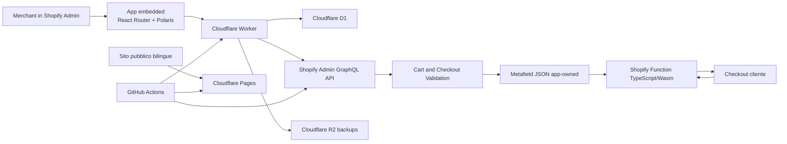
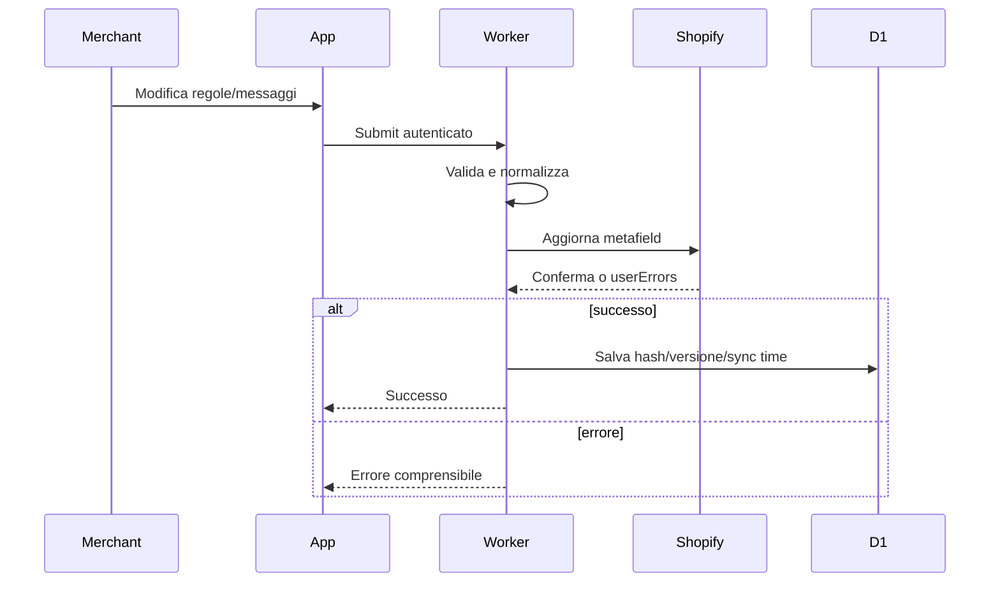

# CF Ready — Codice Fiscale nel Checkout

## Master Plan di prodotto, architettura, implementazione e lancio

**Stato:** baseline approvata per scaffolding e implementazione · M0–M6 completate, Development alla `0.4.30` · Production, submission App Store e wallet M10 non completati
**Data:** 27 luglio 2026 · revisione 28 luglio 2026  
**Documenti vincolanti collegati:** `docs/brand/brand-foundation.md` (identità visiva, tono, materiali pubblici)  
**Brand:** CF Ready  
**Nome pubblico:** CF Ready — Codice Fiscale nel Checkout  
**Abbreviazione interna:** CFR  
**Versione obiettivo:** `1.0.0`  
**Distribuzione:** public app Shopify App Store, disponibile solo ai merchant in Italia  
**Stack vincolante:** Shopify React Router template, TypeScript, Polaris Web Components, App Bridge Web Components, Shopify Function, Cloudflare Workers, D1, R2 e GitHub Actions

---

## 1. Scopo del documento

Questo documento è la fonte autosufficiente per sviluppare, collaudare, pubblicare e gestire CF Ready. Codex e Claude Code devono poter lavorare senza accedere alla conversazione da cui il piano è stato ricavato.

Il documento:

- riporta le decisioni approvate, comprese motivazioni, eccezioni e alternative scartate;
- separa chiaramente requisiti di prodotto, contratti tecnici e attività operative;
- definisce la versione 1.0 completa, non un MVP ridotto;
- ordina milestone, backlog, test e criteri di accettazione;
- assegna responsabilità distinte a Codex e Claude Code;
- mantiene nella sezione **Open items** solo gli aspetti esplicitamente rimandati.

### 1.1 Nota di consolidamento e verifica

La conversazione di origine è stata trattata come materiale storico non autorevole. Ogni decisione di prodotto approvata è stata conservata; le ripetizioni sono state consolidate e le affermazioni tecniche sensibili al tempo sono state ricontrollate sulle fonti ufficiali disponibili il **27 luglio 2026**.

Questa revisione integra inoltre:

- strategia API aggiornata: Admin GraphQL `2026-07` stabile e Function API `2026-07` release candidate durante lo sviluppo `0.x`;
- comportamento esplicito `blockOnFailure: false`;
- limite Shopify di 25 Validation Function attive per store;
- limite relativo alle generazioni ricorrenti degli ordini in abbonamento;
- lifecycle e namespace del metafield della Function;
- costi e trattenute Shopify rilevanti;
- benchmark pubblico del pricing;
- governance di `AGENTS.md`, README e documentazione tecnica;
- preflight provider, ricevute di deploy, readiness e soglie di rivalutazione;
- profilo di esecuzione richiesto per il successivo handover.

### 1.2 Regole di prevalenza

Quando due passaggi storici risultano in tensione, vale la decisione approvata più recente. In particolare:

- il nome definitivo è **CF Ready — Codice Fiscale nel Checkout**, non “Codice Fiscale Checkout”;
- l’unica abbreviazione interna ammessa è `CFR`; ogni abbreviazione precedente è eliminata;
- l’app ha quattro pagine permanenti; stato e scelta del piano sono nella Home e l’onboarding si apre in una finestra;
- non esiste un selettore manuale della lingua;
- si mantiene un solo dev store;
- ESLint e Prettier sono sostituiti da Oxlint e Oxfmt;
- Cloudflare è l’infrastruttura primaria; Oracle è fuori dall’architettura iniziale;
- non esiste alcun fallback architetturale a Hono, Next.js, Express o Remix.

### 1.3 Principio guida

> Usare il comportamento nativo Shopify per tutto ciò che Shopify gestisce già; aggiungere logica applicativa solo per i requisiti non coperti nativamente.

Ulteriori principi:

- il checkout non deve dipendere in tempo reale dal backend Cloudflare;
- un problema tecnico dell’app non deve impedire le vendite: comportamento fail-open;
- nessun dato fiscale degli acquirenti deve transitare o essere conservato nel database dell’app;
- configurazione e attivazione devono restare due azioni distinte;
- l’interfaccia deve sembrare nativa Shopify e usare al massimo Polaris;
- non si aggiungono astrazioni, dipendenze o servizi “per il futuro”;
- la causa condivisa di un problema va corretta una volta, nel punto comune;
- non si sacrifica validazione, sicurezza, accessibilità o prevenzione della perdita di dati in nome della semplicità.

### 1.4 Copertura della conversazione originale

Il documento non riproduce ogni domanda e risposta in ordine cronologico: conserva tutto ciò che serve a ricostruire il prodotto e ad attuarlo senza la chat.

| Area discussa | Dove è consolidata |
|---|---|
| problema fiscale, target, promessa e claim prudenti | sezioni 3–5 |
| decisioni, motivazioni e alternative scartate | sezione 6 |
| regole CF/PEC, clienti esteri, digitali, ritiro e checkout accelerati | sezioni 7 e 10 |
| metafield, Validation, fonte autorevole e fail-open | sezioni 9–13 |
| prova, pricing, una tantum, proratazione e benchmark | sezione 14 |
| Home, regole, messaggi, billing, FAQ e onboarding | sezioni 15–16 |
| naming, URL, Brand Foundation e responsabilità creative | sezione 17 |
| Workers, Pages, D1, R2, ambienti e capacità | sezioni 18–20 |
| sicurezza, privacy, retention, supporto e telemetria | sezioni 21–22 |
| test, review, Controlled Launch e acquisizione merchant | sezioni 23–26 |
| milestone, backlog, checklist e handover | sezioni 27–32 |

Sono state omesse soltanto ripetizioni conversazionali e affermazioni superate da decisioni successive o da documentazione ufficiale più recente. Le questioni volutamente non definite restano esclusivamente nella sezione **Open items**.

---

## 2. Indice

1. Scopo del documento  
2. Indice  
3. Executive summary  
4. Problema, utenti e posizionamento  
5. Perimetro 1.0 e fuori perimetro  
6. Decision log  
7. Requisiti funzionali  
8. Requisiti non funzionali  
9. Architettura  
10. Shopify Function  
11. Configurazione Shopify e metafield  
12. Modello dati D1  
13. Autenticazione, scope e webhook  
14. Billing e pricing  
15. Interfaccia, pagine e onboarding  
16. Internazionalizzazione e contenuti cliente  
17. Brand Foundation e materiali pubblici  
18. Infrastruttura Cloudflare  
19. Repository, ambienti, versionamento e CI/CD  
20. Dipendenze e policy di aggiornamento  
21. Sicurezza, privacy, retention e telemetria  
22. Supporto  
23. Strategia di test e test matrix  
24. App Store e revisione  
25. Controlled Launch e go-to-market  
26. Gestione operativa, incidenti e rollback  
27. Milestone  
28. Backlog ordinato  
29. Criteri di accettazione  
30. Checklist di scaffolding  
31. Handover per Codex  
32. Handover per Claude Code  
33. Rischi e mitigazioni  
34. Open items  
35. Riferimenti ufficiali  
36. Definition of Done della 1.0

---

## 3. Executive summary

CF Ready risolve un problema circoscritto dei merchant italiani che devono emettere fattura elettronica per tutti o molti ordini B2C: Shopify espone nel checkout italiano i campi nativi **Codice Fiscale** e **PEC**, ma non consente al merchant di renderli obbligatori tramite la configurazione standard.

L’app:

- usa una **Cart and Checkout Validation Function** lato Shopify;
- valida i campi nativi `TAX_CREDENTIAL_IT` e `TAX_EMAIL_IT`;
- rende Codice Fiscale e PEC, indipendentemente, non gestiti, facoltativi e validati oppure obbligatori e validati;
- applica una validazione formale completa del Codice Fiscale ordinario di 16 caratteri;
- accetta anche i Codici Fiscali provvisori numerici di 11 cifre;
- valida la PEC come indirizzo email con regole pragmatiche, senza certificarne l’effettiva natura PEC;
- applica le regole solo nei contesti italiani pertinenti;
- esenta automaticamente gli acquirenti con fatturazione estera;
- non modifica il tema, non rinomina “Interno”, non introduce nuovi campi nel carrello o nel checkout;
- non gestisce Partita IVA, Codice SDI o fatturazione elettronica;
- non legge né conserva Codici Fiscali, PEC, ordini o indirizzi degli acquirenti nel proprio database;
- è compatibile con tutti i piani Shopify quando distribuita come public app nell’App Store;
- usa una prova comune di 14 giorni e tre modalità commerciali con identiche funzionalità: mensile, annuale e pagamento una tantum.

Il backend amministrativo è ospitato su Cloudflare Workers. D1 conserva solo sessioni, stato installazione, prova, billing, telemetria tecnica e metadati. La configurazione necessaria alla Function vive in un singolo metafield JSON della Validation, così il checkout non chiama Cloudflare.

La 1.0 viene sviluppata per milestone `0.x`, sottoposta a Shopify quando è production-ready, installata sullo store reale del proprietario solo dopo l’approvazione come public app e poi distribuita con listing a visibilità limitata durante un Controlled Launch. Esternamente viene presentata come una nuova app completa, non come beta o pilot, senza affermazioni false su diffusione o risultati.

---

## 4. Problema, utenti e posizionamento

### 4.1 Problema

Alcuni merchant italiani devono raccogliere il Codice Fiscale prima di poter emettere fattura elettronica per un ordine B2C. Nel comportamento nativo Shopify il cliente può completare il checkout senza compilare il campo fiscale. Il merchant è quindi costretto a:

- inseguire il cliente dopo l’acquisto;
- ritardare la fatturazione;
- rinominare impropriamente il campo “Interno” o “Indirizzo 2”;
- installare soluzioni più invasive basate su carrello o tema;
- perdere o limitare i checkout accelerati.

CF Ready elimina questo attrito usando il campo fiscale nativo e una validazione server-side.

### 4.2 Utente target

Merchant con tutte le seguenti caratteristiche:

- store Shopify con sede in Italia;
- piano Basic, Grow, Advanced o Plus;
- Online Store e checkout in cui Shopify espone i localized fields italiani;
- necessità operativa di emettere fattura elettronica per tutti o molti ordini B2C;
- desiderio di rendere obbligatorio il Codice Fiscale senza modificare tema o carrello.

### 4.3 Promessa centrale

Formulazione consigliata:

> Mai più ordini da fatturare senza Codice Fiscale. Rendi obbligatorio e valida il campo nativo Shopify nel checkout italiano, senza modificare il tema o utilizzare il campo Interno.

Formulazione prudente:

> Per i merchant che devono emettere fattura elettronica per gli ordini B2C, CF Ready impedisce che un cliente completi un ordine italiano senza aver compilato un Codice Fiscale formalmente valido.

### 4.4 Formulazioni da evitare

Non affermare:

- che la legge italiana imponga a ogni e-commerce di raccogliere il Codice Fiscale per ogni ordine;
- che l’app determini l’obbligo fiscale del merchant;
- che il Codice Fiscale sia “certificato” o verificato presso l’Agenzia delle Entrate;
- che una PEC formalmente valida sia certamente una casella PEC esistente;
- che l’app emetta, trasmetta o conservi fatture;
- che l’app sia “la prima”, “la migliore” o “l’unica”;
- che l’app abbia merchant, recensioni o risultati non dimostrati.

### 4.5 Differenziazione

Rispetto alle alternative più ampie o invasive:

- usa campi nativi Shopify;
- non modifica il tema;
- non aggiunge moduli al carrello;
- non richiede Shopify Plus;
- non introduce differenze funzionali per piano Shopify;
- non conta ordini;
- non legge ordini o clienti;
- applica regole italiane ed esenzioni geografiche specifiche;
- richiede poca configurazione;
- mantiene checkout e backend applicativo disaccoppiati.

---

## 5. Perimetro 1.0 e fuori perimetro

### 5.1 Incluso nella 1.0

- Public app Shopify App Store per merchant italiani.
- App embedded nell’Admin Shopify.
- Cart and Checkout Validation Function in TypeScript.
- Configurazione indipendente di Codice Fiscale e PEC.
- Tre modalità per campo:
  - `unmanaged`: Non gestito;
  - `optional`: Facoltativo e validato;
  - `required`: Obbligatorio e validato.
- Validazione Codice Fiscale:
  - formato ordinario di 16 caratteri;
  - omocodia;
  - carattere di controllo;
  - struttura di data, sesso e codice catastale;
  - rifiuto di date palesemente impossibili;
  - formato provvisorio numerico di 11 cifre.
- Validazione PEC come email pragmatica.
- Messaggi personalizzabili in italiano e inglese.
- Inglese come fallback per il checkout in altre lingue.
- Eccezione per fatturazione estera.
- Esclusione degli ordini con destinazione estera.
- Supporto a ritiro online e ordini misti quando i campi nativi sono presenti.
- Comportamento fail-open quando i campi o la configurazione non sono disponibili.
- Prova gratuita comune di 14 giorni.
- Billing mensile, annuale e una tantum.
- Pricing di lancio e generazioni tariffarie.
- Pagina interna di supporto e modulo minimale.
- Sito pubblico bilingue con pagine legali e supporto.
- Controlled Launch.

### 5.2 Esplicitamente escluso

- Partita IVA.
- Codice Destinatario SDI.
- Theme App Extension.
- Checkout UI Extension.
- App Home UI Extension.
- Campi personalizzati nel carrello.
- Campi personalizzati nel checkout.
- Modifiche al tema.
- Rinomina del campo “Interno”.
- Integrazione con software di fatturazione.
- Emissione, trasmissione o conservazione di fatture elettroniche.
- Collegamento allo SDI.
- Verifica anagrafica presso l’Agenzia delle Entrate.
- Verifica che il Codice Fiscale appartenga all’acquirente.
- Verifica DNS o tramite provider della PEC.
- Shopify POS.
- Generazioni successive degli ordini ricorrenti in abbonamento; il checkout iniziale con prodotto in abbonamento va verificato separatamente.
- Raccolta tramite app mobile Shopify quando i localized fields non sono disponibili.
- Piano gratuito.
- Limiti per numero di ordini.
- Funzionalità diverse per piano Shopify.
- Ruoli interni aggiuntivi.
- Pagina Diagnostica.
- Pagina Analytics per il merchant.
- Email automatiche di promemoria prova.
- Servizi esterni per analytics, error tracking, email o pagamenti.
- Sentry, Stripe, database esterni e ORM.

### 5.3 Motivazione delle esclusioni

**Partita IVA e SDI:** non hanno un percorso nativo equivalente ai due localized fields italiani in tutti i piani. Aggiungerli richiederebbe tema, carrello o estensioni Plus, allargherebbe il prodotto verso il B2B e comprometterebbe la promessa di semplicità.

**Theme e Checkout UI Extension:** l’app deve funzionare senza codice nel tema, senza UX differenziata per Plus e senza rompere i checkout accelerati.

**Piano gratuito:** il valore principale non è divisibile senza creare limiti artificiali o pericolosi. Una soglia ordini potrebbe far smettere la validazione proprio durante l’operatività del merchant.

**Diagnostica e analytics visibili:** per una funzione così verticale sarebbero superfici artificiali. La Home deve mostrare solo stato, avvisi comprensibili e azioni di riparazione.

---

## 6. Decision log

| ID | Decisione approvata | Motivazione o alternativa scartata |
|---|---|---|
| D-001 | Sviluppare direttamente una 1.0 completa per milestone, senza MVP pubblico ridotto. | L’app è verticale; la release esterna deve essere completa e production-ready. |
| D-002 | Target: store con sede in Italia. | I localized fields e il caso d’uso sono italiani; riduce anomalie. |
| D-003 | Distribuzione come public app Shopify App Store. | Necessaria per usare Functions su tutti i piani. |
| D-004 | Nessuna differenza per Shopify Plus. | Il prodotto deve offrire la stessa funzione su tutti i piani. |
| D-005 | Niente Partita IVA. | Campo non affidabile per ordini nazionali e non obbligabile allo stesso modo su tutti i piani. |
| D-006 | Niente Codice SDI. | Richiederebbe un campo personalizzato, quindi tema/carrello o estensione Plus. |
| D-007 | Niente Theme App Extension o Checkout UI Extension. | Evitare fragilità, differenze Plus e problemi con checkout accelerati. |
| D-008 | Usare `TAX_CREDENTIAL_IT` e `TAX_EMAIL_IT`. | Sono i localized fields nativi italiani esposti alla Validation Function. |
| D-009 | Tre modalità indipendenti per CF e PEC. | Consentono disattivazione selettiva e configurazione chiara. |
| D-010 | Stato iniziale `unmanaged` per entrambi e Validation disattivata. | Nessun blocco accidentale subito dopo l’installazione. |
| D-011 | Salvataggio e attivazione restano separati. | Il merchant può preparare la configurazione senza modificarne subito il checkout. |
| D-012 | Codice Fiscale facoltativo significa “vuoto consentito, ma valido se compilato”. | Evita di accettare dati formalmente errati. |
| D-013 | PEC facoltativa segue la stessa logica. | Coerenza dei due campi. |
| D-014 | Accettare CF ordinario a 16 caratteri e provvisorio numerico a 11 cifre. | Non bloccare rari identificativi provvisori legittimi. |
| D-015 | Nessuna opzione merchant per disabilitare il formato provvisorio. | Entrambi i formati sono sempre considerati validi. |
| D-016 | Validazione formale rafforzata del CF. | Rifiuta date palesemente impossibili senza fingere verifica anagrafica. |
| D-017 | Non applicare checksum Partita IVA al CF provvisorio. | Evita di certificare erroneamente una sequenza numerica. |
| D-018 | Normalizzare solo per la validazione, senza riscrivere il dato Shopify. | La Function valida ma non deve mutare l’input cliente. |
| D-019 | La modalità inline valida solo a `CHECKOUT_COMPLETION`; la modalità preventiva aggiunge `CHECKOUT_INTERACTION` senza rimuovere Completion. | Mantiene il default non invasivo e offre copertura esplicita al bug Shopify della review. |
| D-020 | Mostrare simultaneamente gli errori CF e PEC. | Il cliente corregge tutto in un solo tentativo. |
| D-021 | Messaggi IT/EN personalizzabili, otto in totale. | Merchant italiani con checkout multilingua. |
| D-022 | Inglese fallback per ogni altra lingua checkout. | Copertura semplice e prevedibile della 1.0. |
| D-023 | Limite 200 caratteri, trim e divieto di messaggi vuoti. | Mantiene messaggi leggibili e validi. |
| D-024 | In modalità inline gli errori sono collegati ai campi nativi; in modalità preventiva sono box globali distinti per CF e PEC. | Il target globale è necessario per rendere gli errori prima della review. |
| D-025 | Nessuna regola per destinazione estera. | I campi italiani non sono pertinenti o possono non essere disponibili. |
| D-026 | Fatturazione estera esenta automaticamente CF e PEC, anche con consegna in Italia. | Shopify non comunica la cittadinanza; il Paese di fatturazione è il proxy disponibile. |
| D-027 | Se la fatturazione non è ancora disponibile ma il contesto italiano è rilevabile, applicare prudentemente la regola. | Evita aggiramenti dovuti a dato temporaneamente assente. |
| D-028 | Se i localized fields non sono esposti, non bloccare. | Non chiedere un dato che il cliente non può inserire. |
| D-029 | Prodotti digitali: validare solo se i localized fields sono presenti. | Il checkout può non raccogliere consegna o campi fiscali. |
| D-030 | Ritiro online incluso se i campi sono presenti; ordini misti inclusi se almeno una consegna è in Italia. | Coprire il caso reale senza coinvolgere POS. |
| D-031 | Configurazione assente, corrotta o sconosciuta: fail-open. | Un errore app non deve interrompere le vendite. |
| D-032 | Stack: React Router template + TypeScript. | Percorso Shopify raccomandato e unico linguaggio. |
| D-033 | Function in TypeScript, non Rust. | Logica piccola, nessuna scansione delle righe e maggiore manutenibilità. |
| D-034 | Cloudflare Workers come hosting primario. | Serverless, gratuito, poca manutenzione e carico amministrativo ridotto. |
| D-035 | Oracle fuori dall’architettura iniziale. | La potenza non compensa manutenzione e rischio di singola VM. |
| D-036 | D1 come unico database applicativo e session storage. | Evita KV e database esterni. |
| D-037 | Un solo metafield JSON sulla Validation. | Lettura unica, aggiornamento atomico e schema versionabile. |
| D-038 | Shopify è fonte autorevole per Validation e billing. | D1 contiene copie normalizzate e stato operativo, non la verità finale. |
| D-039 | Nessuna pagina Diagnostica. | Solo banner semplici e riparazione automatizzata in Home. |
| D-040 | Scope minimo iniziale: `write_validations`. | Nessun accesso a ordini, clienti, prodotti o inventario. |
| D-041 | Autorizzazioni staff native Shopify, senza ruoli app. | Riduce complessità e rispetta le deleghe del merchant. |
| D-042 | Store non italiano: schermata bloccata, niente prova, billing o Validation. | Il trial parte solo quando lo store diventa idoneo. |
| D-043 | Assistenza disponibile anche nella schermata store non supportato. | Permette chiarimenti senza sbloccare funzionalità operative. |
| D-044 | Prova comune di 14 giorni senza scelta preventiva del piano. | Deve coprire anche chi intende acquistare una tantum. |
| D-045 | Prova unica per store e non ripetibile tramite reinstallazione. | Prevenzione abusi. |
| D-046 | Prova fino alle 23:59 del quattordicesimo giorno nel fuso dello store. | Regola semplice, commerciale e non interrompe una giornata operativa. |
| D-047 | Mensile, annuale e una tantum hanno identiche funzionalità. | Nessun tier artificiale. |
| D-048 | Manual Pricing tramite Shopify Billing API. | Shopify App Pricing non supporta acquisti una tantum. |
| D-049 | Cambio mensile/annuale con comportamento Shopify standard. | Nessun calcolo parallelo. |
| D-050 | Cancellazione ordinaria a fine periodo, senza credito pro-rata. | Comportamento normale; configurazione conservata. |
| D-051 | Passaggio a una tantum: prima approvazione acquisto, poi cancellazione con proratazione. | Se l’acquisto fallisce l’abbonamento resta attivo. |
| D-052 | Credito solo per quota non usata del ciclo corrente. | Nessun credito storico per mesi o anni già consumati. |
| D-053 | Rimborso una tantum manuale, non automatico. | Trial già disponibile; eccezioni valutate per duplicati o problemi gravi. |
| D-054 | Una tantum legata allo store e non trasferibile. | Il diritto sopravvive alla reinstallazione dello stesso store. |
| D-055 | Una tantum include aggiornamenti della stessa app. | Evita frammentazione; non comunicare roadmap o versioni future. |
| D-056 | Pricing lancio: €2,99 / €29,90 / €89,90 per 90 giorni. | Strategia di penetrazione per app nuova. |
| D-057 | Pricing bilanciato 1.x: €3,99 / €39,90 / €119,90. | Sotto i benchmark e con annuale pari a circa dieci mensilità. |
| D-058 | Pricing futuro indicativo: €4,99 / €49,90 / €149,90 solo con più valore. | Non aumentare solo per il passare del tempo. |
| D-059 | Prezzo di lancio mantenuto durante rapporto commerciale attivo. | Premia early adopter. |
| D-060 | Cambio piano mantiene la pricing generation acquisita. | Il passaggio mensile/annuale/una tantum non penalizza il merchant. |
| D-061 | Trial iniziato entro fine promozione conserva diritto ai prezzi di lancio fino alla scadenza dei 14 giorni. | Evita che la promozione termini durante il trial. |
| D-062 | Home come centro operativo guidato, non dashboard. | Una dashboard con KPI sarebbe artificiale per un’app così verticale. |
| D-063 | Checklist onboarding scompare definitivamente dopo il completamento. | Nessun rumore permanente. |
| D-064 | Home attiva: “Modifica regole” primaria e “Disattiva nel checkout” secondaria con conferma. | Azioni chiare e separate. |
| D-065 | Save Bar nativa, niente auto-save. | Controllo esplicito delle modifiche. |
| D-066 | Tre radio sempre visibili per ogni campo. | Più chiare di un select con sole tre opzioni. |
| D-067 | Eccezioni automatiche sempre visibili e non modificabili. | Il merchant deve capire gli automatismi nel punto di configurazione. |
| D-068 | Anteprima testuale dinamica delle regole. | Chiarezza senza simulare graficamente il checkout. |
| D-069 | Messaggi in tab Italiano/English, reset separato per lingua. | Evita di sovrascrivere entrambe le lingue. |
| D-070 | Annuale evidenziato come “Consigliato”; una tantum come “Un solo pagamento”. | Evitare il titolo “Lifetime”. |
| D-071 | Lingua UI automatica da Shopify; nessun selettore. | Ogni staff member vede la propria lingua, fallback inglese. |
| D-072 | FAQ in pagina unica con sezioni espandibili. | Evita moltiplicazione di pagine. |
| D-073 | Onboarding in quattro passaggi, riapribile senza reset. | Percorso guidato senza checklist permanente. |
| D-074 | Due documenti legali bilingui con prevalenza italiana. | Privacy separata; termini incorporano billing e rimborsi. |
| D-075 | Sito pubblico su Cloudflare Pages; app/backend su Workers. | URL pubblico più leggibile, backend poco visibile nell’iframe. |
| D-076 | Brand CF Ready; nome lungo approvato; handle `cf-ready`; abbreviazione `CFR`. | Nome distintivo e descrittivo. |
| D-077 | Brand Foundation all’inizio, non alla fine. | Evita rework di UI, sito e listing. |
| D-078 | UI quasi interamente Polaris/App Bridge Web Components. | Manutenzione bassa e coerenza con Admin Shopify. |
| D-079 | Claude Code responsabile di brand, frontend e UI/UX; Codex può realizzare l’icona. | Separazione delle responsabilità creative e tecniche. |
| D-080 | Due sole app e ambienti: Development (`dev`) e Production (`prod`). Development copre sviluppo, integrazione e collaudo sul dev store; Production serve merchant reali. | Per un’app verticale gestita da un solo team, una terza app senza store dedicato duplica configurazioni e introduce drift senza produrre isolamento reale. |
| D-081 | `develop` integra e verifica senza deploy remoto; `main` promuove in Production; feature branch locali. | Conserva il gate tra integrazione e produzione senza mantenere un ambiente intermedio. |
| D-082 | GitHub Actions unico CI/CD. | Coordina Worker, Pages e Shopify Function in una pipeline. |
| D-083 | Test su tre livelli: Vitest, Function fixtures/CLI, Playwright mirato. | Copertura proporzionata al rischio. |
| D-084 | Monitoraggio Cloudflare nativo; niente Sentry. | Restare sul piano gratuito e ridurre servizi. |
| D-085 | Backup D1 cifrati in R2: 8 settimanali e 12 mensili. | Copertura oltre i 7 giorni di D1 Time Travel. |
| D-086 | Retention configurazione 90 giorni dopo uninstall. | Reinstallazione semplice, poi minimizzazione. |
| D-087 | Telemetria tecnica minimale sempre attiva, senza opt-out. | Necessaria a operatività, sicurezza e misurazione essenziale. |
| D-088 | Prompt recensione nativo, neutrale e non incentivato. | Feedback autentico dopo un momento positivo. |
| D-089 | Versioni di sviluppo `0.x`; `1.0.0` prima dei merchant esterni. | Non vendere una prerelease. |
| D-090 | Un solo dev store Basic permanente. | Semplicità operativa. |
| D-091 | Utility CLI di reset solo `dev`, impossibile in `prod`. | Ripetere flussi puliti con un solo dev store. |
| D-092 | Controlled Launch con listing a visibilità limitata. | Test operativo reale di una 1.0 completa. |
| D-093 | Controlled Launch non comunicato come beta/pilot. | Comunicazione normale di lancio, senza nascondere limitazioni materiali o inventare trazione. |
| D-094 | Criteri di uscita: 10 installazioni, 5 Validation attive, 2 settimane, nessun bug critico e flussi chiave verificati. | Gate oggettivo per piena visibilità. |
| D-095 | Strategia incidenti fail-open. | Preservare vendite e configurazioni. |
| D-096 | SemVer, tag Git e migrazioni immutabili. | Rilasci riproducibili e rollback. |
| D-097 | Oxlint e Oxfmt al posto di ESLint e Prettier. | Meno dipendenze e tooling più rapido. |
| D-098 | Dipendenze alla più recente versione stabile compatibile, non `@latest` indiscriminato. | Evitare sia debito iniziale sia combinazioni non supportate. |
| D-099 | Nessun ORM, libreria i18n, state manager, framework CSS o codegen GraphQL iniziale. | Il primo rung che regge è codice mirato e piattaforma nativa. |
| D-100 | Demo screencast di review obbligatorio; video promozionale facoltativo. | Requisito App Store distinto dal marketing. |
| D-101 | Creare e aggiornare la Validation con `blockOnFailure: false`. | Gli errori di business devono bloccare; un’eccezione runtime della Function deve invece restare fail-open. |
| D-102 | Usare una sola Validation per store e non modificare quelle di altre app. | Shopify consente al massimo 25 Validation Function attive per store; se il limite è raggiunto l’app mostra un errore operativo senza eliminare risorse altrui. |
| D-103 | Non promettere copertura delle generazioni successive degli ordini ricorrenti in abbonamento. | La superficie Cart and Checkout Validation corrente non le supporta; il checkout iniziale va testato e documentato separatamente. |
| D-104 | Il metafield della Function usa il namespace riservato `$app:cf-ready-validation` e la key `function-configuration`. | Allinea il dato al relativo Function handle e riduce collisioni o ambiguità. |
| D-105 | Sviluppare sulla Function API `2026-07` release candidate durante le versioni `0.x`; usare Admin GraphQL `2026-07`. | Evita una migrazione pianificata durante lo sviluppo; `1.0.0` è bloccata finché la Function API `2026-07` non è stabile e convalidata. |
| D-106 | Handover operativo con Sol 5.6 e ragionamento `medium`. | Profilo definitivo indicato dall’owner. |
| D-107 | Brand Foundation approvata il 28 luglio 2026. `docs/brand/brand-foundation.md` è la fonte vincolante per identità visiva, tono di voce e materiali pubblici. | Gate M2 superato: UI, sito, listing e screenshot si progettano senza rework di brand. |
| D-108 | Palette: Verde bottiglia `#20492F` primario, Arancio cotto `#C97B2E` accento unico, Panna `#F7F5EE`, Inchiostro `#1A211C`, Grigio caldo `#6B6A5C`. | Il verde porta l’associazione con la validazione restando lontano dal verde-teal Shopify. L’arancio è l’unico tono caldo sopra 3:1 sia sul verde sia sulla carta. |
| D-109 | Nessun colore di brand dentro l’app embedded: solo token semantici Polaris. Il brand vive su icona, sito, listing e screenshot. | Evita divergenza a ogni aggiornamento Polaris e mantiene l’app indistinguibile da una funzione nativa dell’Admin. |
| D-110 | Marchio «Tessera con fascia»: proporzione ISO ID-1, raggio 12,5% del lato corto, fascia piena in alto, sigla `CF` centrata. | Riferimento concreto al Codice Fiscale senza stemmi, tricolore o documenti fiscali. La fascia in alto legge come intestazione; in basso leggeva come banda magnetica. |
| D-111 | Su fondi scuri è obbligatoria la versione negativa del marchio. | La positiva su `#1A1A1A` dà 1,7:1, la negativa 16,0:1. Requisito di contrasto verificato, non preferenza estetica. |
| D-112 | Tipografia: grottesco geometrico di sistema per sito e materiali, nessun webfont, nessun font dichiarato dentro l’Admin. Sigla e wordmark in tracciati derivati da Jost (SIL OFL), peso 500. | Zero richieste di rete e nessuna dipendenza da font installati. Jost al posto del Futura per licenza: il Futura è commerciale e distribuito in bundle con macOS. |
| D-113 | Nessuna dark mode del sito pubblico nella 1.0. | Una superficie in meno da mantenere e verificare. Decisione indipendente da Shopify: al 28 luglio 2026 l’Admin non ha dark mode nativa e, usando solo token Polaris, l’app la seguirebbe comunque da sola. |
| D-114 | Presentare l’icona della listing con la sigla `CF`, accettando la raccomandazione Shopify di evitare il testo nell’icona. | Raccomandazione nelle best practice, non criterio di rifiuto nei requisiti; i monogrammi di due lettere sono diffusi fra le app approvate. Variante senza sigla pronta come rimedio, attivabile senza nuova approvazione (§24.5). |
| D-115 | Mantenere il repository pubblico su GitHub Free con `develop` come branch predefinito, branch protection non aggirabile dagli admin, base aggiornata, conversazioni risolte e gate `verify`, `react-doctor` e `dependency-review` richiesti su `develop` e `main`; abilitare Secret Scanning, Push Protection, CodeQL, Dependabot security updates e private vulnerability reporting. | Rende effettivi i gate già eseguiti, indirizza le security update nella corsia ordinaria, offre un canale privato per le vulnerabilità e conserva la promozione separata `develop` → `main`. |
| D-116 | Restare sull’ultima React Router 7 compatibile con Shopify e non abilitare le API RSC instabili finché Shopify non supporta React Router 8 o esiste un backport. | `GHSA-qwww-vcr4-c8h2` riguarda soltanto i percorsi RSC instabili, non usati da CF Ready. `npm audit` continuerà a segnalarla come high per intervallo di versione: l’abilitazione RSC richiede prima la rimozione dell’eccezione. |
| D-117 | Usare React Doctor stabile con pin esatto: scansione completa bloccante nel gate locale e Action ufficiale advisory sulle modifiche delle PR. Tenere attivi score e share URL, disabilitare il controllo supply-chain esterno. | Aggiunge controlli React deterministici e feedback inline senza duplicare i controlli dipendenze già coperti da npm e GitHub. Il gate resta locale: lo score è indicativo e non decide l’esito, che dipende da `blocking: warning`. |
| D-118 | Le PR ordinarie puntano a `develop` e usano squash; `main` accetta soltanto promozioni autorizzate da `develop`, unite con merge commit. La cancellazione automatica dei branch resta disattivata e i soli branch temporanei vengono eliminati esplicitamente. | Preserva l’ascendenza tra integrazione e Production, evita il drift strutturale causato da squash indipendenti sui due rami e impedisce che una promozione elimini `develop`. |
| D-119 | Abilitare l’auto-merge nativo in `develop` per le sole PR Dependabot minor/patch dopo `CI` e `React Doctor` verdi. Eliminare dopo il merge soltanto i branch `dependabot/*`; major e promozioni `develop` → `main` restano manuali. | Allinea CF Ready a SyncBay e Pratix, rende atomico il vincolo sullo SHA verificato, preserva gli eventi post-merge e non espone `develop` alla cancellazione globale dei branch. |
| D-120 | La visibilità pubblica non rende il progetto open-source: nessuna licenza viene concessa finché l’owner non sceglie esplicitamente e aggiunge un file `LICENSE`. | Una licenza attribuisce diritti di riuso e distribuzione e non va dedotta dalla sola pubblicazione del codice. |
| D-121 | `package.json#version` è la fonte canonica della versione Shopify. Ogni `shopify app deploy` rilasciato passa dal workflow GitHub Actions dell’ambiente e usa quella versione esatta con `--version`; una versione già rilasciata non viene riutilizzata e prima del successivo snapshot si incrementa il SemVer, usando un prerelease in Development quando opportuno. Il primo snapshot fisso Development è `0.1.0`. | Collega ogni snapshot al codice verificato, evita identificatori automatici come `cf-ready-1` e mantiene nomi leggibili senza collisioni. |
| D-122 | Offrire `inline` come visualizzazione errori predefinita e `preventive` come opzione merchant; la Guida la consiglia quando è attiva la conferma ordine Shopify. | La prova live mostra che i box globali a Interaction impediscono la review silenziosa, ma possono apparire già al caricamento e richiedono una scelta informata. |
| D-123 | Abilitare metriche e Workers Logs nativi, ma disabilitare gli invocation log automatici. Traces resta disattivato per default e può essere acceso solo temporaneamente in Development, con traffico sintetico e finestra di diagnosi delimitata. | Invocation log e trace automatici includono URL e query string; i trace includono anche il testo SQL D1. Il campionamento riduce volume e costo, non il rischio di raccogliere parametri tecnici sensibili. |
| D-124 | Non collegare il repository a Workers Builds finché GitHub Actions è il CI/CD canonico. Logpush, OpenTelemetry, Tail Workers e servizi esterni restano differiti finché il monitoraggio Cloudflare nativo non risulta insufficiente. | Evita una seconda corsia di deploy e nuovi destinatari della telemetria senza un bisogno operativo misurato. |
| D-125 | Avvisare il merchant che usa il campo “Interno” / “Indirizzo 2” per raccogliere il Codice Fiscale, tramite dichiarazione esplicita in configurazione e onboarding. Nessun rilevamento automatico e nessuno scope aggiuntivo. | Le impostazioni del modulo checkout non sono esposte dall’Admin API `2026-04`: `CheckoutAndAccountsConfiguration` espone solo `branding`, `overrides`, `isPublished`, `name` e i timestamp, `checkoutProfile` è deprecato e `read_checkout_settings` sblocca esclusivamente gli oggetti di branding. `TranslatableResourceType` non ha una risorsa per il contenuto checkout, quindi nemmeno la rinomina dell’etichetta è leggibile, e una rinomina fatta da una Checkout UI Extension di terzi resta invisibile per costruzione. La Function riceve `address2` ma è pura e non può segnalare nulla; leggere gli ordini richiederebbe `read_orders`, protected customer data e l’analisi di dati fiscali, contro §21.4. Il conflitto degrada l’esperienza con due campi duplicati, non blocca le vendite: non giustifica scope nuovi. |

---

## 7. Requisiti funzionali

### 7.1 Idoneità e installazione

**FR-001** — Al primo accesso l’app deve leggere il Paese dello store tramite GraphQL Admin API.

**FR-002** — Solo `IT` può:

- iniziare la prova;
- accedere all’onboarding operativo;
- configurare regole;
- creare o attivare la Validation;
- scegliere un piano.

**FR-003** — Uno store non italiano vede una schermata bilingue “Store non supportato” con:

- Paese rilevato;
- spiegazione del requisito;
- indicazione di controllare l’indirizzo store in Shopify;
- link a Guida e FAQ;
- azione “Contatta lo sviluppatore”.

**FR-004** — Uno store bloccato non viene disinstallato automaticamente.

**FR-005** — Se lo store diventa italiano, la prova parte al primo accesso idoneo, non alla prima installazione bloccata.

**FR-006** — Se uno store attivo cambia Paese e non è più italiano, l’app disabilita la Validation, preserva la configurazione e mostra un avviso.

### 7.2 Regole checkout

**FR-010** — Codice Fiscale e PEC hanno tre stati indipendenti:

```text
unmanaged
optional
required
```

**FR-011** — `unmanaged` non genera alcun errore per quel campo.

**FR-012** — `optional` permette vuoto, ma blocca un valore compilato e non valido.

**FR-013** — `required` blocca vuoto e valore non valido con messaggi distinti.

**FR-014** — In modalità `inline` la Validation viene eseguita solo a `CHECKOUT_COMPLETION`; in modalità `preventive` viene eseguita anche a `CHECKOUT_INTERACTION`.

**FR-015** — Se entrambi i campi falliscono, vengono restituiti entrambi gli errori.

**FR-016** — A Completion gli errori puntano al localized field corrispondente; a Interaction, in modalità preventiva, ogni errore usa il target globale `$.cart`.

**FR-017** — La modalità preventiva è disattivata per default, mantiene Completion come barriera finale e mostra un avviso merchant sugli errori anticipati.

### 7.3 Applicabilità geografica

**FR-020** — Destinazione estera: nessuna validazione.

**FR-021** — Fatturazione estera: nessuna validazione, anche con consegna o ritiro in Italia.

**FR-022** — Destinazione italiana e fatturazione italiana: regole normali.

**FR-023** — Destinazione italiana e fatturazione non ancora disponibile: regole normali se i localized fields sono presenti.

**FR-024** — Checkout senza spedizione: regole solo se i localized fields sono presenti e non esiste una fatturazione estera.

**FR-025** — Ritiro online senza indirizzo di consegna: regole se i localized fields sono presenti e la fatturazione non è estera.

**FR-026** — Ordine misto: applicare le regole se almeno un gruppo di consegna è in Italia, salvo fatturazione estera.

**FR-027** — Localized field assente: non generare errore per quel campo.

### 7.4 Codice Fiscale

**FR-030** — Prima della validazione:

- `trim()` esterno;
- conversione temporanea in maiuscolo;
- nessuna mutazione del valore Shopify.

**FR-031** — Spazi interni, trattini e separatori rendono il valore non valido.

**FR-032** — Formato ordinario:

- esattamente 16 caratteri;
- struttura alfanumerica prevista;
- posizioni nominali, anno, mese, giorno/sesso e codice catastale coerenti;
- omocodia nelle posizioni ammesse;
- carattere di controllo corretto;
- mese valido;
- giorno valido dopo decodifica sesso;
- rifiuto di `00`, 31 aprile, 31 giugno, 31 settembre, 31 novembre e 30 febbraio;
- 29 febbraio ammesso, perché il secolo non è ricavabile in modo univoco dalle due cifre dell’anno.

**FR-033** — Formato provvisorio:

- esattamente 11 cifre;
- nessuna lettera o separatore;
- nessun algoritmo Partita IVA;
- nessuna affermazione di esistenza o attribuzione.

### 7.5 PEC

**FR-040** — Prima della validazione applicare trim esterno senza riscrivere il valore.

**FR-041** — Validazione pragmatica:

- esattamente una `@`;
- local part e dominio non vuoti;
- nessuno spazio interno;
- dominio strutturalmente valido e con label non vuote;
- supporto a sottodomini;
- supporto ai caratteri comuni `.`, `_`, `-`, `+` nella parte locale;
- maiuscole e minuscole accettate;
- niente DNS;
- niente elenco provider PEC;
- niente certificazione di esistenza.

### 7.6 Configurazione e attivazione

**FR-050** — Prima installazione:

- CF `unmanaged`;
- PEC `unmanaged`;
- Validation disattivata.

**FR-051** — “Salva” aggiorna la configurazione ma non attiva una Validation disattivata.

**FR-052** — “Attiva nel checkout”:

1. verifica idoneità geografica;
2. verifica trial o entitlement;
3. valida configurazione e messaggi;
4. crea la Validation se non esiste;
5. altrimenti la abilita;
6. scrive il metafield JSON;
7. salva ID e hash in D1;
8. verifica la risposta Shopify;
9. mostra conferma.

**FR-053** — “Disattiva nel checkout”:

- chiede conferma;
- disabilita la Validation;
- non cancella Validation o configurazione;
- aggiorna D1.

**FR-054** — Se Shopify non conferma la scrittura del metafield, il salvataggio non è considerato riuscito.

**FR-055** — La Home riconcilia in modo leggero Validation, metafield, billing e D1.

**FR-056** — Divergenze innocue vengono riparate automaticamente; situazioni ambigue producono banner e azione “Ripara configurazione”.

**FR-057** — Due Validation duplicate non vengono cancellate automaticamente.

**FR-058** — Prima dell’attivazione, CF Ready avverte che il campo nativo
“Interno” / “Indirizzo 2” non va usato per raccogliere il Codice Fiscale e
chiede al merchant una dichiarazione esplicita. Se il merchant dichiara di
usarlo così, l’app mostra le istruzioni per rimuovere quell’uso in
Impostazioni → Checkout e mantiene un promemoria in Home finché la
dichiarazione non viene revocata.

**FR-059** — L’avviso non è un rilevamento: non blocca l’attivazione, non è
prerequisito di FR-052 e non deve essere presentato come verifica automatica
della configurazione dello store. CF Ready non legge, non rinomina e non
modifica il campo “Interno” (D-125).

### 7.7 Messaggi

**FR-060** — Otto messaggi modificabili:

| Chiave | Italiano | Inglese |
|---|---|---|
| `taxCodeRequired` | sì | sì |
| `taxCodeInvalid` | sì | sì |
| `pecRequired` | sì | sì |
| `pecInvalid` | sì | sì |

**FR-061** — Nessun messaggio può essere vuoto dopo trim.

**FR-062** — Limite: 200 caratteri per messaggio.

**FR-063** — Reset separato per italiano e inglese, con conferma.

**FR-064** — Default:

Italiano:

- CF obbligatorio: “Inserisci il Codice Fiscale per completare l’ordine.”
- CF non valido: “Il Codice Fiscale inserito non è formalmente valido. Controllalo e riprova.”
- PEC obbligatoria: “Inserisci l’indirizzo PEC per completare l’ordine.”
- PEC non valida: “L’indirizzo PEC inserito non ha un formato email valido.”

English:

- CF required: “Enter your Italian tax code to complete the order.”
- CF invalid: “The Italian tax code entered is not formally valid. Check it and try again.”
- PEC required: “Enter your certified email address (PEC) to complete the order.”
- PEC invalid: “The certified email address (PEC) does not have a valid email format.”

### 7.8 Billing

**FR-070** — Trial completo di 14 giorni senza piano o metodo di pagamento iniziale.

**FR-071** — Trial unico per store.

**FR-072** — Il giorno iniziale è il giorno 1 e l’accesso resta valido fino alle 23:59 del giorno 14 nel fuso dello store.

**FR-073** — Durante il trial tutte le funzioni sono disponibili.

**FR-074** — Se viene scelto mensile o annuale durante il trial, passare a Shopify solo i giorni residui.

**FR-075** — L’acquisto una tantum richiede approvazione immediata e non ha una seconda prova.

**FR-076** — A trial scaduto senza piano:

- la Function non blocca più;
- configurazione e messaggi restano salvati;
- la Home chiede di scegliere un piano;
- il pagamento riattiva senza riconfigurare.

**FR-077** — Avvisi trial solo in app a 7 giorni, 3 giorni, ultimo giorno e scadenza.

**FR-078** — Nessuna email automatica di trial.

**FR-079** — Passaggi mensile/annuale seguono Shopify `STANDARD`.

**FR-080** — Cancellazione ordinaria: accesso fino a fine periodo, senza pro-rata.

**FR-081** — Passaggio a una tantum:

1. mostra prezzo, periodo residuo, credito stimato e costo economico netto stimato;
2. crea acquisto una tantum al prezzo pieno della pricing generation;
3. aspetta approvazione;
4. verifica l’acquisto;
5. cancella l’abbonamento con proratazione nativa;
6. registra entitlement una tantum.

**FR-082** — Nessun credito storico; solo quota residua del ciclo in corso.

**FR-083** — Acquisto abbandonato o rifiutato non cancella l’abbonamento.

**FR-084** — Rimborso completo una tantum revoca entitlement; rimborso parziale lo mantiene salvo accordo diverso.

**FR-085** — Shopify Billing è fonte autorevole; D1 viene riconciliato.

### 7.9 Supporto e recensioni

**FR-090** — Modulo supporto minimale con:

- categoria;
- oggetto;
- messaggio;
- email merchant precompilata ma modificabile;
- metadati tecnici non sensibili;
- numero richiesta mostrato nell’app.

**FR-091** — Nessuna copia automatica al merchant nella 1.0.

**FR-092** — Nessun CF, PEC, ordine o dato buyer negli allegati o log.

**FR-093** — Prompt recensione nativo dopo almeno 7 giorni di Validation attiva, onboarding completato e nessun errore aperto.

**FR-094** — Azioni: “Lascia un feedback”, “Non ora”, “Non chiedermelo più”.

**FR-095** — Nessun incentivo o richiesta di recensione positiva.

### 7.10 Limiti piattaforma e protezioni operative

**FR-096** — L’app deve mantenere una sola Cart and Checkout Validation per store.

**FR-097** — Ogni creazione o aggiornamento della Validation deve impostare `blockOnFailure: false`.

**FR-098** — Se Shopify rifiuta la creazione perché lo store ha già raggiunto il limite di Validation Function attive:

- non eliminare né disabilitare Validation di altre app;
- non lasciare uno stato locale falsamente attivo;
- mostrare un errore traducibile e un percorso di supporto;
- conservare la configurazione per un nuovo tentativo.

**FR-099** — Listing, FAQ e Termini devono dichiarare che le generazioni successive degli ordini ricorrenti in abbonamento non sono coperte dalla Validation Function corrente.

**FR-100** — Il checkout iniziale contenente un prodotto in abbonamento deve essere testato separatamente; l’esito osservato va documentato senza estenderlo alle ricorrenze successive.

---

## 8. Requisiti non funzionali

### 8.1 Affidabilità

**NFR-001** — Il checkout non effettua chiamate a Cloudflare.

**NFR-002** — Configurazione invalida o entitlement non leggibile produce zero errori checkout.

**NFR-003** — Ogni operazione mutante verso Shopify deve essere idempotente o riconciliabile.

**NFR-004** — Webhook duplicati non devono produrre doppie transizioni.

**NFR-005** — Nessun deploy se fallisce un gate obbligatorio.

### 8.2 Prestazioni

**NFR-010** — Worker progettato per stare nel limite Free di 10 ms CPU per richiesta ordinaria.

**NFR-011** — Nessun lavoro costoso in global scope.

**NFR-012** — Niente SSR pesante; preferire asset statici e loader/action essenziali.

**NFR-013** — Query D1 indicizzate e limitate ai record necessari.

**NFR-014** — Function richiede solo i campi GraphQL necessari e deve rimanere ampiamente sotto i limiti di istruzioni, memoria e binary size.

### 8.3 Sicurezza

**NFR-020** — Token e refresh token cifrati a livello applicativo prima della scrittura D1.

**NFR-021** — Secret solo in Cloudflare/GitHub/Shopify secret storage, mai nel repository o nei log.

**NFR-022** — HMAC webhook obbligatoria; HMAC non valida produce `401`.

**NFR-023** — Input form e JSON metafield validati al trust boundary.

**NFR-024** — Utility distruttive non compilabili o non eseguibili in `prod`.

**NFR-025** — Nessun accesso a dati protetti di clienti o ordini.

### 8.4 Privacy

**NFR-030** — L’app non legge o conserva CF, PEC, ordini, indirizzi buyer o fatture.

**NFR-031** — Logging con codici errore e identificativi tecnici, senza payload sensibili.

**NFR-032** — Telemetria limitata agli eventi approvati e descritta nella Privacy Policy.

**NFR-033** — Retention applicata automaticamente.

### 8.5 Accessibilità e UI

**NFR-040** — Polaris Web Components come default.

**NFR-041** — Label accessibili, ordine heading corretto, focus gestito e navigazione da tastiera.

**NFR-042** — Contrasto verificato.

**NFR-043** — Layout responsive dentro Shopify Admin.

**NFR-044** — Nessun design system esterno.

### 8.6 Manutenibilità

**NFR-050** — TypeScript strict.

**NFR-051** — Dipendenze dirette minime e versioni esatte.

**NFR-052** — Nessun ORM, state manager o framework CSS.

**NFR-053** — Migrazioni D1 versionate e immutabili dopo il rilascio.

**NFR-054** — SemVer, changelog, tag e note IT/EN.

**NFR-055** — Ogni logica non banale lascia almeno un test eseguibile.

---

## 9. Architettura

### 9.1 Vista logica



### 9.2 Componenti

#### App embedded

- Shopify React Router template.
- React e TypeScript.
- Polaris Web Components.
- App Bridge Web Components.
- Quattro pagine permanenti e onboarding in finestra.
- Loader/action server-side nel Worker.

#### Cloudflare Worker

- autenticazione e token exchange;
- session storage D1;
- GraphQL Admin API;
- webhook;
- billing;
- configurazione;
- telemetria tecnica;
- supporto minimale;
- riconciliazione.

#### D1

- sessioni cifrate;
- store e idoneità;
- trial;
- billing normalizzato;
- stato app;
- eventi webhook;
- audit/telemetria;
- supporto.

#### Shopify Validation e metafield

- una Validation per store;
- un singolo JSON app-owned;
- source of truth delle regole runtime;
- entitlement con scadenza difensiva.

#### Shopify Function

- eseguita da Shopify;
- nessuna rete;
- nessun dato persistito dall’app;
- output solo errori di validazione.

#### Cloudflare Pages

- landing pubblica;
- Privacy Policy;
- Termini;
- Support;
- materiali bilingui.

#### R2

- backup D1 cifrati;
- nessun dato buyer.

### 9.3 Fonte autorevole

| Informazione | Fonte autorevole | Copia/indice |
|---|---|---|
| Regole checkout e messaggi | Metafield Shopify Validation | hash/versione in D1 |
| Stato attivo della Validation | Shopify Validation | `app_state` |
| Trial comune | D1 | scadenza nel metafield |
| Abbonamento/acquisto | Shopify Billing | stato normalizzato in D1 |
| Sessioni/token | D1 | nessuna duplicazione |
| Idoneità Paese | GraphQL Admin API | `shops.country_code` |
| Onboarding | D1 | nessuna fonte esterna |
| Telemetria | D1/Workers Logs | aggregati interni |

### 9.4 Flusso checkout

1. Shopify esegue la Function a un evento della buyer journey.
2. Legge JSON configurazione dal metafield.
3. Se JSON assente, disabilitato, corrotto, non supportato o entitlement scaduto, restituisce zero errori.
4. Accetta sempre `CHECKOUT_COMPLETION`; accetta `CHECKOUT_INTERACTION` solo in modalità preventiva.
5. Determina applicabilità geografica.
6. Se billing estero o destinazione esclusivamente estera, restituisce zero errori.
7. Per ogni localized field presente applica la regola.
8. A Completion restituisce errori inline; a Interaction restituisce box globali distinti.

### 9.5 Flusso salvataggio



### 9.6 Scelte architetturali scartate

- **Hono + SPA:** più Cloudflare-native, ma richiederebbe più autenticazione e billing manuali; esplicitamente escluso come fallback.
- **Next.js/OpenNext:** sovradimensionato e più dipendenze.
- **Express/Node server:** non adatto a Workers.
- **Remix:** percorso precedente rispetto al template React Router.
- **App Home UI Extension:** solo custom distribution; incompatibile con public app.
- **Oracle A1:** fuori dall’architettura iniziale.
- **KV:** evitato per non introdurre un secondo storage.
- **Prisma/ORM:** non necessario per schema piccolo e D1.

---

## 10. Shopify Function

### 10.1 Contratto

- Tipo: Cart and Checkout Validation Function.
- Linguaggio: TypeScript.
- Target corrente: `cart.validations.generate.run`.
- Function API: pin `2026-07` durante lo sviluppo `0.x`. Al 27 luglio 2026 Shopify la classifica ancora come **release candidate**; non pubblicare `1.0.0` finché non è diventata stabile e non ha superato build, fixture e checkout reali.
- Admin GraphQL API: pin `2026-07`, già stabile.
- Trigger logico: `CHECKOUT_COMPLETION`; anche `CHECKOUT_INTERACTION` quando `errorDisplay` è `preventive`.
- Configurazione: un metafield JSON sulla Validation.
- Output: `validationAdd.errors`.
- Modalità errore runtime: `blockOnFailure: false`.
- Compatibilità corrente dichiarata da Shopify:
  - checkout e checkout accelerati supportati;
  - POS non supportato;
  - generazioni successive degli ordini ricorrenti in abbonamento non supportate;
  - massimo 25 Validation Function attive per store.

### 10.2 Query di input concettuale

La query reale deve essere generata e verificata contro lo schema della Function API pinata. Deve richiedere soltanto:

```graphql
query CartValidationsGenerateRunInput {
  buyerJourney {
    step
  }
  cart {
    billingAddress {
      countryCode
    }
    deliveryGroups {
      deliveryAddress {
        countryCode
      }
      # Richiedere il minimo campo disponibile per distinguere pickup/local
      # solo se necessario dopo il proof of concept.
    }
    localizedFields(keys: [TAX_CREDENTIAL_IT, TAX_EMAIL_IT]) {
      key
      value
    }
  }
  shop {
    localTime {
      date
      # Usare i predicate temporali locali se il codice generato li supporta.
    }
  }
  validation {
    metafield(
      namespace: "$app:cf-ready-validation"
      key: "function-configuration"
    ) {
      jsonValue
    }
  }
}
```

Il commento sul metodo di consegna non autorizza una query più ampia “per sicurezza”: prima verificare se la presenza dei localized fields e dei delivery group è sufficiente.

### 10.3 Algoritmo di applicabilità

Pseudocodice vincolante:

```text
config = parseConfiguration()
if config invalid or config.enabled != true:
  allow

if entitlement is not active at shop local time:
  allow

if buyerJourney.step != CHECKOUT_COMPLETION:
  if config.errorDisplay != preventive or buyerJourney.step != CHECKOUT_INTERACTION:
    allow

fields = localized fields actually returned by Shopify
if neither CF nor PEC field is present:
  allow

if billing country exists and billing country != IT:
  allow

if one or more delivery countries exist:
  if no delivery country is IT:
    allow
  else:
    validate present fields
else:
  # digital, pickup or no delivery address
  # localized field presence is treated as Shopify's applicability signal
  validate present fields unless billing is foreign
```

Questa regola copre la decisione prudenziale per fatturazione non ancora disponibile senza costringere un checkout privo di campi fiscali.

### 10.4 Validazione CF 16 caratteri

Implementare in una funzione pura con:

- tabella posizioni;
- decodifica omocodia;
- set mesi `A B C D E H L M P R S T`;
- decodifica giorno/sesso;
- limiti giorni per mese;
- febbraio massimo 29;
- controllo codice catastale;
- checksum finale con tabelle ufficialmente note per posizioni pari/dispari.

Non creare classi o provider. Una funzione principale e pochi helper puri sono sufficienti.

### 10.5 Validazione CF 11 cifre

```text
/^\d{11}$/
```

Il controllo indica solo “formato provvisorio accettato”, non validità sostanziale.

### 10.6 Validazione PEC

Usare una funzione piccola e leggibile, non una regex RFC monolitica. Verificare:

1. trim;
2. assenza spazi;
3. una sola `@`;
4. local part non vuota;
5. dominio non vuoto;
6. label dominio valide;
7. punti e trattini in posizioni lecite;
8. lunghezze ragionevoli.

### 10.7 Fail-open

Restituiscono zero errori:

- metafield assente;
- JSON non parsabile;
- `schemaVersion` sconosciuta;
- `enabled` falso;
- entitlement scaduto o non valido;
- local time non leggibile;
- campo nativo assente;
- contesto geografico escluso;
- eccezione non gestita.

Il caso “campo nativo assente” è in correzione. Nei flussi express
`cart.localizedFields` può arrivare vuoto, perché l’origine dipende
dall’opzione di consegna selezionata, e un motore che decide sulla presenza dei
campi lascia completare l’ordine senza Codice Fiscale. La regola sostitutiva è
già definita, destinazione italiana e spedizione presente, e mantiene il
fail-open per gli ordini senza consegna, dove il campo non può comparire.
L’adozione attende da Shopify la conferma che con una spedizione verso l’Italia
il campo esista sempre; la matrice wallet di M10 verifica la correzione, non la
decide. Motivazione ed esito in
`docs/evidence/2026-07-29-checkout-validation-rendering.md`.

La Function può scrivere log tecnici minimi, entro il limite Shopify, senza valori fiscali.

Il fail-open deve essere applicato anche dal proprietario della Function: `validationCreate` e `validationUpdate` impostano sempre `blockOnFailure: false`. In questo modo gli errori di validazione restituiti intenzionalmente continuano a bloccare il checkout, mentre un’eccezione runtime imprevista non blocca le vendite.

### 10.8 Error target

Usare:

```text
$.cart.localizedField.TAX_CREDENTIAL_IT
$.cart.localizedField.TAX_EMAIL_IT
```

Le fonti Shopify correnti indicano tre forme diverse per lo stesso target: la
Function API mostra il plurale `localizedFields`, mentre la tabella dei target
supportati e la Localized Fields API usano forme singolari. La prova live del
29 luglio 2026 ha dimostrato che la forma camelCase sopra rende inline, mentre
il plurale blocca senza messaggio. Il 30 luglio 2026 Shopify Developer Support
ha confermato la forma singolare, il matching case-sensitive sulla chiave
uppercase e la natura di difetto di piattaforma del plurale, annunciando una
correzione documentale non ancora pubblicata. Il target resta quindi da
riconfermare sulla reference quando la correzione esce, prima della `1.0.0`;
evidenza, rollback e quesiti aperti sono in
`docs/evidence/2026-07-29-checkout-validation-rendering.md`.

### 10.9 Budget prestazionale

- nessuna iterazione sulle righe carrello;
- massimo due localized fields;
- massimo due errori;
- nessuna rete;
- nessuna libreria esterna oltre runtime Shopify;
- nessuna data library;
- nessun parser generico pesante.

### 10.10 Criteri di accettazione Function

- fixture positive e negative complete;
- build Wasm riuscita;
- `shopify app function run` conforme;
- target errori verificato su dev store;
- checkout accelerati assegnati al canary M10 e verificati prima della
  `1.0.0`;
- input/output senza dati nei log;
- costo istruzioni ampiamente sotto i limiti;
- config corrotta non blocca;
- trial scaduto non blocca;
- eccezione runtime verificata con `blockOnFailure: false`;
- limite di 25 Validation gestito senza toccare quelle di altre app;
- checkout iniziale con prodotto in abbonamento assegnato alla matrice canary
  M10 e verificato separatamente prima della `1.0.0`;
- nessuna pretesa di copertura delle ricorrenze successive.
- build `1.0.0` rifiutata se la Function API `2026-07` è ancora release candidate o non validata dallo schema generato dalla CLI corrente.

---

## 11. Configurazione Shopify e lifecycle della Validation

### 11.1 Configurazione letta dalla Function

La configurazione operativa vive in un metafield app-owned associato alla Cart and Checkout Validation:

```text
namespace: $app:cf-ready-validation
key: function-configuration
type: json
```

Il namespace deriva dal Function handle `cf-ready-validation`. Se lo scaffold impone un handle diverso, aggiornare insieme handle, query e mutation prima di creare qualsiasi installazione: non mantenere alias legacy.

Seguire il lifecycle dei metafield del Function owner documentato dalla versione API pinata: preferire il campo `metafields` di `validationCreate`/`validationUpdate` quando disponibile, così owner e configurazione restano coordinati. Non aggiungere una `metafieldDefinitionCreate` runtime o una seconda scrittura generica senza una necessità imposta dallo schema corrente; se Shopify introduce una definizione dichiarativa obbligatoria per questo owner, versionarla nel file TOML dell’app prima delle scritture.

La forma logica del valore è:

```json
{
  "schemaVersion": 2,
  "enabled": true,
  "errorDisplay": "inline",
  "entitlement": {
    "kind": "trial",
    "validThrough": "2026-08-10"
  },
  "rules": {
    "taxCode": "required_validated",
    "pec": "optional_validated"
  },
  "messages": {
    "it": {
      "taxCodeRequired": "Inserisci il Codice Fiscale per completare l’ordine.",
      "taxCodeInvalid": "Il Codice Fiscale inserito non è formalmente valido. Controllalo e riprova.",
      "pecRequired": "Inserisci l’indirizzo PEC per completare l’ordine.",
      "pecInvalid": "L’indirizzo PEC inserito non ha un formato email valido."
    },
    "en": {
      "taxCodeRequired": "Enter your Italian tax code to complete the order.",
      "taxCodeInvalid": "The Italian tax code entered is not formally valid. Check it and try again.",
      "pecRequired": "Enter your certified email address (PEC) to complete the order.",
      "pecInvalid": "The certified email address (PEC) does not have a valid email format."
    }
  }
}
```

Valori ammessi per ogni regola:

```text
unmanaged
optional_validated
required_validated
```

Valori ammessi per `errorDisplay`:

```text
inline
preventive
```

Valori ammessi per `entitlement.kind`:

```text
trial
subscription
one_time
none
```

Regole:

- `validThrough` è una data locale inclusiva per prova e sottoscrizione;
- per una licenza una tantum valida, `validThrough` è `null`;
- `enabled` rappresenta la volontà operativa del merchant, non sostituisce l’entitlement;
- `errorDisplay` è obbligatorio; `inline` è il default applicativo e
  `preventive` abilita anche Interaction con target globali;
- la Function valida entrambi: app attiva e diritto commerciale valido;
- messaggi sempre presenti, non vuoti, trimmati e di massimo 200 caratteri;
- configurazioni con schema futuro sconosciuto sono fail-open.

### 11.2 Fonte autorevole

| Informazione | Fonte autorevole | Replica |
|---|---|---|
| Regole e messaggi usati nel checkout | Metafield Shopify | Nessuna replica necessaria in D1 |
| Validation attiva/disattiva | Oggetto Shopify Validation | Stato normalizzato in D1 per la UI |
| Prova gratuita | D1 | Data di scadenza copiata nel metafield |
| Sottoscrizione e acquisto una tantum | Shopify Billing | Stato normalizzato in D1 e copiato nel metafield |
| Onboarding e stato UI | D1 | Nessuna |
| Sessioni e token | D1 cifrato | Nessuna |

La UI non deve presentare come certo uno stato locale vecchio: all’apertura della Home e prima di ogni mutazione rilevante va eseguita una riconciliazione con Shopify.

### 11.3 Creazione

`Attiva nel checkout`:

1. autentica la richiesta;
2. verifica store italiano;
3. verifica configurazione completa;
4. verifica prova o licenza valida;
5. acquisisce una lease D1 per store, rinnovata dal proprietario finché
   l’operazione resta attiva e rilasciata come cleanup best-effort;
6. verifica che non esista già la Validation CFR;
7. crea una sola Validation con `validationCreate`, `blockOnFailure: false` e il metafield JSON nello stesso owner input supportato dalla versione corrente;
8. verifica tramite readback che Validation e metafield coincidano;
9. registra l’evento tecnico;
10. mostra toast di conferma.

Nessuna Validation viene creata alla sola installazione.

Se Shopify segnala il limite di 25 Validation Function attive, non eliminare o disabilitare risorse di terzi: conservare la configurazione, registrare un error code stabile e mostrare al merchant un’istruzione operativa.

### 11.4 Aggiornamento

Il salvataggio di regole o messaggi:

1. valida lato server;
2. conserva lo stato `enabled` corrente;
3. usa `validationUpdate` con `blockOnFailure: false` e una configurazione completa, non patch parziali;
4. esegue readback;
5. aggiorna hash/versione osservata in D1;
6. segnala un conflitto se una seconda sessione ha modificato la configurazione nel frattempo.

Per modifiche concorrenti alle regole è sufficiente un controllo ottimistico
con hash o timestamp. La lease D1 per store serializza invece il lifecycle
create/enable/disable, dove due `validationCreate` concorrenti lascerebbero
risorse duplicate su Shopify.

### 11.5 Disattivazione

`Disattiva nel checkout`:

- richiede conferma;
- usa `validationUpdate` con `enable: false` e `blockOnFailure: false`, o l’equivalente corrente;
- conserva regole, messaggi e identificativo;
- verifica il readback;
- lascia possibile una riattivazione immediata;
- non cancella il metafield.

### 11.6 Riconciliazione

Eseguire riconciliazione:

- all’apertura della Home;
- dopo webhook billing;
- dopo `shop/update`;
- dopo ritorno da una pagina di approvazione Shopify;
- dopo un errore di scrittura;
- su reinstallazione.

La riconciliazione:

1. legge stato Billing da Shopify;
2. legge Validation e metafield;
3. aggiorna lo stato normalizzato D1;
4. corregge automaticamente solo divergenze sicure;
5. in caso di ambiguità, mantiene fail-open e mostra un avviso operativo.

Non introdurre job periodici finché non esiste un problema osservato: il confronto della data locale nella Function e la riconciliazione event-driven coprono la 1.0.

---

## 12. Modello dati Cloudflare D1

### 12.1 Principi

- SQL semplice e migrazioni append-only;
- niente ORM;
- prepared statement sempre;
- foreign key e vincoli database dove utili;
- timestamp UTC ISO 8601;
- importi in minor units intere, mai floating point;
- nessun dato di acquirenti;
- payload webhook completi non conservati;
- ogni tabella esiste perché serve a un requisito 1.0.

Lo schema descritto qui è il bersaglio della 1.0, non il contenuto di una
singola migrazione. Poiché le migrazioni applicate sono immutabili, ogni tabella
e colonna viene creata dalla milestone che la usa: `shops` e `shopify_sessions`
con M1, `app_state` tecnico, `webhook_events` e `app_events` con M4, `trials`,
`trial_ledger`, `billing_accounts` e `billing_events` con M5, le colonne di
onboarding di `app_state` con M6, `support_requests` con il modulo di supporto.

### 12.2 Schema fisico minimo

#### `shops`

Una riga per store conosciuto.

| Campo | Tipo/logica |
|---|---|
| `id` | integer primary key |
| `shop_domain` | text unique, normalizzato |
| `shopify_installation_gid` | text nullable |
| `country_code` | text |
| `shop_currency` | text nullable |
| `billing_currency` | text nullable |
| `installation_status` | `active`, `uninstalled`, `blocked_country`, `suspended` |
| `installed_at` | text |
| `uninstalled_at` | text nullable |
| `created_at` | text |
| `updated_at` | text |

Non salvare una preferenza lingua globale: la lingua dell’app è determinata per ogni utente dalla locale Shopify corrente.

#### `shopify_sessions`

Implementa il contratto `SessionStorage` richiesto dal pacchetto Shopify.

| Campo | Tipo/logica |
|---|---|
| `id` | text primary key |
| `shop_id` | foreign key |
| `is_online` | integer boolean |
| `scope` | text |
| `access_token_ciphertext` | blob/text cifrato |
| `refresh_token_ciphertext` | blob/text nullable, cifrato |
| `access_token_expires_at` | text nullable |
| `refresh_token_expires_at` | text nullable |
| `online_user_id` | text nullable |
| `session_payload_ciphertext` | blob/text cifrato, solo campi necessari |
| `created_at` | text |
| `updated_at` | text |

Indice su `shop_id`; eliminazione immediata su disinstallazione.

#### `trials`

Una prova per store idoneo.

| Campo | Tipo/logica |
|---|---|
| `shop_id` | primary key e foreign key |
| `status` | `not_started`, `active`, `expired`, `converted` |
| `eligible_at` | text |
| `started_at` | text nullable |
| `ends_at` | text nullable |
| `pricing_generation` | `launch`, `balanced`, `value` |
| `created_at` | text |
| `updated_at` | text |

La prova parte quando uno store idoneo italiano apre per la prima volta l’app. Uno store non italiano non consuma la prova.

#### `trial_ledger`

Registro pseudonimizzato delle prove già fruite, introdotto in M5. Serve a
impedire che il ciclo disinstalla, attendi `shop/redact`, reinstalla produca una
seconda prova: la cancellazione dei dati porta via anche `trials`.

| Campo | Tipo/logica |
|---|---|
| `shop_hash` | text primary key, SHA-256 del dominio dello store |
| `trial_ends_at` | text nullable |
| `pricing_generation` | `launch`, `balanced`, `value` |
| `recorded_at` | text |

Non contiene dominio, identificatori Shopify o dati riferibili in chiaro, ed è
l’unica traccia che sopravvive a `shop/redact`, come consentito da §21.5 e
§21.6. Viene consultato solo quando manca la riga in `trials`.

#### `billing_accounts`

Stato commerciale normalizzato corrente.

| Campo | Tipo/logica |
|---|---|
| `shop_id` | primary key e foreign key |
| `entitlement_status` | `trial`, `active`, `ending`, `expired`, `refunded`, `none` |
| `plan_kind` | `monthly`, `annual`, `one_time`, `none` |
| `pricing_generation` | `launch`, `balanced`, `value` |
| `shopify_charge_gid` | text nullable |
| `current_period_start` | text nullable |
| `current_period_end` | text nullable |
| `one_time_purchased_at` | text nullable |
| `last_reconciled_at` | text nullable |
| `created_at` | text |
| `updated_at` | text |

È una cache operativa, non la fonte definitiva del billing.

#### `billing_events`

Registro minimale e append-only degli eventi rilevanti.

| Campo | Tipo/logica |
|---|---|
| `id` | integer primary key |
| `shop_id` | foreign key |
| `shopify_resource_gid` | text |
| `event_type` | text |
| `status` | text |
| `amount_minor` | integer nullable |
| `currency` | text nullable |
| `period_start` | text nullable |
| `period_end` | text nullable |
| `occurred_at` | text |
| `created_at` | text |

Vincolo univoco su identificatore Shopify + tipo evento per l’idempotenza.

#### `app_state`

Stato tecnico per store.

| Campo | Tipo/logica |
|---|---|
| `shop_id` | primary key e foreign key |
| `onboarding_status` | `not_started`, `in_progress`, `completed` |
| `onboarding_step` | integer |
| `setup_checklist_dismissed_at` | text nullable |
| `address2_conflict_declared_at` | text nullable, dichiarazione FR-058 |
| `validation_gid` | text nullable |
| `validation_enabled` | integer boolean |
| `config_schema_version` | integer nullable |
| `config_hash` | text nullable |
| `last_sync_at` | text nullable |
| `last_error_code` | text nullable |
| `updated_at` | text |

#### `webhook_events`

Ricevute idempotenti, non payload.

| Campo | Tipo/logica |
|---|---|
| `webhook_id` | text primary key |
| `shop_domain` | text nullable |
| `topic` | text |
| `status` | `processing`, `processed`, `failed` |
| `received_at` | text |
| `processed_at` | text nullable |
| `error_code` | text nullable |
| `claim_token` | text nullable, proprietario corrente del claim |
| `installation_started_at` | text nullable, ciclo protetto dal claim |

#### `app_events`

Telemetria essenziale e audit operativo sono consolidati in una sola tabella.

| Campo | Tipo/logica |
|---|---|
| `id` | integer primary key |
| `shop_id` | foreign key nullable |
| `webhook_id` | text nullable, chiave di idempotenza per nome evento |
| `event_name` | text |
| `event_class` | `lifecycle`, `billing`, `validation`, `onboarding`, `support`, `error` |
| `metadata_json` | text con allowlist di campi non sensibili |
| `occurred_at` | text |

Non registrare URL completi, form body, Codice Fiscale, PEC, indirizzi o payload GraphQL.

#### `support_requests`

Solo per il modulo interno minimale.

| Campo | Tipo/logica |
|---|---|
| `id` | text primary key leggibile |
| `shop_id` | foreign key nullable |
| `category` | text |
| `contact_email` | text |
| `subject` | text |
| `message` | text |
| `technical_metadata_json` | text, allowlist |
| `status` | `received`, `answered`, `closed` |
| `created_at` | text |
| `updated_at` | text |

### 12.3 Migrazioni

- file numerati e immutabili, ad esempio `0001_initial.sql`;
- una migrazione nuova corregge una precedente già pubblicata;
- test di migrazione da database vuoto e da snapshot della versione precedente;
- nessuna migrazione distruttiva automatica in Production;
- backup e procedura di rollback prima di una migrazione irreversibile;
- CI verifica che tutti i file siano applicabili in ordine.

### 12.4 Dati deliberatamente non memorizzati

- Codice Fiscale;
- PEC degli acquirenti;
- ordini;
- indirizzi;
- nomi dei clienti;
- prodotti o righe carrello;
- fatture;
- nazionalità;
- contenuto completo dei webhook;
- segreti in chiaro.

---

## 13. Autenticazione, permessi e webhook

### 13.1 Permessi

Scope iniziale:

```text
write_validations
```

Non richiedere scope su:

- ordini;
- clienti;
- prodotti;
- inventario;
- contenuti del tema;
- fatture;
- Storefront API.

Ogni eventuale scope futuro richiede una decisione esplicita, motivazione, revisione privacy e nuova verifica App Store.

L’idoneità geografica usa il dato dello store, non la cittadinanza del cliente:

```graphql
query ShopEligibility {
  shop {
    shopAddress {
      countryCodeV2
    }
  }
}
```

Registrare il risultato normalizzato in D1, ma ricontrollarlo all’apertura e dopo `shop/update`.

### 13.2 Autenticazione

- usare il flusso del template Shopify React Router;
- nessun account separato;
- sessione offline per lo store;
- sessione online per l’utente che apre l’app;
- offline access token con scadenza e refresh, obbligatorio per nuove public app dal 1° aprile 2026;
- refresh trasparente e concorrenza controllata;
- token cifrati con Web Crypto e chiave fornita come secret;
- chiavi diverse tra `dev` e `prod`;
- rotazione documentata;
- cancellazione immediata su disinstallazione.

### 13.3 Autorizzazioni staff

Qualsiasi membro staff a cui Shopify concede accesso all’app può:

- modificare regole;
- modificare messaggi;
- attivare o disattivare la Validation.

L’approvazione degli addebiti resta governata dai permessi nativi Shopify. Nessun RBAC interno.

### 13.4 Webhook

Configurare in `shopify.app.toml`:

```text
app/uninstalled
shop/update
app_subscriptions/update
app_purchases_one_time/update
customers/data_request
customers/redact
shop/redact
```

I tre topic di compliance usano `compliance_topics` e condividono l’endpoint
`/webhooks/compliance`. `app/scopes_update` è registrato dallo scaffold e
mantenuto. I due topic billing vengono registrati con M5, insieme alla logica
che li consuma: fino ad allora una sottoscrizione senza comportamento non
aggiunge garanzie.

Per ogni endpoint:

- verifica HMAC sui byte originali;
- rifiuto delle firme non valide;
- idempotenza via webhook ID;
- risposta rapida;
- elaborazione ridotta al minimo;
- nessun payload completo nei log;
- codice errore stabile e non sensibile.

### 13.5 Comportamenti

#### `app/uninstalled`

- disabilita accesso;
- elimina token e sessioni;
- marca lo store `uninstalled`;
- avvia la finestra di retention di 90 giorni;
- non tenta API Shopify con token revocato.

#### `shop/update`

- aggiorna il Paese osservato;
- se il Paese non è più `IT`, disabilita la Validation in modo fail-open e marca `blocked_country`;
- se torna `IT`, non riattiva automaticamente: rende nuovamente disponibile l’app e chiede attivazione esplicita.

#### Webhook billing

- aggiorna evento e cache;
- riconcilia con `currentAppInstallation`;
- aggiorna entitlement nel metafield;
- non attiva una Validation che il merchant aveva disattivato.

#### Privacy

- `customers/data_request`: conferma che non risultano dati acquirente conservati;
- `customers/redact`: nessun dato acquirente da cancellare;
- `shop/redact`: elimina dati non necessari e applica la retention minimale descritta nella sezione privacy.

---

## 14. Billing e pricing

### 14.1 Modello

Tutte le funzionalità sono uguali per tutti i piani commerciali:

- nessun limite ordini;
- nessun piano Free;
- nessuna differenza Basic/Pro;
- nessuna funzione riservata a Shopify Plus;
- prova comune di 14 giorni;
- mensile, annuale o un solo pagamento.

L’inclusione di un acquisto una tantum richiede Manual Pricing tramite Shopify Billing API. Non mescolare Shopify App Pricing e Billing API manuale.

### 14.2 Prezzi

| Generazione | Mensile | Annuale | Una tantum | Uso |
|---|---:|---:|---:|---|
| Launch | €2,99 / 30 giorni | €29,90 / 365 giorni | €89,90 | primi 90 giorni dal lancio |
| Balanced | €3,99 / 30 giorni | €39,90 / 365 giorni | €119,90 | prezzo standard 1.x |
| Value | €4,99 / 30 giorni | €49,90 / 365 giorni | €149,90 | ipotesi interna futura, solo con valore aggiunto sostanziale |

La generazione Value non va pubblicizzata come roadmap e non costituisce impegno.

### 14.3 Prezzo di lancio

Data di lancio provvisoria decisa il 30 luglio 2026: **1 settembre 2026**, con
finestra Launch fino al **29 novembre 2026**. È il valore implementato in
`app/billing.server.ts`; va riconfermato quando la data reale di lancio è nota,
prima della `1.0.0`. Uno store che diventa idoneo prima dell'apertura della
finestra riceve comunque la generazione `launch`.

Durante i primi 90 giorni:

- badge `Prezzo di lancio`;
- prezzo promozionale in evidenza;
- prezzo standard barrato;
- data esatta di fine promozione;
- niente countdown;
- il merchant che inizia la prova entro la scadenza può acquistare al prezzo Launch fino alla fine naturale dei suoi 14 giorni.

### 14.4 Pricing generation acquisita

- registrata quando lo store diventa idoneo alla prova;
- materializzata al primo acquisto;
- mantenuta passando tra mensile, annuale e una tantum;
- mantenuta finché esiste continuità commerciale;
- persa dopo cessazione completa e successiva nuova sottoscrizione;
- un acquisto una tantum non perde mai il prezzo o diritto già approvato;
- nessun prezzo viene cambiato retroattivamente.

### 14.5 Prova comune

1. Lo store italiano apre per la prima volta l’app.
2. Parte automaticamente una prova completa di 14 giorni.
3. Non viene richiesto piano o metodo di pagamento.
4. Il merchant può configurare e attivare la Validation.
5. Può scegliere una modalità in qualsiasi momento.
6. Senza piano approvato, alla scadenza la Function diventa fail-open.
7. Impostazioni e messaggi restano salvati.
8. Un pagamento successivo permette la riattivazione senza riconfigurare.

Nessuna nuova prova dopo disinstallazione/reinstallazione.

### 14.6 Sottoscrizione durante la prova

Per mensile o annuale:

- creare la sottoscrizione con i soli giorni di prova residui;
- non riavviare 14 giorni;
- mostrare chiaramente la data di primo addebito;
- al ritorno da Shopify, verificare lo stato prima di concedere entitlement.

Per una tantum:

- l’addebito avviene all’approvazione;
- i giorni residui sono rinunciati;
- non esiste addebito automatico al termine della prova;
- il merchant deve approvare espressamente.

### 14.7 Cambio mensile e annuale

Usare il replacement behavior Shopify `STANDARD`:

- mensile → annuale: comportamento nativo e approvazione Shopify;
- annuale → mensile: cambio alla fine del periodo già pagato;
- nessun calcolo custom;
- mantenimento della pricing generation.

### 14.8 Passaggio a “Un solo pagamento”

La logica approvata è credito pro rata del solo ciclo corrente non usufruito, non cumulo storico.

Flusso:

1. mostra prezzo una tantum della generazione acquisita;
2. legge inizio e fine ciclo corrente;
3. calcola e mostra un credito pro rata stimato;
4. chiarisce che l’acquisto una tantum può apparire a prezzo pieno e il credito separatamente nella fattura Shopify;
5. crea l’acquisto una tantum;
6. il merchant approva su Shopify;
7. l’app verifica `ACTIVE`;
8. solo allora cancella la sottoscrizione con proratazione;
9. riconcilia entrambi gli stati;
10. aggiorna entitlement;
11. in caso di acquisto abbandonato, lascia la sottoscrizione invariata.

Formula informativa:

```text
credito stimato =
canone del ciclo corrente × tempo residuo / durata del ciclo corrente
```

Non generano credito:

- mesi o anni precedenti;
- parte già trascorsa del ciclo corrente;
- giorni di prova;
- importi rimborsati;
- tasse.

Il calcolo visibile è una stima: Shopify resta la fonte dell’importo effettivo.

### 14.9 Cancellazione ordinaria

- fine periodo, non immediata;
- nessun rimborso pro rata;
- uso consentito fino a `currentPeriodEnd`;
- alla scadenza Function fail-open;
- configurazione conservata;
- proratazione riservata al passaggio alla modalità una tantum.

### 14.10 Rimborsi

- nessun rimborso automatico;
- valutazione manuale;
- casi tipici: duplicazione, problema tecnico grave non risolvibile, errore imputabile all’app;
- normalmente nessun rimborso per ripensamento dopo la prova;
- rimborso totale di una tantum revoca il diritto;
- rimborso parziale mantiene il diritto salvo accordo diverso;
- policy definitiva soggetta a revisione legale.

### 14.11 Comunicazione “Un solo pagamento”

Testo pubblico:

> Un solo pagamento per questo store Shopify, senza rinnovi. Include le funzionalità dell’app e i relativi aggiornamenti per la durata operativa del servizio.

Regole interne:

- valido per un singolo store;
- non trasferibile;
- riconosciuto dopo reinstallazione;
- include gli aggiornamenti della stessa app;
- nessuna menzione pubblica di versioni future o “2.x”;
- evitare “lifetime” come titolo contrattuale.

### 14.12 Criteri di accettazione Billing

- prova comune testata senza charge iniziale;
- giorni residui corretti;
- nessuna doppia prova;
- mensile/annuale/una tantum approvati in modalità test;
- rifiuto e abbandono non concedono accesso;
- webhook duplicati innocui;
- riconciliazione corregge stato locale;
- passaggio ricorrente → una tantum annulla solo dopo conferma;
- credito pro rata mostrato come stima;
- cancellazione ordinaria mantiene accesso fino a fine periodo;
- scadenza rende il checkout fail-open;
- pricing generation conservata nei cambi;
- `test: false` verificato esplicitamente prima di Production.

### 14.13 Costi e trattenute Shopify

Snapshot ufficiale verificato il 27 luglio 2026:

- registrazione Shopify App Store: **19 USD una tantum per Partner account**;
- revenue share ordinaria: **0% sui primi 1.000.000 USD** di ricavi lordi app conteggiati secondo le regole Shopify vigenti dal 1° gennaio 2025;
- revenue share: **15%** oltre tale soglia, salvo categorie di sviluppatori a cui Shopify applica condizioni diverse;
- commissione di elaborazione: **2,9%** su tutti gli addebiti;
- imposte ed eventuali oneri regolamentari restano separati.

Questi valori non sono costanti di business da codificare nell’app: vanno ricontrollati prima della submission e considerati nelle proiezioni economiche. Fonte: [Revenue share for Shopify App Store developers](https://shopify.dev/docs/apps/launch/distribution/revenue-share).

### 14.14 Benchmark pubblico e razionale del pricing

Snapshot del 27 luglio 2026; prezzi, recensioni e piani possono cambiare.

| App | Evidenza pubblica osservata | Confronto utile |
|---|---|---|
| [Fatture Italia](https://apps.shopify.com/fatture-italia?locale=it) | da $6/mese; 20 recensioni; prodotto ampio con raccolta dati, SDI, gestionali e POS | dimostra disponibilità a pagare per un problema fiscale italiano, ma non è un confronto funzionale uno-a-uno |
| [King Checkout Validation](https://apps.shopify.com/king-checkout-validation) | piano a pagamento da circa $4,99/mese o $49,90/anno; Built for Shopify; circa 18 recensioni | benchmark più vicino per una Validation Function, ma generalista |
| [GetFiscal DatiFattura](https://apps.shopify.com/getfiscal?locale=it) | piano gratuito e Pro da $5,90/mese; 1 recensione | raccoglie più dati nel carrello e li salva nell’ordine; il piano gratuito rende poco leggibile la conversione a pagamento |
| [InvoiceForm](https://apps.shopify.com/invoiceform) | $5,90/mese; nessuna recensione osservata | usa moduli tema sui piani standard e checkout nativo solo su Plus |
| [Fattura Elettronica IT](https://apps.shopify.com/fatturazione-it) | Free fino a 50 ordini e Pro $4,99/mese; nessuna recensione osservata | soluzione nel carrello con accesso a tema e ordini |
| [EU VAT Tax Exemption](https://apps.shopify.com/eu-vat-tax-exemption) | $7,99/mese o $83,88/anno; 2 recensioni osservate | prodotto B2B/VIES molto più ricco, quindi non direttamente comparabile |

Conclusioni operative:

- recensioni pubbliche, rating e badge indicano solo trazione approssimativa; non rivelano installazioni paganti, MRR, conversione o churn;
- la fascia circa €4–6/mese è già presente nel mercato delle app fiscali/validation;
- €2,99 di lancio riduce la barriera per una nuova app senza recensioni;
- €3,99 nella 1.x resta prudente rispetto ai benchmark;
- €4,99 è giustificabile solo dopo un aumento visibile del valore;
- il pagamento una tantum non è validato direttamente dai concorrenti osservati e va monitorato per evitare cannibalizzazione dell’annuale;
- nessun dato di terze parti sulle installazioni va presentato come ufficiale Shopify.

---

## 15. Interfaccia, pagine e onboarding

### 15.1 Principi UI

- interfaccia embedded;
- quasi esclusivamente Polaris Web Components e App Bridge;
- niente dashboard artificiale;
- Home come centro operativo guidato;
- niente design system esterno;
- niente simulazione grafica del checkout;
- CSS custom minimo;
- accessibile, responsive e coerente con Shopify Admin;
- azioni ad alto impatto con conferma;
- Save Bar nativa per modifiche non salvate.

Claude Code definisce frontend e UX finale nel rispetto dei requisiti funzionali; i nomi di componenti sotto sono indicativi e vanno verificati nella versione Polaris corrente.

### 15.2 Navigazione permanente

1. Home
2. Regole checkout
3. Messaggi al cliente
4. Guida e FAQ

L’onboarding non è una quinta pagina permanente.

Piano e fatturazione non è più una pagina propria: stato commerciale e scelta
della modalità vivono in Home, in due blocchi distinti — lo stato nella colonna
laterale, la scelta in quella principale. La decisione nasce dal fatto che il
merchant apre la Home e da lì deve poter vedere se la prova sta finendo senza
cambiare pagina. Il contenuto di §15.6 resta invariato: cambia solo dove sta.

Home resta una voce visibile del menu ed è anche dichiarata ad App Bridge come
rotta di casa dell’app, così il titolo dell’app riporta lì. Senza quella
dichiarazione il titolo porta alla radice dell’URL, che senza `shop` finisce sul
form di accesso.

### 15.3 Home

Ordine dei contenuti:

1. **Stato principale**
   - attiva;
   - disattivata;
   - prova in corso;
   - prova scaduta;
   - pagamento da approvare;
   - store non supportato;
   - sincronizzazione necessaria.
2. **Configurazione corrente**
   - Codice Fiscale;
   - PEC.
3. **Come si applicano le regole**
   - consegna e fatturazione italiane;
   - fatturazione estera esclusa;
   - campi assenti fail-open.
4. **Prossimo passo consigliato**
   - completare onboarding;
   - attivare;
   - fare ordine di prova;
   - scegliere piano;
   - risolvere sincronizzazione.
5. **Guida e assistenza**.

Finché la dichiarazione FR-058 resta attiva, il blocco `Prossimo passo
consigliato` include il promemoria di rimuovere il Codice Fiscale dal campo
“Interno”.

Con Validation attiva:

- azione primaria `Modifica regole`;
- azione secondaria `Disattiva nel checkout`;
- conferma per la disattivazione.

La checklist iniziale scompare definitivamente dopo il completamento dell’onboarding.

### 15.4 Regole checkout

Due sezioni con tre radio sempre visibili.

**Codice Fiscale**

- Non gestito
- Facoltativo e validato
- Obbligatorio e validato

**PEC**

- Non gestita
- Facoltativa e validata
- Obbligatoria e validata

Ogni opzione ha una spiegazione concreta. Dopo le regole:

- riquadro non modificabile `Eccezioni automatiche`;
- controllo `Mostra avvisi preventivi nel checkout`, disattivato per default,
  con avviso che gli errori possono apparire già al caricamento e indicazione
  “Consigliato se usi la conferma ordine Shopify”;
- anteprima dinamica `Come funzionerà il checkout`;
- banner `warning` sul campo “Interno” quando il CF non è `unmanaged`, con
  checkbox `Uso il campo Interno per il Codice Fiscale` e, se selezionata, le
  istruzioni per rimuovere quell’uso (FR-058);
- Save Bar `Salva` / `Annulla`;
- salvataggio non attiva implicitamente una Validation disattivata.

### 15.5 Messaggi al cliente

Due sezioni, una per lingua:

- Italiano
- English

Polaris Web Components non espone un componente tab e costruirne uno a mano
significherebbe reimplementarne l’accessibilità, che §8.1 della Brand
Foundation vieta. Le due lingue restano quindi entrambe visibili: la regola
per cui un errore non può nascondersi dietro una scheda chiusa è così
soddisfatta per costruzione, e il ripristino resta separato per lingua.

Quattro campi per lingua:

- CF obbligatorio;
- CF non valido;
- PEC obbligatoria;
- PEC non valida.

Comportamenti:

- massimo 200 caratteri;
- trim;
- nessun valore vuoto;
- contatore;
- esempio testuale Polaris, non mockup checkout;
- Save Bar comune;
- `Ripristina testi predefiniti` separato per lingua;
- conferma prima del ripristino.

### 15.6 Piano e fatturazione

I contenuti di questa sezione vivono in Home, non in una pagina propria (§15.2).

Durante la prova:

- data esatta di scadenza;
- avvisi interni a 7, 3 e 1 giorno;
- tre modalità;
- annuale evidenziato come `Consigliato`;
- una tantum come `Un solo pagamento`;
- nessuna email promemoria.

Dopo l’acquisto:

- piano attuale;
- periodo corrente e prossimo addebito se disponibile;
- pricing generation acquisita;
- alternative consentite;
- flusso separato per passaggio una tantum;
- spiegazione del credito pro rata;
- stato dell’ultimo tentativo;
- link alla gestione nativa Shopify quando pertinente.

### 15.7 Guida e FAQ

Pagina unica con sezioni espandibili:

- Cos’è CF Ready;
- quando viene richiesto il Codice Fiscale;
- clienti con fatturazione estera;
- eccezioni automatiche;
- ritiro in negozio;
- significato di “formalmente valido”;
- CF ordinario e provvisorio;
- validazione PEC;
- modalità di visualizzazione degli errori e conferma ordine;
- checkout accelerati;
- app disattivata;
- campo “Interno” usato per il Codice Fiscale;
- prova e pagamenti;
- privacy e dati non conservati;
- assenza di fatturazione elettronica;
- perché non gestisce Partita IVA e SDI;
- piani e canali supportati;
- limitazioni;
- risoluzione problemi;
- riapertura onboarding;
- contatto sviluppatore.

La Guida e FAQ deve consigliare la modalità preventiva con box globali ai
merchant che mantengono attivo il passaggio Shopify di conferma dell’ordine.
Deve spiegare che i box possono apparire già al caricamento, ma evitano che il
cliente raggiunga la review con un blocco senza messaggio. Non deve suggerire
che CF Ready rilevi automaticamente l’impostazione Shopify.

La voce sul campo “Interno” spiega che il Codice Fiscale va raccolto nel campo
fiscale nativo, che tenerlo anche in “Interno” mostra al cliente due campi per
lo stesso dato e che l’uso va rimosso in Impostazioni → Checkout. Deve dire
esplicitamente che CF Ready non può leggere quell’impostazione e si basa sulla
dichiarazione del merchant (D-125).

### 15.8 Store non supportato

Schermata bilingue accessibile anche senza onboarding:

- titolo `Store non supportato`;
- Paese rilevato;
- requisito `IT`;
- indicazione di verificare l’indirizzo store in Shopify;
- nessuna prova iniziata;
- nessuna Validation;
- nessun pagamento;
- accesso a FAQ;
- `Contatta lo sviluppatore`.

### 15.9 Onboarding

Quattro passaggi:

1. introduzione, perimetro e limitazioni;
2. scelta regole CF e PEC;
3. eccezioni automatiche e revisione messaggi;
4. riepilogo, avviso sul campo “Interno” (FR-058) e attivazione.

Regole:

- si può tornare indietro;
- il riepilogo finale va visualizzato;
- azioni finali:
  - `Attiva nel checkout`;
  - `Completa senza attivare`;
- completamento senza attivazione conserva la configurazione;
- onboarding riapribile dalla Guida senza reset;
- checklist iniziale non ricompare.

### 15.10 Recensioni

Usare Reviews API nativa Shopify solo quando:

- Validation attiva da almeno 7 giorni;
- onboarding completato;
- nessun errore tecnico aperto;
- non durante un task o errore;
- Shopify considera il merchant idoneo.

Azioni:

- `Lascia un feedback`;
- `Non ora`;
- `Non chiedermelo più`.

Nessun incentivo e nessuna richiesta di recensione positiva.

---

## 16. Lingue, contenuti e messaggi

### 16.1 Lingua amministrativa

- locale letta dall’amministratore Shopify corrente;
- `it*` → italiano;
- `en*` → inglese;
- tutte le altre → inglese;
- nessun selettore manuale;
- staff diversi possono vedere lingue diverse;
- dizionari TypeScript/JSON tipizzati;
- nessuna libreria i18n nella 1.0.

### 16.2 Lingua checkout

- italiano → messaggi italiani;
- inglese → messaggi inglesi;
- tutte le altre → inglese;
- fallback a default inglese se il testo configurato è invalido.

### 16.3 Microcopy fiscale

Non affermare:

- che tutti gli e-commerce italiani debbano sempre raccogliere il CF;
- che il CF sia verificato presso l’Agenzia delle Entrate;
- che una PEC sia certificata come tale;
- che l’app emetta o invii fatture;
- che l’app sostituisca consulenza fiscale o legale.

Formulazione consigliata:

> Per i merchant che devono emettere fattura elettronica per gli ordini B2C, CF Ready impedisce che un cliente completi un ordine italiano senza aver compilato un Codice Fiscale formalmente valido.

Promessa breve:

> Mai più ordini da fatturare senza Codice Fiscale.

### 16.4 Contenuti pubblici

Italiano principale e inglese completo per:

- sito;
- App Store listing;
- Privacy Policy;
- Termini;
- Support;
- screenshot e didascalie;
- onboarding;
- FAQ.

Le versioni devono restare semanticamente allineate; niente traduzioni automatiche parziali.

### 16.5 Glossario canonico

In M6 creare `docs/glossario.md` per i termini che compaiono in UI, checkout,
supporto e documenti pubblici. Deve distinguere almeno:

- Codice Fiscale, CF provvisorio e validazione formale;
- PEC e indirizzo email formalmente valido;
- Validation, regole, attivazione e disattivazione;
- prova, piano, abbonamento, annuale e pagamento una tantum;
- store, merchant, cliente e acquirente;
- Development, Production, publish, deploy e release.

Il glossario stabilisce termini e traduzioni IT/EN, non duplica requisiti o
microcopy completa.

---

## 17. Brand Foundation

### 17.1 Identità fissata

| Elemento | Valore |
|---|---|
| Brand | CF Ready |
| Nome pubblico | CF Ready — Codice Fiscale nel Checkout |
| Nome breve Admin | CF Ready |
| Abbreviazione interna | CFR |
| Handle | `cf-ready` |
| Repository | `cf-ready` |
| Package privato | `cf-ready` |
| Function | `cf-ready-validation` |

Non usare abbreviazioni precedenti nelle nuove risorse.

### 17.2 Stato: approvata

Brand Foundation è una milestone iniziale, in parallelo al proof of concept tecnico e prima della UI definitiva. **Consegnata e approvata dall’owner il 28 luglio 2026** (D-107). Tutti i deliverable previsti sono prodotti:

| Deliverable | Dove vive |
|---|---|
| Direzione visiva, palette, tipografia, tono di voce, principi di microcopy, design token, regole accessibilità/contrasto, stile sito e screenshot | `docs/brand/brand-foundation.md` |
| Tavola di direzione approvata | `docs/brand/brand-board.html` |
| Marchio, lockup, favicon, icona App Store, wordmark, PNG, token CSS | `docs/brand/assets/` |

`docs/brand/brand-foundation.md` è la mini brand guide versionata richiesta da questa sezione ed è **vincolante** per M6, M7 e M9. Qualunque deviazione da palette, marchio, tipografia o tono richiede una decisione esplicita dell’owner e l’aggiornamento di quel documento insieme a questo piano.

Sintesi delle decisioni approvate, per esteso in D-107…D-113 e nel registro §11 del documento di brand:

- marchio «Tessera con fascia», proporzione ISO ID-1, fascia in alto, sigla `CF`;
- Verde bottiglia `#20492F`, Arancio cotto `#C97B2E`, Panna `#F7F5EE`, Inchiostro `#1A211C`, Grigio caldo `#6B6A5C`;
- grottesco geometrico di sistema, nessun webfont, sigla e wordmark in tracciati;
- nessun colore di brand dentro l’app embedded;
- versione negativa obbligatoria su fondi scuri;
- nessuna dark mode del sito pubblico.

Restano aperti solo due punti di rifinitura, non bloccanti per M6: correzione ottica della crenatura del wordmark e conferma delle dimensioni PNG richieste dai requisiti App Store al momento della submission.

### 17.3 Limiti dentro Shopify Admin

Nell’app embedded prevalgono:

- tipografia Shopify;
- colori semantici Polaris;
- componenti Polaris;
- layout nativo;
- accessibilità;
- CSS minimo.

Il brand si esprime soprattutto in:

- icona;
- logo;
- tono;
- sito pubblico;
- listing;
- screenshot;
- eventuali illustrazioni;
- accenti compatibili con Polaris.

Dentro l’Admin il colore di brand non compare su controlli e stati. La sola
deroga è la decisione A-16 della Brand Foundation, che lo ammette dentro
un’illustrazione sulle superfici prive di azioni operative: primo passo e
riepilogo dell’onboarding, testata di Guida e FAQ, schermata Store non
supportato.

### 17.4 Responsabilità

- Claude Code: Brand Foundation, frontend, UI/UX, sito, screenshot e materiali pubblici;
- Codex: può rifinire tecnicamente gli asset del marchio, che esistono già in `docs/brand/assets/`; non ridisegnarli né ricolorarli;
- entrambi: non introdurre framework UI o dipendenze di design non approvate.

---

## 18. Cloudflare

### 18.1 Servizi

- Workers: app embedded, React Router, API, OAuth, webhook, billing;
- Static Assets: bundle frontend;
- D1: unico database applicativo;
- R2: backup cifrati;
- Workers Logs: osservabilità;
- Pages: sito pubblico statico;
- Email binding: invio supporto al destinatario verificato, previa verifica nel proof of concept.

### 18.2 Nomi risorse

| Ambiente | Worker | D1 | R2 backup | Jurisdiction R2 |
|---|---|---|---|---|
| Development | `cf-ready-dev` | `cf-ready-db-dev` | nessuno | — |
| Production | `cf-ready` | `cf-ready-db-prod` | `cf-ready-backups-prod` | `eu` |

Nell’URL Production non compare `prod`.

### 18.3 URL

Sito pubblico, da riservare:

```text
https://cf-ready.pages.dev/
https://cf-ready.pages.dev/privacy
https://cf-ready.pages.dev/terms
https://cf-ready.pages.dev/support
```

Worker Development:

```text
https://cf-ready-dev.tmsf.workers.dev
```

Worker Production:

```text
https://cf-ready.tmsf.workers.dev
```

Il sottodominio account osservato è `tmsf`. Non cambiarlo senza verificare
l’impatto sugli altri Worker. La disponibilità dei nomi Worker va riconfermata
nel preflight del primo deploy.

L’utente nell’app vede normalmente:

```text
https://admin.shopify.com/store/<store>/apps/cf-ready/app
```

### 18.4 Budget Free

Progettare per:

- 100.000 richieste dinamiche Worker/giorno;
- 10 ms CPU/richiesta sul piano Free;
- 128 MB;
- D1 Free entro quote correnti;
- asset statici fuori dal carico dinamico;
- nessuna richiesta Worker per checkout, perché la Function gira su Shopify.

Il proof of concept deve misurare la CPU reale. Evitare:

- SSR pesante;
- parsing ripetuto;
- ORM;
- grosse librerie;
- lavoro sincrono nei webhook;
- rendering o calcoli non necessari.

Il numero di ordini dei merchant non determina il carico del Worker: la Function viene eseguita da Shopify. Il consumo Cloudflare dipende soprattutto da aperture dell’app, OAuth, salvataggi, billing e webhook.

La stima preliminare discussa per il piano Free era **10.000–20.000 store** con ampio margine, assumendo circa 50–100 richieste dinamiche mensili per store. È una stima di capacità non contrattuale, non un claim pubblico: prima di usarla per decisioni operative servono misure CPU, query D1, picchi webhook e prova di carico. La prima soglia commerciale reale sarà molto inferiore e non richiede pre-ottimizzazione.

Prima del Controlled Launch, M8 registra soglie numeriche basate sulle quote
Cloudflare allora vigenti. L’architettura e il piano economico vanno rivalutati
se si verifica almeno una di queste condizioni:

- CPU Worker `p95` oltre il 50% del limite per sette giorni;
- consumo di una quota Workers, D1 o R2 oltre il 50% per due periodi consecutivi;
- backup o restore non rispettano più il tempo operativo documentato;
- picchi webhook, lock o concorrenza rendono instabile il modello corrente;
- l’osservabilità non consente più di diagnosticare un P0/P1 senza dati aggiuntivi.

Le soglie sono stop point, non trigger di migrazione automatica.

### 18.5 Backup

Due livelli:

1. D1 Time Travel, 7 giorni sul piano Free corrente;
2. export cifrato in R2:
   - settimanale, ultime 8 copie;
   - mensile, 12 copie;
   - checksum;
   - verifica di ripristino periodica.

Le chiavi di cifratura non risiedono nel bucket. Il bucket R2 di Production usa
la jurisdiction `eu`; ogni binding Worker o endpoint S3 deve dichiarare la
stessa jurisdiction.

Non automatizzare una pipeline complessa prima di validare il metodo di export D1 dal runtime/CI: implementare il percorso più semplice supportato da Wrangler e GitHub Actions.

### 18.6 Log

- JSON strutturato;
- request/correlation ID;
- error code stabile;
- nessun input fiscale;
- eventi ordinari campionati;
- errori e webhook tracciati;
- conservazione nativa corrente del piano Free;
- niente Sentry nella 1.0.

Stato e attivazione progressiva:

- da M3, metriche e Workers Logs sono attivi in Development; gli invocation log
  automatici sono disattivati per non conservare URL e query string Shopify;
- in M4 aggiungere soltanto gli eventi strutturati e sanitizzati necessari ad
  auth, webhook e lifecycle, senza payload, header, token, store domain, CF o
  PEC;
- in M8 definire sampling degli eventi ordinari, query salvate, soglie e runbook
  di osservabilità prima del Controlled Launch;
- Traces resta spento per default in Development e Production. Può essere
  abilitato al 100% solo durante una breve riproduzione Development con dati
  sintetici, poi va disabilitato e verificato con readback; non usarlo su
  traffico merchant;
- Workers Builds/Git integration non viene attivato: GitHub Actions resta
  l’unica corsia di deploy. Una sostituzione richiede una decisione esplicita,
  non l’affiancamento dei due sistemi;
- Logpush, export OpenTelemetry, Tail Workers e osservabilità esterna restano
  P2 e si valutano soltanto se retention, query o diagnosi native risultano
  insufficienti.

L’attivazione Development del 29 luglio 2026 e il relativo rollback sono
registrati in
`docs/evidence/2026-07-29-checkout-validation-rendering.md#aggiornamento-osservabilità-development`.

---

## 19. Repository, ambienti, versionamento e CI/CD

### 19.1 Struttura repository

Struttura indicativa, da adattare allo scaffold reale:

```text
cf-ready/
├── app/                    # React Router e Worker
├── extensions/
│   └── cf-ready-validation/
├── site/                   # sito statico Pages
├── migrations/             # D1
├── tests/
│   └── e2e/
├── docs/
│   ├── INDEX.md
│   ├── glossario.md
│   ├── plans/
│   │   └── 2026-07-28-CF-Ready-Master-Plan.md
│   ├── brand/                  # brand-foundation.md, brand-board.html, assets/
│   ├── legal/
│   └── runbooks/
├── .github/                    # workflow, template PR, Dependabot
├── AGENTS.md
├── CLAUDE.md
├── README.md
├── SECURITY.md
├── shopify.app.toml
├── shopify.app.dev.toml
├── wrangler.json
├── package.json
└── package-lock.json
```

Non creare un monorepo framework o pacchetti condivisi finché una duplicazione reale non lo giustifica.

### 19.2 Ambienti

Le app Shopify e il dev store CF Ready appartengono all’organizzazione Partner
`Temisfera`.

| Nome umano | Identificatore | Uso |
|---|---|---|
| Development | `dev` | sviluppo, integrazione e collaudo sul dev store |
| Production | `prod` | merchant reali |

La separazione Development/Production è il minimo raccomandato da Shopify.
Una terza app intermedia non offre isolamento senza uno store dedicato e, per il
team e lo scope correnti, duplicherebbe configurazioni, secret e deploy. Se in
futuro più collaboratori o merchant reali rendessero insufficiente il dev store,
un ambiente intermedio richiederebbe una nuova decisione basata su quel bisogno.

Un solo dev store permanente, piano simulato Basic:

```text
cf-ready-dev
```

Utility CLI di reset per `dev`:

- richiede conferma;
- elimina dati D1 dello store;
- elimina Validation e metafield;
- resetta prova, onboarding, billing test e telemetria;
- ha guardia strutturale che rifiuta `prod`;
- non compare nella UI.

### 19.3 Store reale

Lo store standard dell’attività:

- non viene usato prima dell’approvazione come public app;
- dopo l’approvazione riceve la build Production;
- funge da canary production-like;
- installazione iniziale con Validation disattivata;
- attivazione in fascia a basso traffico;
- ordine controllato;
- monitoraggio;
- fail-open immediato in caso di anomalia.

### 19.4 Branch

- `main` → Production;
- `develop` → integrazione verificata su Development, senza deploy automatico;
- `feature/*` → lavoro isolato;
- PR ordinarie verso `develop`;
- promozioni Production esclusivamente da `develop` a `main`;
- commit e titoli PR in formato Conventional Commit;
- squash merge per le PR ordinarie;
- merge commit per le sole promozioni `develop` → `main`, così `develop` resta
  antenato di `main`;
- cancellazione esplicita dei branch temporanei dopo lo squash; non eliminare
  `develop` dopo una promozione;
- Production solo con merge esplicito;
- nessuna cancellazione automatica di estensioni Shopify.

“Pubblica” richiede commit, push, PR, gate, merge e, quando la modifica è
deployabile, il deploy pertinente con verifica live. La release SemVer,
submission App Store e attivazioni commerciali restano azioni separate e
richiedono autorizzazione esplicita.

### 19.5 Versionamento

- `0.1.x–0.7.x`: sviluppo funzionale;
- `0.8.x`: feature complete;
- `0.9.x`: release candidate, review e hardening;
- `1.0.0`: prima release commerciale a merchant esterni;
- `1.0.x`: fix;
- `1.x.0`: funzionalità compatibili;
- major solo per cambi incompatibili o sostanziali.

Ogni release Production:

- tag `vX.Y.Z`;
- changelog;
- note IT/EN;
- artifact riproducibile;
- migrazioni versionate;
- riferimento al commit deployato;
- piano di rollback.

Modifiche solo a documentazione interna, ADR, piani o governance agentica non
richiedono bump, tag o GitHub Release.

`CHANGELOG.md` è mantenuto dalla `0.1.0`: ogni snapshot rilasciato, anche in
Development, ha una voce con versione, data, milestone e sintesi. Note pubbliche
IT/EN e tag restano requisiti delle sole release Production.

Ogni snapshot Shopify rilasciato deve ricevere un identificatore esplicito con
`shopify app deploy --version`:

- Development: versione esatta di `package.json`, con prerelease SemVer quando
  opportuno;
- Production: versione esatta di `package.json`, identica alla release SemVer.

`package.json#version`, inizialmente `0.1.0`, è la fonte canonica di `<X.Y.Z>` e
deve coincidere con il lockfile e, in Production, con il tag `vX.Y.Z`. Tutti i
deploy Shopify rilasciati, inclusi quelli avviati manualmente dall’owner,
passano dal workflow GitHub Actions dell’ambiente. Una versione già rilasciata
non viene riutilizzata: prima di un nuovo snapshot si incrementa il SemVer nel
manifest e nel lockfile. Un deploy locale diretto può essere usato solo come
preview non rilasciata.

Numero assegnato a ogni milestone fino alla `1.0.0`:

| Milestone | Versione | Nota |
| --- | --- | --- |
| M0–M2 | nessuna | fondazioni, proof of concept e brand: niente di rilasciato |
| M3 — Motore di validazione | `0.1.0` | primo snapshot Development fisso |
| M4 — Dati, auth e lifecycle | `0.2.0` | |
| M5 — Billing | `0.3.0` | |
| M6 — UI completa | `0.4.0` | |
| M7 — Sito, legale e supporto | `0.5.0` | |
| M8 — Hardening | `0.6.0` → `0.8.0` | consegnata in tre layer, un minor ciascuno: `0.6.0` durabilità e osservabilità, `0.7.0` sicurezza e dipendenze, `0.8.0` capacità e prove operative, che chiude feature complete |
| M9 — Release candidate e review | `0.9.0` | |
| M10 — Canary store reale | `0.9.x` | nessun minor: il canary usa la build della release candidate |
| M11 — `1.0.0` e Controlled Launch | `1.0.0` | tag `v1.0.0` alla promozione Production |
| M12 — Visibilità completa | nessuna | sola visibilità; i fix successivi sono `1.0.x` |

Dentro una milestone, ogni ulteriore snapshot rilasciato incrementa la **patch**
(`0.2.1`, `0.2.2`). Un **prerelease numerato**, `0.3.0-dev.1`, si usa solo per
provare in Development un candidato prima della chiusura della milestone: non è
il caso ordinario e non sostituisce il bump.

Una modifica si legge e si revisiona intera: codice, bump di manifest e
lockfile, changelog e documentazione della stessa modifica stanno **nella
stessa PR**, non in PR separate. La ricevuta di deploy, che esiste solo dopo il
rilascio, non ha mai una PR propria: quella di uno snapshot intermedio viaggia
con la prima PR utile successiva, quella dell'ultimo snapshot viene registrata
nella PR di chiusura della milestone insieme all'esito dei gate. Il tag
`vX.Y.Z` viene creato alla promozione Production.

La ricevuta di deploy registra ambiente, configurazione, versione Shopify,
commit, ID della versione rilasciata e versione di rollback. Gli identificatori
automatici creati durante il bootstrap, come `cf-ready-1` e `cf-ready-2`,
restano nella cronologia come rollback: non vengono rinominati o cancellati, ma
non devono essere generati da nuovi deploy.

### 19.6 GitHub Actions

GitHub Actions resta l’unico sistema CI/CD.

In M0 il workflow `CI` esegue `npm ci` e `npm run check` su PR e push verso
`main` o `develop`; `npm run check` include React Doctor con blocco sui warning.
Il workflow separato `React Doctor` analizza in modalità advisory le modifiche
delle PR, pubblica annotazioni inline solo quando trova problemi e registra il
risultato sui push verso `main`. Il workflow `Promotion guard` verifica che
`main` accetti solo promozioni da `develop`: è separato da `CI` perché deve
ascoltare anche `edited`, l’unico evento che scatta quando cambia il base branch
di una PR, e su `edited` `CI` rifarebbe l’intera verifica a ogni ritocco di
titolo o descrizione. I controlli elencati sotto descrivono il target
da attivare nelle milestone che introducono i relativi artifact; il controllo
documentazione entra in M1. Codice e workflow provano sempre lo stato corrente.

**PR — configurazione target**

- installazione con `npm ci`;
- controllo lockfile;
- Oxlint;
- Oxfmt check;
- typecheck;
- Vitest Worker/D1;
- test Function;
- build Worker;
- build Function;
- build sito;
- test migrazioni;
- controllo documentazione;
- audit dipendenze quando cambiano manifest o lockfile;
- titolo PR Conventional Commit.

**Merge su `develop`**

- ripete i gate;
- non esegue scritture remote;
- conserva su `develop` il candidato integrato da verificare con l’app
  Development e il dev store prima della promozione.

**Merge su `main`**

- approvazione esplicita;
- ripete tutti i gate;
- backup pre-migrazione se necessario;
- applica migrazioni `prod`;
- deploy coordinato Shopify + Cloudflare;
- smoke Production;
- registra versione.

Il deploy Production e le release richiedono autorizzazione esplicita dell’owner.

Configurazione minima GitHub:

- template PR con verifiche, impatto deploy/release e rollback;
- template issue separati per bug e miglioramenti, senza dati reali;
- `SECURITY.md` e private vulnerability reporting;
- Dependabot per npm e GitHub Actions;
- Vulnerability alerts, Secret Scanning, Push Protection e CodeQL;
- Action di terze parti vincolate a commit e permessi workflow minimi;
- squash per le PR ordinarie e merge commit per le sole promozioni
  `develop` → `main`;
- cancellazione automatica dei branch disattivata; eliminazione esplicita dei
  soli branch temporanei dopo il merge;
- tutti i risultati CI applicabili verificati verdi prima di ogni merge;
- auto-merge verso `develop` per le sole PR Dependabot minor/patch, dopo `CI`
  e `React Doctor` verdi; pulizia dei soli branch `dependabot/*` già uniti;
  major e promozioni verso `main` restano manuali.

Il repository pubblico su GitHub Free usa branch protection su `develop` e
`main`, con `develop` come branch predefinito, conversazioni
risolte, protezioni applicate agli admin e `verify`, `react-doctor` e
`dependency-review` come required checks; su `main` è required anche
`promotion-guard`. La base aggiornata prima del merge resta richiesta solo su
`main`: su `develop` obbliga ogni PR già aperta a risincronizzare e rieseguire i
gate dopo ogni merge, mentre `CI` sul push a `develop` intercetta comunque una
rottura di integrazione entro il minuto successivo. Restano applicabili:

- niente push diretti intenzionali su `main` o `develop`;
- ogni merge passa da PR e CI verde osservata; squash per le PR ordinarie e
  merge commit per le sole promozioni `develop` → `main`;
- i controlli locali sui secret restano obbligatori;
- i secret Production non vengono spostati in un repository secret privo di
  separazione per ambiente senza un preflight specifico;
- deploy Production e release restano azioni owner-triggered;
- il piano si rivaluta solo con nuovi collaboratori o rischio materiale.

### 19.7 Documentazione repository

- `AGENTS.md` vive nella root ed è creato in M0 prima di M1;
- contiene solo regole operative stabili, comandi di verifica, mappa ambienti e
  vincoli di deploy/release;
- `CLAUDE.md` è minimale e importa `AGENTS.md`, senza duplicarne le regole;
- `README.md` descrive setup locale, comandi correnti e struttura reale;
- `docs/INDEX.md` è il catalogo canonico della documentazione;
- `docs/TOOLCHAIN.md` raccoglie runtime, comandi e gate quando non sono più
  leggibili direttamente dal README e da `package.json`;
- ADR, runbook e documentazione tecnica vengono aggiornati nella stessa modifica
  che cambia comportamento, configurazione o operatività;
- un controllo CI verifica link e anchor locali, script `npm run` citati e
  assenza di output generati tracciati;
- non creare documenti paralleli con stesso titolo, basename o scopo;
- non duplicare il Master Plan: gli altri documenti rimandano alla fonte
  decisionale pertinente.

### 19.8 Preflight provider e ricevute

Prima di qualsiasi write remota o deploy:

1. identificare ambiente, account Cloudflare, organizzazione Shopify, app,
   store e risorse target;
2. leggere lo stato remoto corrente e verificare che il target coincida;
3. controllare solo la presenza delle credenziali necessarie, senza stamparle;
4. confermare autorizzazione applicabile, backup e rollback;
5. interrompere l’operazione se target o identità non coincidono.

Dopo ogni write remota o deploy:

- eseguire readback dalla fonte autorevole;
- registrare commit SHA, versione/deployment ID, stato migrazioni e smoke;
- registrare il target di rollback;
- distinguere chiaramente prova locale, publish Git e stato live.

Un comando terminato con exit code `0` non è, da solo, prova del risultato live.

---

## 20. Dipendenze

### 20.1 Politica

Usare la più recente versione stabile compatibile dell’intera matrice Shopify–React Router–Cloudflare al momento dello scaffold, non `@latest` indiscriminato.

- versioni dirette pin esatto;
- Node.js `26.5.0` bloccato in `mise.toml`; il setup locale usa
  `mise trust`, `mise install` e `mise exec`, mentre la CI usa la stessa
  versione tramite `actions/setup-node`;
- `package-lock.json` committato;
- `npm ci` in CI;
- nessuna beta/RC/canary per dipendenze e toolchain, salvo la sola eccezione approvata della Function API `2026-07` durante lo sviluppo `0.x`;
- ultima patch della major supportata;
- aggiornamenti Shopify, React Router, Cloudflare e Function solo con test completi;
- revisione trimestrale allineata alle API Shopify;
- Dependabot settimanale;
- auto-merge verso `develop` delle sole PR Dependabot minor/patch dopo i gate
  verdi; major e promozioni verso `main` restano manuali.

Un alert senza percorso vulnerabile attivo può essere chiuso solo con motivazione
verificabile e va rivalutato se cambia la superficie usata. Non forzare major
incompatibili per eliminare un alert non applicabile.

### 20.2 Runtime app previsto

```text
react
react-dom
react-router
@shopify/shopify-app-react-router
```

### 20.3 Development previsto

```text
@react-router/dev
@cloudflare/vite-plugin
wrangler
vite
typescript
@types/react
@types/react-dom
@shopify/polaris-types
@shopify/app-bridge-types
@shopify/cli
oxlint
oxfmt
react-doctor
vitest
@cloudflare/vitest-pool-workers
@playwright/test
```

`@types/node` resta: serve al typecheck dei file di configurazione build-time
(`vite.config.ts` usa `process.env`, `vitest.config.ts` importa `node:path` e
`node:url`) ed è dichiarato in `tsconfig.json` sotto `compilerOptions.types`. Il
codice runtime in `app/` e `workers/` non usa API Node.

### 20.4 Shopify Function

```text
@shopify/shopify_function
```

Vitest può essere riutilizzato dal workspace root.

### 20.5 Dipendenze condizionali da non aggiungere in anticipo

- `isbot`: solo se richiesto dal rendering del template;
- GraphQL codegen: solo se le query crescono abbastanza;
- Testing Library: solo se gli E2E e i test di route non coprono un’esigenza reale;
- adapter sessione di terze parti: solo se l’adapter D1 minimale non soddisfa il contratto.

### 20.6 Esclusioni

Non usare:

- ESLint;
- Prettier;
- Prisma;
- Drizzle o altro ORM;
- Express;
- `@react-router/node`;
- `@react-router/serve`;
- Hono;
- Next.js;
- Remix legacy;
- `@shopify/polaris` React;
- `@shopify/app-bridge-react`, salvo necessità dimostrata;
- Tailwind;
- shadcn/ui;
- Bootstrap;
- Material UI;
- Sass;
- Redux/Zustand;
- Axios;
- Zod;
- i18next;
- librerie fiscali;
- librerie date;
- SDK email esterni;
- Sentry;
- Stripe;
- database esterni.

### 20.7 Dependency pruning dopo scaffold

1. generare dal template Shopify corrente;
2. stabilire una baseline funzionante;
3. adattare Workers/D1;
4. rimuovere Prisma e server Node;
5. sostituire ESLint/Prettier con Oxlint/Oxfmt;
6. rimuovere ogni pacchetto senza import o funzione reale;
7. aggiornare alla matrice stabile compatibile;
8. eseguire build e test;
9. congelare nel lockfile.

---

## 21. Sicurezza, privacy, retention e telemetria

### 21.1 Confini di fiducia

Input non affidabili:

- parametri e session token dal browser;
- form amministrativi;
- webhook;
- redirect di billing;
- metafield Shopify;
- variabili di ambiente;
- righe D1 esistenti;
- input della Function.

Ogni confine richiede validazione esplicita. Il fatto che una richiesta provenga dall’Admin embedded non sostituisce autenticazione e autorizzazione server-side.

### 21.2 Controlli di sicurezza

- CSP e header coerenti con app embedded Shopify;
- origine/host Shopify validati;
- token di sessione verificati;
- webhook HMAC sui byte originali;
- redirect consentiti tramite allowlist;
- query D1 preparate;
- output HTML escapato dal framework;
- secret solo in Cloudflare/GitHub secret store;
- token cifrati at rest;
- nessun secret nel repository, artifact, log o support request;
- dipendenze bloccate e audit sicurezza;
- errori pubblici generici, dettagli solo nei log;
- rate limiting applicativo solo se emerge abuso reale;
- nessuna route di reset in Production;
- azioni billing idempotenti;
- confronto importi/valuta lato server;
- nessuna concessione entitlement basata sul solo `returnUrl`.

### 21.3 Minaccia principale: blocco checkout errato

Mitigazioni:

- logica Function piccola e pura;
- fail-open per config e stato incerti;
- max due errori;
- fixture geografiche complete;
- canary sullo store reale;
- disattivazione rapida;
- rollback Function;
- nessuna chiamata esterna durante checkout.

### 21.4 Privacy by design

L’app non legge né conserva:

- CF o PEC degli acquirenti;
- ordini;
- indirizzi;
- fatture;
- prodotti.

La Function riceve i valori necessari in Shopify, li valuta localmente e restituisce soltanto errori. Il backend Cloudflare non partecipa al checkout.

### 21.5 Retention

| Dato | Retention |
|---|---|
| Sessioni/token | fino a scadenza o disinstallazione; eliminazione immediata alla disinstallazione |
| Configurazione/onboarding dopo disinstallazione | 90 giorni |
| Richieste di supporto | 12 mesi, salvo necessità diversa documentata |
| Errori tecnici dettagliati | 90 giorni |
| Telemetria essenziale `app_events` | 12 mesi |
| Ricevute webhook | periodo minimo utile, target 90 giorni |
| Prova e pricing generation pseudonimizzati | a lungo termine per prevenire abuso e preservare condizioni |
| Stato billing operativo D1 e riferimenti Shopify | fino a `shop/redact`; Shopify resta autorevole per acquisti e obblighi amministrativi |
| Backup settimanali | ultime 8 copie |
| Backup mensili | 12 mesi |
| Dati acquirente | mai conservati |

Dopo 90 giorni dalla disinstallazione, se `shop/redact` non è arrivato:

- elimina regole, onboarding, support metadata non necessari e stato tecnico;
- conserva soltanto il `trial_ledger` pseudonimizzato, se giuridicamente
  sostenibile, per impedire una seconda prova.

I 90 giorni sono il limite massimo residuale. Shopify invia `shop/redact` circa
48 ore dopo la disinstallazione: quando arriva, la cancellazione è immediata e
la finestra non viene consumata. Non esiste un job periodico; la retention più
lunga si applica solo agli store per cui il webhook non arriva.

### 21.6 `shop/redact`

Applicare:

- eliminazione di sessioni, token, configurazione, onboarding e log riferibili non necessari;
- eventuale conservazione della sola prova già fruita e della relativa pricing
  generation nel `trial_ledger` pseudonimizzato descritto in §12.2;
- nessuna copia D1 del diritto una tantum o dei riferimenti billing: dopo una
  reinstallazione vengono riletti dalla fonte autorevole Shopify;
- nessun contenuto libero del merchant oltre obblighi applicabili.

La base giuridica e la forma della pseudonimizzazione devono essere validate
nella revisione legale prima del lancio. Se il `trial_ledger` non è conservabile,
prevale la cancellazione e va individuato un meccanismo Shopify compatibile per
impedire una seconda prova.

### 21.7 Telemetria

Eventi permessi:

- installazione/disinstallazione;
- onboarding completato;
- Validation attivata/disattivata;
- prova iniziata/scaduta;
- piano scelto;
- conversione;
- error code;
- locale amministratore;
- pricing generation.

Sempre attiva perché necessaria a funzionamento, sicurezza e valutazione del lancio. Descritta nella Privacy Policy. Nessun cookie analytics, fingerprint o comportamento di clienti.

### 21.8 Documenti legali

Solo due documenti pubblici, IT/EN:

1. **Privacy Policy**
2. **Termini d’uso e condizioni commerciali**

I Termini incorporano:

- prova;
- prezzi e rinnovi;
- una tantum;
- proratazione;
- cancellazioni;
- rimborsi;
- limitazioni;
- assenza di consulenza fiscale;
- disponibilità e cessazione;
- legge applicabile.

In caso di differenze interpretative prevale la versione italiana, previa conferma legale.

### 21.9 Segnalazione vulnerabilità

La root contiene `SECURITY.md` e GitHub Private Vulnerability Reporting è
attivo. La policy include:

- versioni supportate;
- canale privato per le segnalazioni;
- informazioni minime da includere senza dati merchant;
- presa in carico indicativa entro 3 giorni lavorativi;
- prima classificazione indicativa entro 7 giorni lavorativi;
- regole di disclosure coordinata e aggiornamenti al segnalante.

Questi tempi sono obiettivi operativi, non uno SLA. Vulnerabilità, credenziali e
dettagli sfruttabili non vengono gestiti tramite issue pubbliche.

---

## 22. Assistenza

La 1.0 implementa solo il minimo:

- supporto nativo Shopify;
- Support link verso `/help`;
- pagina FAQ;
- modulo interno;
- invio a una casella sviluppatore verificata;
- conferma in-app con numero richiesta;
- nessuna copia email automatica al merchant;
- risposta manuale dello sviluppatore.

Dati tecnici allegabili tramite allowlist:

- dominio store;
- Paese rilevato;
- lingua app;
- versione;
- stato prova/licenza;
- stato Validation;
- ultimo error code;
- data/ora.

Mai allegare:

- CF;
- PEC acquirenti;
- ordini;
- indirizzi;
- token;
- secret;
- payload completi.

Prima di implementare l’invio, verificare che l’Email binding Cloudflare corrente copra il destinatario verificato nel piano usato. In caso contrario, il fallback 1.0 è un link `mailto:` precompilato: non introdurre un SaaS email a pagamento solo per il modulo.

---

## 23. Strategia di test e test matrix

### 23.1 Livelli

1. **Vitest nel runtime Workers**
   - logica applicativa;
   - route;
   - D1;
   - session storage;
   - webhook;
   - billing state machine;
   - cifratura.
2. **Test Shopify Function**
   - fixture JSON;
   - `shopify app function run`;
   - build Wasm;
   - test su dev store.
3. **Playwright mirato**
   - flussi amministrativi e checkout critici;
   - Chromium;
   - WebKit per i percorsi pubblici prioritari.
4. **Verifica manuale**
   - pagamenti Shopify;
   - checkout accelerati;
   - App Store review;
   - store reale canary.

Non imporre una percentuale di coverage globale. La logica fiscale, geografica, billing, entitlement, webhook e migrazioni deve avere copertura esplicita completa dei rami.

### 23.1.1 Gate per tipo di modifica

| Corsia | Quando | Gate minimo |
|---|---|---|
| `docs` | documentazione e governance senza runtime | controllo documentazione, formato, `git diff --check` |
| `standard` | TypeScript, route, config o test ordinari | docs gate, lint, typecheck, test mirati, build |
| `security/dependency` | auth, webhook, cifratura, manifest o lockfile | standard, audit, lockfile, test di regressione mirato |
| `deploy` | provider, migrazioni, Worker, Function o Pages | gate completo, preflight provider, backup se applicabile, smoke, readback e rollback |

Il comando canonico locale resta uno solo e può instradare queste corsie. Non
costruire classificatori o cache di verifica finché il costo reale dei gate non
lo giustifica. Provider, database, browser e deploy richiedono sempre prove
fresche.

### 23.2 Fixture Codice Fiscale

Usare dati sintetici o pubblicamente documentati, mai CF di clienti reali.

| Caso | Atteso |
|---|---|
| vuoto + non gestito | pass |
| vuoto + facoltativo | pass |
| vuoto + obbligatorio | errore required |
| minuscolo valido | pass dopo normalizzazione |
| spazi esterni | pass dopo trim |
| lunghezza diversa da 11/16 | invalid |
| caratteri illeciti | invalid |
| mese non ammesso | invalid |
| giorno 00 | invalid |
| giorno > 71 | invalid |
| giorno incompatibile con mese | invalid |
| 29 febbraio | accettato se struttura/checksum validi |
| codice catastale malformato | invalid |
| checksum errato | invalid |
| omocodia ammessa | pass |
| omocodia in posizione illecita | invalid |
| 11 cifre | pass come provvisorio |
| 11 caratteri con lettera | invalid |

### 23.3 Fixture PEC

| Caso | Atteso |
|---|---|
| vuota + non gestita | pass |
| vuota + facoltativa | pass |
| vuota + obbligatoria | required |
| email semplice valida | pass |
| maiuscole | pass |
| spazi esterni | pass dopo trim |
| spazio interno | invalid |
| doppia `@` | invalid |
| dominio senza label valida | invalid |
| punto iniziale/finale dominio | invalid |
| trattino in posizione illecita | invalid |
| casella non realmente PEC ma formato email valido | pass |

### 23.4 Matrice geografica

| Consegna | Fatturazione | Campi presenti | Regole |
|---|---|---:|---|
| Italia | Italia | sì | applicate |
| Italia | estero | sì | non applicate |
| estero | Italia | qualsiasi | non applicate |
| estero | estero | qualsiasi | non applicate |
| Italia | assente | sì | applicate in late checkout |
| Italia | assente | no | fail-open |
| solo ritiro Italia | Italia/assente | sì | applicate |
| solo ritiro Italia | estero | sì | non applicate |
| ordine misto con consegna Italia | Italia/assente | sì | applicate |
| qualsiasi | qualsiasi | no | fail-open |

Testare esplicitamente più delivery groups e i tipi `SHIPPING`, `LOCAL`, `PICK_UP`, `PICKUP_POINT`, `RETAIL` se esposti dalla versione Function.

### 23.5 Matrice configurazione

Per ognuno dei due campi:

| Stato | Vuoto | Valido | Invalido |
|---|---|---|---|
| Non gestito | pass | pass | pass |
| Facoltativo e validato | pass | pass | errore invalid |
| Obbligatorio e validato | errore required | pass | errore invalid |

Testare tutte le nove combinazioni CF × PEC e due errori simultanei.

### 23.6 Matrice entitlement

| Stato | `enabled` | Atteso |
|---|---:|---|
| prova valida | true | regole attive |
| ultimo giorno prova | true | regole attive fino a fine giorno locale |
| prova scaduta | true | fail-open |
| abbonamento attivo | true | regole attive |
| abbonamento ending prima di fine periodo | true | regole attive |
| abbonamento terminato | true | fail-open |
| una tantum attiva | true | regole attive |
| rimborso totale una tantum | true | fail-open |
| qualsiasi entitlement | false | fail-open |
| entitlement sconosciuto | true | fail-open |
| Function genera eccezione runtime | qualsiasi | checkout consentito tramite `blockOnFailure: false` |

### 23.7 Billing

- prova parte solo per `IT`;
- prova non riparte dopo reinstallazione;
- giorni residui corretti;
- approvazione, rifiuto, abbandono;
- webhook fuori ordine;
- webhook duplicati;
- API temporaneamente non disponibile;
- mensile → annuale;
- annuale → mensile;
- ricorrente → una tantum;
- cancellazione dopo conferma one-time;
- mancata cancellazione con one-time attiva: avviso e retry sicuro;
- proratazione solo sul ciclo corrente;
- rimborso totale/parziale;
- valuta e minor units;
- pricing generation;
- scadenza promo durante prova.

### 23.8 Lifecycle Validation e limiti piattaforma

- prima creazione produce una sola Validation CFR;
- nuova attivazione riusa la stessa Validation;
- `blockOnFailure` resta falso dopo ogni update;
- namespace e key del metafield coincidono tra mutation e input query;
- readback dopo create/update;
- store con 24 Validation attive: creazione CFR riuscita;
- store al limite di 25: errore gestito, nessuna risorsa terza modificata;
- checkout iniziale con prodotto in abbonamento verificato;
- generazione ricorrente successiva dichiarata non coperta;
- POS dichiarato non coperto.

### 23.9 Auth, webhook e sicurezza

- token online/offline;
- refresh prima e dopo scadenza;
- refresh simultanei;
- ciphertext non decifrabile con chiave errata;
- HMAC valido/invalido;
- body webhook alterato;
- replay webhook;
- sessione revocata;
- utente staff autorizzato;
- redirect non consentito;
- form manomesso;
- SQL injection;
- log privi di valori fiscali;
- reset CLI rifiutato in `prod`.

### 23.10 UI/E2E

- prima installazione;
- onboarding completo;
- completa senza attivare;
- riapri onboarding;
- Save Bar e Annulla;
- radio e anteprima dinamica;
- tab lingua messaggi;
- reset separato per lingua;
- attivazione/disattivazione;
- store non italiano;
- prova a 7/3/1/0 giorni;
- pagina billing;
- errore di sincronizzazione;
- reinstallazione entro 90 giorni;
- locale italiano;
- locale inglese;
- altra locale con fallback inglese;
- tastiera, focus, screen reader basics;
- viewport stretto/largo.

### 23.11 Checkout reali

Obbligatori prima di `1.0.0`:

- checkout standard;
- Shop Pay;
- Apple Pay, se disponibile nel dev store e dispositivo;
- Google Pay, se disponibile;
- PayPal, se disponibile;
- acquisto rapido da pagina prodotto;
- cliente italiano;
- cliente con fatturazione estera e consegna Italia;
- destinazione estera;
- ritiro in negozio;
- prodotto fisico;
- prodotto digitale;
- ordine misto;
- checkout iniziale con prodotto in abbonamento, senza estrapolare il risultato alle ricorrenze successive.

Se un wallet non è materialmente disponibile nell’ambiente di test, documentare il limite e verificare almeno il blocco server-side e il percorso di correzione offerto da Shopify.
La prova con prodotto in abbonamento è eseguita in M10 sul canary store reale,
dove prodotto e selling plan sono controllati.

### 23.12 Browser

- WebKit/Safari come controllo manuale prioritario;
- Chromium per E2E generale;
- niente matrice browser eccessiva per l’Admin embedded, purché i browser supportati da Shopify siano coperti;
- checkout pubblico senza interception o mock durante lo smoke finale.

---

## 24. Shopify App Store e revisione

### 24.1 Distribuzione

- public app;
- Shopify App Store;
- disponibile solo ai merchant in Italia;
- nessuna custom distribution;
- nessun requisito Plus;
- listing inizialmente a visibilità limitata dopo approvazione;
- passaggio a visibilità completa solo dopo i criteri Controlled Launch.

Il controllo interno del Paese resta obbligatorio anche con filtro geografico della listing.

### 24.2 Identità listing

- nome: **CF Ready — Codice Fiscale nel Checkout**;
- identificatore distintivo iniziale: CF Ready;
- handle: `cf-ready`;
- disponibilità da verificare e riservare nel Partner Dashboard;
- coerenza tra listing, App Home, sito e documenti.

### 24.3 Target della comunicazione

Merchant italiani che devono emettere fattura elettronica per tutti o molti ordini B2C e vogliono evitare ordini senza Codice Fiscale.

Non presentare l’app come obbligatoria per ogni e-commerce.

### 24.4 Listing bilingue

Includere:

- beneficio principale;
- uso del campo nativo;
- nessuna modifica tema;
- compatibilità piani standard;
- CF formalmente validato;
- PEC come plus;
- eccezioni clienti esteri;
- canali supportati;
- limitazioni;
- pricing e prova;
- privacy;
- link supporto, termini e privacy.

### 24.5 Materiali

- icona;
- screenshot Admin;
- screenshot o illustrazione del problema/beneficio, senza fingere UI checkout diversa;
- didascalie IT/EN;
- brand coerente;
- nessuna prova sociale inventata;
- nessun claim di installazioni o risultati senza evidenza.

Specifiche verificate il 28 luglio 2026 sulle fonti Shopify. Vanno riverificate alla submission perché i requisiti cambiano.

| Elemento | Requisito | Stato |
|---|---|---|
| Icona app | 1200 × 1200 px, JPEG o PNG | pronta: `docs/brand/assets/png/icon-app-1200.png` |
| Angoli icona | quadrati, è Shopify ad arrotondarli | conforme |
| Padding icona | il logo non deve toccare i bordi | conforme, marchio al 70% del lato |
| Testo nell’icona | da evitare | vedi rischio sotto |
| Feature image | 1600 × 900 px, 16:9, un solo punto focale, fondo pieno, contrasto ≥ 4,5:1, alt text | da produrre in M9 |
| Marchi Shopify | vietati in icona, banner e screenshot | conforme, nessuno presente |
| Contenuto delle immagini | devono mostrare soprattutto la UI reale dell’app | coerente con la direzione di brand §9.3 |

**Sigla dentro l’icona — rischio accettato (D-114).** Le linee guida raccomandano di evitare il testo nell’icona; il marchio approvato contiene la sigla `CF`. L’owner ha deciso il 28 luglio 2026 di **presentare l’icona con la sigla** e accettare il rischio: è una raccomandazione nelle best practice, non un criterio di rifiuto elencato nei requisiti, e i monogrammi di due lettere sono diffusi fra le app approvate.

Piano di rimedio già pronto, da attivare solo se la review contesta: sostituire l’icona della listing con `docs/brand/assets/icon-app-notext.svg` (stessa tessera, stessa fascia, senza sigla) e rigenerare il PNG a 1200 px. Non richiede modifiche al resto dell’identità né una nuova approvazione. Non rimuovere la sigla altrove: toglierebbe al marchio il legame diretto con il Codice Fiscale.

Fonti: [App Store requirements](https://shopify.dev/docs/apps/launch/shopify-app-store/app-store-requirements), [Best practices](https://shopify.dev/docs/apps/launch/shopify-app-store/best-practices), [Visual design](https://shopify.dev/docs/apps/design/visual-design).

### 24.6 Demo screencast reviewer

Obbligatorio secondo il requisito App Store applicabile.

Durata target: 3–5 minuti. Inglese o sottotitoli inglesi.

Scaletta:

1. installazione;
2. store italiano;
3. onboarding;
4. CF obbligatorio;
5. PEC;
6. attivazione;
7. checkout bloccato senza CF;
8. checkout consentito con CF valido;
9. fatturazione estera esclusa;
10. billing test;
11. disattivazione.

Il video promozionale pubblico resta facoltativo.

### 24.7 Istruzioni reviewer

Fornire:

- store e credenziali di test secondo il canale Shopify previsto;
- prodotto testabile;
- come impostare indirizzi;
- CF sintetici validi/non validi;
- PEC valida/non valida;
- percorso billing con test charge;
- risultati attesi;
- limitazioni wallet;
- contatto rapido.

### 24.8 Audit pre-submission

- App Store requirements correnti;
- toolkit/audit ufficiale Shopify;
- GraphQL Admin API;
- scope minimi;
- webhook privacy;
- billing test;
- installazione pulita;
- disinstallazione/reinstallazione;
- store Basic;
- IT/EN complete;
- URL legali;
- supporto;
- no PII nei log;
- Function API `2026-07` diventata stabile, rigenerata dalla CLI corrente e nuovamente validata;
- review video;
- nessuna feature descritta ma assente;
- nessun prezzo o limite ambiguo.

### 24.9 Record di release readiness

Prima della submission, creare
`docs/runbooks/release-readiness-1.0.md`. Non duplica i requisiti: collega prove
fresche per ogni gate bloccante e registra:

- commit e versione candidati;
- configurazioni e API effettivamente validate;
- migrazioni applicate per ambiente;
- risultati CI, smoke, E2E, backup/restore e security audit;
- URL, documenti pubblici e canale di segnalazione vulnerabilità;
- rischi non bloccanti esplicitamente accettati;
- autorizzazione separata a deploy Production e release.

Una checklist compilata senza link, ID o risultati osservati non costituisce
readiness.

---

## 25. Controlled Launch

### 25.1 Natura

Il Controlled Launch è una modalità interna di distribuzione di una `1.0.0` completa, production-ready, approvata e acquistabile. Non è un MVP, beta o prodotto limitato.

Esternamente:

- normale nuova app;
- 14 giorni gratuiti;
- prezzo di lancio;
- supporto regolare;
- richiesta di feedback legittima.

Non dichiarare:

- adozione inesistente;
- recensioni inventate;
- maturità o risultati non verificati;
- disponibilità nelle ricerche se la listing è limitata.

### 25.2 Acquisizione merchant

Ricercare thread recenti e pertinenti su:

- Shopify Community;
- forum Shopify/e-commerce italiani;
- Reddit;
- community pubbliche;
- discussioni sulla rinomina del campo Interno;
- richieste di CF obbligatorio.

Regole:

- rispondere solo quando pertinente;
- rispettare policy della community;
- niente spam;
- dichiarare che l’app è nuova se utile;
- non fingersi merchant indipendente;
- postare tramite account dell’owner;
- Codex può preparare testi, non pubblica senza accesso/autorizzazione.

### 25.3 Prezzi

Durante Controlled Launch:

- €2,99 mensile;
- €29,90 annuale;
- €89,90 una tantum;
- 14 giorni;
- pricing generation Launch mantenuta secondo regole.

### 25.4 Criteri di uscita

- almeno 10 merchant reali installati;
- almeno 5 con Validation attiva;
- almeno 2 settimane;
- nessun bug critico aperto;
- billing verificato;
- disinstallazione/reinstallazione verificata;
- checkout standard e accelerato verificati;
- cliente italiano e fatturazione estera verificati;
- supporto operativo;
- backup e rollback provati.

Questi sono minimi, non automatismi: l’owner può prolungare la fase se i segnali qualitativi sono insufficienti.

### 25.5 Metriche

- installazioni;
- onboarding completati;
- Validation attive;
- conversione prova → pagamento;
- scelta mensile/annuale/una tantum;
- disinstallazioni;
- errori;
- richieste supporto;
- recensioni autentiche;
- motivi di mancata conversione raccolti volontariamente.

Nessuna analytics sugli acquirenti.

---

## 26. Operazioni, incidenti, backup e rollback

### 26.1 Classificazione

| Severità | Esempio | Azione |
|---|---|---|
| P0 | checkout legittimi bloccati su vasta scala | fail-open immediato, rollback, comunicazione |
| P1 | billing o attivazione errati per più store | blocca nuove mutazioni, riconcilia, fix urgente |
| P2 | funzione Admin degradata con checkout sicuro | fix prioritario |
| P3 | difetto cosmetico o documentale | backlog ordinario |

### 26.2 Runbook P0

1. confermare il sintomo con prove fresche;
2. identificare versione e store interessati;
3. disabilitare la regola interessata o distribuire config fail-open;
4. preservare configurazioni;
5. non disinstallare l’app;
6. riprodurre con l’app Development sul dev store;
7. correggere la causa condivisa;
8. aggiungere il test minimo che falliva;
9. eseguire test automatici e smoke checkout sul dev store;
10. ottenere l’autorizzazione Production;
11. eseguire deploy e verifica;
12. riattivare automaticamente solo se sicuramente corretto; altrimenti
    richiedere un’azione merchant;
13. redigere un postmortem breve.

### 26.3 Rollback

- Worker: redeploy della versione salvata precedente;
- Function: release Shopify precedente compatibile;
- D1: migrazioni forward-fix preferite;
- Time Travel solo per perdita/corruzione, non come normale rollback schema;
- R2 per disaster recovery;
- nessuna migrazione distruttiva insieme a una release non verificata;
- verificare allineamento Worker/Function/schema dopo rollback.

Ogni deploy conserva una ricevuta minima con ambiente, commit, deployment ID,
migrazioni, smoke, readback e versione di rollback. Il rollback è concluso solo
dopo il readback dell’allineamento remoto, non quando termina il comando.

### 26.4 Verifiche periodiche

- ripristino backup;
- scadenza token/refresh;
- API Shopify supportata;
- dipendenze e security advisory;
- Function su checkout reale;
- URL legali;
- casella supporto;
- quote Workers/D1/R2;
- alert GitHub Actions;
- privacy retention;
- coerenza di `SECURITY.md`, documenti, link e comandi operativi;
- validità di secret, token CI e accessi provider senza esporne i valori;
- soglie Free tier e necessità di rivalutazione architetturale.

Cadenza minima:

- mensile: GitHub, alert, workflow falliti, dipendenze e documentazione;
- trimestrale: API Shopify, quote Cloudflare, secret/accessi e restore drill;
- prima di ogni release: controllo completo basato su prove fresche.

---

## 27. Milestone e sequenza di implementazione

### M0 — Prenotazioni e fondazioni ✅ completata

Deliverable:

- repository pubblico `CF-Ready`;
- handle Shopify `cf-ready`;
- app Development e Production;
- progetto Pages `cf-ready`;
- nome Worker `cf-ready` confermato; la risorsa viene creata prima del primo
  deploy Production;
- D1/R2 nominati;
- inventario secret;
- dev store Basic unico;
- ADR breve con stack definitivo;
- `AGENTS.md` operativo;
- `CLAUDE.md` minimale che importa `AGENTS.md`;
- README e documentazione tecnica di baseline allineati allo scaffold reale;
- `docs/INDEX.md`;
- template PR, Dependabot e baseline sicurezza GitHub.

Gate:

- disponibilità nomi confermata;
- nessun deploy del backend o dell’app Production; è ammesso il placeholder
  Pages usato per riservare `cf-ready.pages.dev`;
- nessun segreto nel repository;
- istruzioni operative e comandi documentati corrispondono al repository;
- nessuna duplicazione fra istruzioni Codex e Claude Code.

### M1 — Proof of concept tecnico ✅ completata

**Chiusa il 28 luglio 2026.** Contratti tecnici ed evidenze osservate sono
registrati rispettivamente in `docs/contracts/m1-technical-contracts.md` e
`docs/evidence/2026-07-28-m1-proof-of-concept.md`.

Deliverable:

- scaffold Shopify React Router;
- adattamento Cloudflare Workers;
- D1 SessionStorage minimo;
- login embedded;
- refresh offline token;
- pagina Home minimale;
- query Admin GraphQL;
- webhook HMAC;
- scrittura/lettura D1;
- Function minimale;
- preflight provider;
- controllo documentazione;
- verifica con l’app Development sul dev store;
- misurazione CPU;
- evidenze del proof of concept.

Gate:

- installazione funzionante;
- sessione persistente;
- Function blocca un caso controllato;
- CPU compatibile col Free tier;
- app Development e dev store confermati prima delle scritture;
- link, anchor e comandi documentati validi;
- nessun fallback a framework alternativo.

### M2 — Brand Foundation ✅ completata

In parallelo a M1, a cura di Claude Code. **Chiusa il 28 luglio 2026.**

Deliverable, tutti consegnati:

- mini brand guide → `docs/brand/brand-foundation.md`;
- palette e tipografia → approvate (D-108, D-112);
- tono → approvato (§7 del documento di brand);
- design token → `docs/brand/assets/tokens.css`;
- logo e icona → non più solo concept: asset vettoriali in `docs/brand/assets/` (D-110);
- direzione sito/listing → §9 del documento di brand;
- accessibilità verificata → §10 del documento di brand, più la verifica di contrasto del marchio in contesto (D-111).

Gate:

- ✅ approvazione owner ottenuta il 28 luglio 2026, prima della UI definitiva.

Rifiniture non bloccanti tracciate in Open items §34.5.

### M3 — Motore di validazione ✅ completata

**Completata il 29 luglio 2026.** Query, motore e matrice
automatizzata sono nel workspace `cf-ready-validation`; build Function, test e
gate locale completo sono verdi. L’indagine live ha isolato il problema nel
target al plurale dell’esempio Function: Shopify blocca senza rendere
`$.cart.localizedFields.<KEY>`, mentre
`$.cart.localizedField.<KEY>` rende inline CF e PEC su checkout standard
one-page e three-page con conferma ordine OFF. Messaggi ASCII e Unicode,
italiano e inglese, Function API `2026-04` e `2026-07` confermano che testo e
versione API non sono la causa.

Con conferma ordine ON, la review read-only continua a bloccare il submit finale
senza messaggio: è un difetto Shopify distinto. La modalità preventiva
opzionale, con box globali a `CHECKOUT_INTERACTION` e Completion mantenuto,
evita la review silenziosa. Il motore e il contratto config v2 sono implementati
in M3; il controllo merchant sarà consegnato con la UI completa in M6.
La superficie autenticata standard è verificata. I wallet non sono esposti dal
dev store con Test Payment Gateway e vengono quindi verificati in M10 sul canary
store reale dell’owner, senza trasformare l’assenza della superficie Development
in un esito negativo.

L’evidenza completa è in
`docs/evidence/2026-07-29-checkout-validation-rendering.md`. Shopify ha
confermato la sintassi del target e riconosciuto il bug della review il
30 luglio 2026. Restano gate pre-Production tracciati nell’evidenza: la
riconferma del target sulla reference corretta, il percorso supportato per campo
vuoto con conferma ordine attiva e l’applicazione lato server della validazione
sulle superfici accelerate. Non impediscono la chiusura della matrice
Development disponibile. Il deploy fisso Development è completato con lo snapshot Shopify
`0.1.0` e il Worker `cf-ready-dev`. Poiché Shopify distribuisce configurazione
app e Function nello stesso snapshot, M3 ha anticipato soltanto il backend
Development minimo necessario all’URL persistente
`cf-ready-dev.tmsf.workers.dev`; dati, auth e lifecycle completi restano
deliverable M4.

L’audit di chiusura ha misurato l’artefatto corrente con
`shopify app function run`: 794.719 istruzioni su 11.000.000, 1.344 KiB di
memoria, modulo Wasm da 15 KiB, output conforme e nessun log. Il readback della
Home embedded, alimentato dalla query paginata delle Validation Shopify, ha
confermato una sola Validation CF Ready attiva. Il checkout iniziale con
prodotto in abbonamento è assegnato alla matrice canary M10, che dispone del
prodotto con selling plan necessario.

Deliverable:

- query Function completa;
- CF 16 + omocodia + checksum;
- CF 11;
- PEC;
- geografia;
- ritiro/multi-delivery;
- i18n messaggi;
- fail-open;
- fixture complete.

Gate:

- matrice Function verde;
- test dev store;
- snapshot Shopify Function Development `0.1.0` versionato, con smoke, readback
  e rollback registrati;
- checkout accelerati rinviati al canary M10, dove sono disponibili metodi reali
  controllati.

### M4 — Dati, auth e lifecycle ✅ completata

**Chiusa il 30 luglio 2026**, rilasciata in Development come `0.2.0` e corretta
in giornata con la `0.2.1`. Migrazione D1, deploy, snapshot Shopify, gate live e
difetti emersi sono registrati in
`docs/evidence/2026-07-30-m4-development-migration.md`. I contratti che M5 e M6
riusano sono in `docs/contracts/m4-technical-contracts.md`.

L'audit di chiusura ha osservato sul dev store l'intero ciclo di vita:
autenticazione con riconciliazione, consegna reale di `shop/update` da Shopify,
disinstallazione con eliminazione della sessione, reinstallazione con creazione
di una nuova Validation e rinnovo trasparente del token offline alla scadenza.
Le prove live hanno prodotto due correzioni — la guardia su `shop/redact` per
gli store che reinstallano e la deduplicazione dell'evento di installazione —
entrambe rilasciate prima della chiusura. Il gate sullo store non italiano è
chiuso con residuo accettato, §34.7. Resta una sola conferma differita, non
bloccante: il `shop/redact` reale atteso intorno al 1 agosto 2026, che deve
lasciare intatto lo store reinstallato.

Per decisione, restano fuori da M4: i webhook billing e le tabelle `trials`,
`billing_accounts` e `billing_events` con M5, le colonne di onboarding di
`app_state` con M6, `support_requests` con il modulo di supporto. Il limite
delle 25 Validation attive è gestito oggi con il messaggio Shopify: il codice
stabile e l'istruzione operativa arrivano con la messaggistica merchant di M6.

Deliverable:

- schema D1;
- migrazioni;
- session adapter;
- cifratura;
- webhook;
- install/uninstall;
- country gate;
- Validation lifecycle;
- riconciliazione.
- log strutturati e sanitizzati per errori auth, webhook e lifecycle.

Gate:

- reinstallazione;
- refresh token;
- webhook duplicati;
- store non italiano.

Stato dei gate al 30 luglio 2026, con prove nell'evidenza Development:

- **reinstallazione**: verde. Ciclo completo osservato sul dev store, inclusa la
  ricreazione della Validation dopo la reinstallazione;
- **webhook duplicati**: verde. Test automatici sulla riacquisizione delle sole
  ricevute fallite, più consegne reali di Shopify elaborate una volta sola;
- **store non italiano**: chiuso con residuo dichiarato, non osservabile in
  Development, Open items §34.7;
- **refresh token**: verde. Alla scadenza reale il token offline è stato
  rinnovato senza intervento del merchant e senza alterare lo stato dello store.

Le prove live hanno esposto due difetti, entrambi corretti prima della chiusura:
`shop/redact` cancellava i dati anche di uno store che aveva reinstallato nel
frattempo, e `app_installed` veniva registrato a ogni autenticazione invece che
una volta per installazione.

### M5 — Billing ✅ completata

**Chiusa il 30 luglio 2026**, rilasciata in Development dalla `0.3.0` alla
`0.3.6`. I contratti sono in `docs/contracts/m5-technical-contracts.md`, gate e
ricevute in `docs/evidence/2026-07-30-m5-development-release.md`.

L'audit di chiusura ha osservato sul dev store, con addebiti di prova, la
sottoscrizione durante la prova con i soli giorni residui, il cambio da mensile
ad annuale con sostituzione nativa, l'acquisto abbandonato che lascia
l'abbonamento intatto e il passaggio a pagamento unico con cancellazione
successiva all'acquisto. In nessun caso il diritto è arrivato dal ritorno di un
redirect. La reinstallazione ha inoltre mostrato che Shopify conserva l'acquisto
una tantum attraverso le installazioni, quindi §14.11 non richiede un registro
applicativo.

I gate hanno prodotto otto correzioni, fra cui il flusso di approvazione che non
sopravviveva all'iframe embedded, un rifiuto di Shopify invisibile, il webhook
degli acquisti mancante e la conversione eseguita due volte per concorrenza. La
cancellazione ordinaria resta l'unico gate non eseguito, con residuo dichiarato
negli Open items §34.9.

Deliverable:

- trial comune;
- generazioni tariffarie;
- mensile/annuale;
- una tantum;
- conversioni;
- cancellazioni;
- rimborsi normalizzati;
- entitlement metafield;
- scadenza fail-open.

Gate: verdi, salvo la cancellazione ordinaria spostata al canary M10.

- matrice billing test completa;
- nessun entitlement basato su redirect;
- `test` charges verificati.

### M6 — UI completa ✅ completata

Deliverable:

- Home con stato e scelta del piano;
- Regole;
- Messaggi;
- Guida;
- onboarding in finestra;
- IT/EN;
- glossario canonico di termini cliente e tecnici;
- Reviews prompt;
- responsive/accessibilità.

Gate:

- UI coerente brand/Polaris;
- Save Bar;
- E2E critici;
- nessun framework UI extra.

Consegnata da `0.4.0` a `0.4.21`. Gli E2E di §23.10 sono stati eseguiti
manualmente sul dev store, uno per snapshot: l'automazione richiede
un'infrastruttura browser e una sessione staff autenticata, ed è una decisione
di dipendenza rimasta aperta. Operazioni e residui in
`docs/evidence/2026-07-31-m6-ui-completa.md`.

### M7 — Sito, legale e supporto

Deliverable:

- Pages;
- Home pubblica;
- Privacy;
- Termini;
- `SECURITY.md`;
- Support;
- modulo o fallback `mailto:`;
- contenuti IT/EN.

Gate:

- URL pubblici;
- revisione legale;
- canale privato per vulnerabilità verificato;
- testi coerenti con listing/app.

### M8 — Hardening

Consegnata in tre layer versionati, come da §19.5:

- `0.6.0` durabilità e osservabilità: backup R2, restore test, log, sampling,
  query e runbook Workers Logs, procedura temporanea Traces, formato della
  ricevuta di deploy;
- automazione degli E2E di §23.10: decisione rimandata qui da M6. Richiede
  un'infrastruttura browser e una sessione staff autenticata, quindi è una
  scelta di dipendenza e non un dettaglio di implementazione. Il perimetro
  proposto è una manciata di percorsi critici con sessione catturata a mano,
  eseguiti in locale prima di un rilascio, più i controlli che l'automazione fa
  meglio di una persona: ordine di tabulazione, focus, viewport stretto e largo;
- `0.7.0` sicurezza e dipendenze: security audit, dependency audit,
  manutenzione periodica GitHub e provider;
- `0.8.0` capacità e prove operative: load/CPU check, soglie Free tier e
  criteri di rivalutazione, runbook, E2E e matrice manuale. Chiude feature
  complete.

Deliverable:

- backup R2;
- restore test;
- log;
- sampling, query e runbook per Workers Logs;
- procedura temporanea Traces solo Development con dati sintetici e readback
  della disattivazione;
- runbook;
- security audit;
- dependency audit;
- load/CPU check;
- soglie Free tier e criteri di rivalutazione;
- formato ricevuta deploy/readback;
- manutenzione periodica GitHub/provider;
- E2E;
- manual matrix.

Gate:

- nessun P0/P1;
- fail-open provato;
- rollback provato e verificato tramite readback;
- restore drill e soglie operative documentati.

### M9 — Release candidate e review

Versione `0.9.x`.

Deliverable:

- listing;
- screenshot;
- demo screencast;
- reviewer instructions;
- record `release-readiness-1.0`;
- audit App Store;
- submission.

Gate:

- readiness supportata da prove fresche;
- approvazione Shopify.

### M10 — Canary store reale

Deliverable:

- installazione Production sullo store dell’owner;
- billing reale controllato;
- attivazione a basso traffico;
- ordini reali controllati;
- checkout standard e wallet accelerati disponibili verificati con importi e
  dati controllati;
- matrice wallet completa: Apple Pay, Google Pay, Shop Pay e PayPal avviati da
  pagina prodotto, carrello e checkout;
- checkout iniziale con prodotto in abbonamento verificato con selling plan
  controllato, senza estendere l’esito alle generazioni ricorrenti;
- monitoraggio.

Gate:

- nessun errore critico;
- conferma compatibilità piano standard;
- nessun flusso wallet completa un ordine senza Codice Fiscale quando la
  destinazione è italiana. È bloccante e presuppone la correzione del fail-open
  già applicata; un esito negativo va segnalato a Shopify con gli
  identificativi di esecuzione. Regola e motivazione in
  `docs/evidence/2026-07-29-checkout-validation-rendering.md`.

### M11 — `1.0.0` e Controlled Launch

Deliverable:

- tag `v1.0.0`;
- visibilità limitata;
- outreach mirato;
- primi merchant;
- monitoraggio metriche;
- feedback.

### M12 — Visibilità completa

Gate:

- criteri Controlled Launch;
- nessun rischio aperto non accettato;
- approvazione owner;
- listing Italia pienamente visibile.

---

## 28. Backlog ordinato

### P0 — Obbligatorio per `1.0.0`

1. Riservare naming e URL.
2. Scaffold React Router/Workers.
3. D1 SessionStorage con token refresh.
4. Function e test fiscali/geografici.
5. Lifecycle Validation.
6. Country gate.
7. Trial e billing manuale completo.
8. Entitlement fail-open.
9. Quattro pagine permanenti e onboarding in finestra.
10. IT/EN.
11. Webhook privacy e lifecycle.
12. Privacy/Termini.
13. Backup/restore.
14. CI/CD.
15. App Store listing e video.
16. Security, accessibility ed E2E.
17. Canary.

### P1 — Necessario per qualità di lancio

1. Reviews prompt.
2. Modulo supporto, se Email binding confermato.
3. Telemetria Controlled Launch.
4. Screenshot e sito rifiniti.
5. Avviso e dichiarazione sul campo “Interno” (FR-058, FR-059).
6. Runbook incidenti.
7. Query/report interni semplici sulle metriche.

### P2 — Dopo trazione, non blocca `1.0.0`

- miglioramenti FAQ basati su ticket reali;
- strumenti diagnostici merchant solo se richiesti ripetutamente;
- ulteriori lingue solo con domanda;
- dominio personalizzato;
- servizi osservabilità esterni;
- nuove funzioni che giustifichino pricing Value.

### Esclusi, non backlog

- Partita IVA;
- Codice SDI;
- Theme App Extension;
- Checkout UI Extension;
- emissione fatture;
- integrazioni gestionali;
- API Agenzia Entrate;
- verifica reale PEC;
- analytics ordini;
- ruoli interni;
- app mobile/POS.

---

## 29. Criteri di accettazione end-to-end

La `1.0.0` è accettabile quando:

1. uno store Basic italiano installa l’app;
2. la prova parte senza pagamento;
3. onboarding e limiti sono chiari;
4. regole e messaggi si salvano con Save Bar;
5. nessun salvataggio attiva implicitamente;
6. l’attivazione crea/abilita una sola Validation;
7. un checkout Italia/Italia senza CF è bloccato se richiesto;
8. un CF ordinario valido passa;
9. un CF provvisorio 11 cifre passa;
10. un CF invalido è respinto se gestito;
11. PEC rispetta i tre stati;
12. gli errori sono associati ai campi;
13. fatturazione estera è esclusa;
14. destinazione estera è esclusa;
15. ritiro Italia è coperto quando i campi esistono;
16. campi assenti/config corrotta/entitlement incerto sono fail-open;
17. disattivazione conserva config;
18. trial scaduto non blocca ordini;
19. mensile, annuale e una tantum funzionano;
20. conversione one-time applica la sequenza sicura;
21. reinstallazione non genera nuova prova e riconosce one-time;
22. store non italiano è bloccato senza prova/pagamento;
23. app e sito sono IT/EN;
24. nessun dato fiscale raggiunge Cloudflare o log;
25. webhook sono firmati e idempotenti;
26. token scaduti vengono aggiornati;
27. backup ripristinabile;
28. CI riproduce build e test;
29. review screencast e listing sono completi;
30. store reale standard supera il canary;
31. non restano P0/P1 aperti;
32. ogni deploy ha target verificato, ricevuta, readback e rollback;
33. `SECURITY.md` e il canale privato per vulnerabilità sono operativi;
34. link, anchor e comandi documentati superano il controllo automatico;
35. il record di release readiness collega prove fresche per tutti i gate.

---

## 30. Checklist di scaffolding

### Prima di generare codice

- [x] Confermare owner Shopify Partner e Cloudflare.
- [x] Verificare disponibilità `CF Ready`.
- [x] Riservare handle `cf-ready`.
- [x] Riservare `cf-ready.pages.dev`.
- [x] Leggere sottodominio `workers.dev`: `tmsf`.
- [x] Creare repository pubblico `CF-Ready`.
- [x] Creare/provisionare app `dev` e `prod` secondo il flusso Shopify corrente.
- [x] Creare dev store Basic `cf-ready-dev`.
- [x] Definire API version supportata più recente.
- [x] Inventariare secret senza copiarli nel piano.
- [x] Creare `AGENTS.md` e `CLAUDE.md` minimale.
- [x] Creare `docs/INDEX.md`.
- [x] Configurare template PR, Dependabot e baseline sicurezza GitHub.

### Scaffold

- [x] Generare dal template Shopify React Router corrente.
- [ ] Eseguire baseline locale prima di modificare dipendenze.
- [ ] Committare baseline identificabile.
- [x] Integrare Cloudflare Vite plugin.
- [x] Rimuovere server Node.
- [x] Rimuovere Prisma/SQLite.
- [x] Creare binding D1.
- [x] Implementare D1 SessionStorage.
- [x] Gestire token offline con refresh.
- [x] Sostituire lint/format con Oxlint/Oxfmt.
- [x] Verificare e rimuovere eventuali dipendenze non usate.
- [x] Pin esatti e lockfile.
- [x] Aggiungere controllo documentazione.
- [x] Aggiungere preflight provider senza stampa di segreti.

### Proof of concept

- [x] Login embedded.
- [x] Sessione persistente.
- [x] Refresh token abilitato; persistenza cifrata coperta da test. La prova
  live con scadenza forzata resta registrata come limite nelle evidenze M1.
- [x] Query shop country.
- [x] D1 read/write.
- [x] Webhook HMAC.
- [x] Function minimale.
- [x] Validation create/update.
- [x] Metafield letto dalla Function.
- [x] CPU misurata.

### Prima di Production

- [ ] App Store audit.
- [ ] Function API `2026-07` stabile e validata con la CLI corrente.
- [ ] `test: false`.
- [ ] URL prod.
- [x] D1/R2 prod; bucket R2 con jurisdiction `eu`.
- [ ] secret separati.
- [ ] documenti legali.
- [x] `SECURITY.md` e canale vulnerabilità.
- [ ] support email.
- [ ] backup/restore.
- [ ] soglie Free tier documentate.
- [ ] record `release-readiness-1.0` completo.
- [ ] preflight Production e target di rollback verificati.
- [ ] video reviewer.
- [ ] reviewer instructions.
- [ ] approvazione owner al deploy.

---

## 31. Handover operativo per Codex

### 31.1 Responsabilità primaria

Codex prende ownership di:

- scaffold tecnico;
- React Router su Workers;
- D1 e migrazioni;
- session storage e auth;
- Shopify Function;
- API GraphQL;
- Validation lifecycle;
- billing;
- webhook;
- sicurezza;
- CI/CD;
- backup;
- test automatici;
- runbook;
- eventuale produzione tecnica dell’icona dopo concept approvato.

### 31.2 Ordine di lavoro

1. leggere questo documento integralmente;
2. verificare documentazione Shopify/Cloudflare corrente;
3. riservare/controllare naming prima di usarlo;
4. generare baseline;
5. completare M1 prima della UI;
6. definire contratti route/config per Claude Code;
7. implementare motore e billing con test;
8. integrare la UI senza sovrascrivere decisioni Claude;
9. consegnare prove per ogni gate;
10. non fare deploy/release Production senza autorizzazione esplicita.

### 31.3 Regole tecniche

- usare **Sol 5.6 con ragionamento medium** negli ambienti Work e Codex quando selezionabile;
- se non disponibile, usare il livello più alto accessibile senza indebolire verifiche e gate; il modello non è una dipendenza del prodotto;
- usare GraphQL;
- dipendenze minime;
- nessun fallback architetturale non approvato;
- niente compatibilità legacy;
- migrazioni append-only;
- fix alla causa condivisa;
- fail-open checkout;
- non loggare PII;
- preservare modifiche concorrenti;
- verificare sempre stato reale prima di dichiarare completamento.

### 31.4 Deliverable a Claude

- route disponibili;
- tipi dei form;
- stati UI;
- error code;
- JSON config;
- schema D1 rilevante;
- mock/fake data non sensibili;
- Story/fixture degli stati;
- vincoli Polaris;
- criteri di accettazione accessibilità.

### 31.5 Evidenze richieste

- output test;
- build Worker/Function;
- migrazioni applicate;
- stato CI;
- app Development e dev store verificati;
- smoke;
- CPU;
- readback Validation/metafield;
- nessun secret nei diff;
- checklist aggiornata.

---

## 32. Handover operativo per Claude Code

### 32.1 Responsabilità primaria

Claude Code prende ownership di:

- Brand Foundation;
- logo e concept icona;
- palette;
- tipografia;
- tono e microcopy;
- UI/UX;
- frontend delle quattro pagine permanenti;
- onboarding;
- responsive/accessibilità;
- sito Pages;
- screenshot e materiali App Store;
- coerenza IT/EN.

### 32.2 Vincoli

- Polaris Web Components al massimo possibile;
- App Bridge nativo;
- nessun framework UI/CSS aggiuntivo;
- nessun font proprietario dentro Admin se rompe la coerenza;
- CSS minimo;
- Home guidata, non dashboard;
- nessun mockup checkout fragile;
- nessuna funzione o claim oltre lo scope;
- non modificare backend, schema o billing senza coordinamento;
- non introdurre dipendenze senza necessità dimostrata.

### 32.3 Sequenza

1. ✅ leggere questo documento integralmente;
2. ✅ consegnare Brand Foundation in M2;
3. ✅ ottenere approvazione owner — 28 luglio 2026;
4. costruire wireflow e stati sulle API contract Codex — **prossimo passo, bloccato finché M1 non consegna i contratti** (§31.4);
5. implementare pagine e onboarding;
6. completare IT/EN;
7. testare accessibilità e responsive;
8. produrre sito/listing/screenshot;
9. ✅ consegnare guida brand versionata — `docs/brand/brand-foundation.md`, mantenuta aggiornata a ogni decisione successiva.

### 32.4 Stati da progettare

- primo accesso;
- onboarding;
- disattivata;
- attiva;
- prova 7/3/1/0 giorni;
- piano attivo;
- pagamento pending/fallito;
- store non supportato;
- config non sincronizzata;
- errore recuperabile;
- nessuna connessione;
- salvataggio in corso/riuscito/fallito;
- conferme azioni.

### 32.5 Collaborazione

Codex definisce contratti e dati; Claude definisce presentazione e interazione. Le modifiche devono essere integrate in piccoli PR o commit facilmente revisionabili, senza riscrivere file altrui fuori scope.

---

## 33. Rischi e mitigazioni

| Rischio | Probabilità | Impatto | Mitigazione |
|---|---:|---:|---|
| Localized fields non presenti in un flusso | media | alta | campo assente = fail-open; test reali |
| Accelerated checkout mostra errore poco chiaro | media | media/alta | test wallet; FAQ trasparente |
| Store ha già 25 Validation Function attive | bassa | media | una sola Validation CFR; errore operativo; non toccare risorse terze |
| Merchant presume copertura delle ricorrenze in abbonamento | media | alta | listing/FAQ/Termini espliciti; test separato del checkout iniziale |
| Limite CPU Worker Free | bassa/media | media | PoC, niente SSR pesante/ORM |
| Incompatibilità template Workers | media | alta | M1 anticipata; adattamento stack fissato |
| Token offline refresh errato | media | alta | adapter testato e cifrato |
| Stato billing fuori sync | media | alta | webhook + riconciliazione Shopify |
| Trial aggirata con reinstallazione | media | media | record pseudonimizzato a lungo termine |
| One-time troppo conveniente | media | economico | monitorare mix, aumentare solo nuovi merchant |
| Credito pro rata percepito come sconto immediato | media | media | indicarlo come credito separato/stimato |
| CF formalmente valido ma inesistente | certo | legale/comunicativo | claim esplicito solo formale |
| Cliente estero classificato tramite fatturazione | media | fiscale | FAQ e responsabilità merchant |
| Cambio paese store | bassa | alta | `shop/update`, fail-open, blocco |
| Corruzione config/metafield | bassa | alta | schema/versione/readback/fail-open |
| PII nei log | bassa | alta | allowlist, test log, review |
| Perdita D1 | bassa | alta | Time Travel + R2 + restore test |
| Single-region/service outage | bassa | media | Shopify Function continua; Admin degrada |
| Requisiti App Store cambiano | media | alta | audit fresco pre-submission |
| Nome/URL non disponibile | media | media | riservare in M0 |
| Review legale contesta retention | media | alta | legal review e cancellazione prevalente |
| Un solo dev store nasconde first install | media | media | utility reset e review Shopify |
| Dipendenza `0.x` Oxfmt cambia comportamento | media | bassa | pin esatto e update deliberato |
| Issue o PR pubblica espone dati reali o codice ostile | media | alta | template con divieti espliciti, workflow PR senza secret, approvazione dei primi contributori e disclosure privata |
| Advisory React Router RSC segnalato da `npm audit` | nulla finché RSC è disattivo | alta se RSC viene abilitato | vietare RSC instabile; monitorare supporto Shopify a React Router 8 o backport |
| Abuso modulo supporto | bassa | bassa | limite semplice/turnstile solo se necessario |

---

## 34. Open items

Questa sezione contiene esclusivamente temi esplicitamente rimandati, non decisioni tecniche mancanti.

1. ~~**Icona finale**~~ — **chiuso il 28 luglio 2026.** Marchio «Tessera con fascia» approvato, asset vettoriali in `docs/brand/assets/` (D-110).
2. ~~**Dettagli finali del brand**~~ — **chiuso il 28 luglio 2026.** Palette, tipografia, design token, logo e tono di voce approvati (D-107…D-113). La microcopy definitiva resta da scrivere in M6 e M7, ma dentro le regole già fissate.
3. **Dettagli visuali UI/UX** — ancora aperto, come previsto:
   - composizione definitiva;
   - spaziature;
   - accenti;
   - eventuali illustrazioni;
   - responsive fine.

   Dipende dai contratti route/form/stati che Codex consegna a fine M1 (§31.4). Non è un tema di brand.
4. **Pacchetto visivo pubblico** — direzione fissata in `docs/brand/brand-foundation.md` §9. Restano da produrre i materiali veri in M7 e M9: testi del sito, listing completa, screenshot, didascalie.
5. **Rifiniture di brand non bloccanti**
   - ~~correzione ottica della crenatura del wordmark~~ — **chiusa il 28 luglio 2026**, valori in `docs/brand/brand-foundation.md` §4.4;
   - ~~conferma delle dimensioni richieste dai requisiti App Store~~ — **chiusa il 28 luglio 2026**, specifiche in §24.5;
   - ~~decisione sulla sigla nell’icona della listing~~ — **chiusa il 28 luglio 2026**: rischio accettato, si presenta l’icona con la sigla (D-114);
   - ✅ riverifica del marchio dentro l’Admin reale completata in M1; resta la
     verifica sullo store reale in M10;
   - feature image 1600 × 900, da produrre in M9 insieme agli screenshot — richiede contenuto reale.
6. **Licenza del repository** — la repo è pubblica ma non open-source. La scelta
   tra una licenza permissiva, copyleft o nessuna concessione resta
   esplicitamente all’owner; fino ad allora non si aggiunge `LICENSE` e vale
   D-120.
7. **Conferma live del gate geografico** — rischio accettato il 30 luglio 2026.
   Il paese dell’indirizzo del dev store è vincolato all’entità commerciale
   dell’account: cambiarlo creerebbe una nuova entità e scollegherebbe i negozi
   esistenti, danno sproporzionato rispetto alla prova. Nemmeno il canary M10
   aiuta, perché lo store reale dell’owner è italiano. Il ramo resta coperto dai
   test automatici, che verificano disattivazione, marcatura `blocked_country`,
   fail-open sull’errore e mancata riattivazione al rientro. Il rischio residuo
   è basso perché ogni errore del percorso è fail-open e non può bloccare
   vendite. Si riapre solo se un merchant reale non italiano installa l’app.
8. **Rilevamento automatico del campo “Interno” usato come Codice Fiscale** —
   rimandato il 30 luglio 2026. Verificato sull’Admin API `2026-04`: né lo
   stato del campo (`Non includere` / `Facoltativo` / `Obbligatorio`) né la sua
   etichetta sono leggibili, e nessun altro canale è compatibile con lo scope
   minimo e con §21.4 (D-125). La 1.0 usa la dichiarazione del merchant
   (FR-058). Si riapre solo se Shopify espone in lettura le opzioni modulo del
   checkout: da ricontrollare insieme alla riverifica della Function API
   `2026-07` prevista in §35.
I punti residui di brand sono verifiche e produzione di materiali che dipendono da milestone successive. **La Brand Foundation è chiusa.**
9. **Cancellazione ordinaria e credito pro rata** — spostati al canary M10 il
   30 luglio 2026. Sul dev store il pagamento unico attivo impedisce di creare
   un abbonamento da cancellare, e un addebito di prova non è rimborsabile
   perché non è mai stato pagato. Restano coperti dai test automatici il periodo
   di grazia `ending`, l'accesso fino a fine periodo e l'assenza di
   proratazione; resta da confrontare la stima del credito mostrata al merchant
   con l'importo calcolato da Shopify. Rischio di comunicazione, non di
   diritto. Nello stesso gruppo rientra la revoca per rimborso di FR-084, non
   esercitabile su un addebito di prova mai pagato.

I punti 1 e 2 erano da decidere presto in M2 e sono stati chiusi lì.

---

## 35. Riferimenti ufficiali da riverificare

Le API e i requisiti cambiano: prima di implementare o pubblicare, verificare sempre la versione corrente.

### Shopify

- [Shopify Functions](https://shopify.dev/docs/apps/build/functions/index)
- [Cart and Checkout Validation Function API — latest](https://shopify.dev/docs/api/functions/latest/cart-and-checkout-validation)
- [Cart and Checkout Validation Function API 2026-07 — release candidate al 27 luglio 2026](https://shopify.dev/docs/api/functions/2026-07/cart-and-checkout-validation)
- [Admin GraphQL API 2026-07](https://shopify.dev/docs/api/admin-graphql/2026-07)
- [`validationCreate`](https://shopify.dev/docs/api/admin-graphql/latest/mutations/validationCreate)
- [`validationUpdate`](https://shopify.dev/docs/api/admin-graphql/latest/mutations/validationUpdate)
- [`ShopAddress`](https://shopify.dev/docs/api/admin-graphql/latest/objects/ShopAddress)
- [`CheckoutAndAccountsConfiguration`](https://shopify.dev/docs/api/admin-graphql/latest/objects/CheckoutAndAccountsConfiguration) e [`TranslatableResourceType`](https://shopify.dev/docs/api/admin-graphql/latest/enums/TranslatableResourceType) — verificare se le opzioni modulo del checkout diventano leggibili (§34 punto 8)
- [Opzioni modulo del checkout](https://help.shopify.com/en/manual/checkout-settings/checkout-form-options)
- [Scaffold an app](https://shopify.dev/docs/apps/build/scaffold-app)
- [App Home](https://shopify.dev/docs/apps/build/app-home)
- [Polaris web components](https://shopify.dev/docs/api/app-home/web-components)
- [Manual pricing](https://shopify.dev/docs/apps/launch/billing/manual-pricing)
- [Shopify App Pricing](https://shopify.dev/docs/apps/launch/billing/shopify-app-pricing)
- [Billing overview](https://shopify.dev/docs/apps/launch/billing)
- [Revenue share e fee App Store](https://shopify.dev/docs/apps/launch/distribution/revenue-share)
- [`appSubscriptionCancel`](https://shopify.dev/docs/api/admin-graphql/latest/mutations/appsubscriptioncancel)
- [`appPurchaseOneTimeCreate`](https://shopify.dev/docs/api/admin-graphql/latest/mutations/appPurchaseOneTimeCreate)
- [`currentAppInstallation`](https://shopify.dev/docs/api/admin-graphql/latest/queries/currentAppInstallation)
- [Offline access tokens](https://shopify.dev/docs/apps/build/authentication-authorization/access-tokens/offline-access-tokens)
- [Privacy law compliance](https://shopify.dev/docs/apps/build/compliance/privacy-law-compliance)
- [App distribution](https://shopify.dev/docs/apps/launch/distribution)
- [App Store visibility](https://shopify.dev/docs/apps/launch/distribution/visibility)
- [App Store requirements](https://shopify.dev/docs/apps/launch/shopify-app-store/app-store-requirements)
- [Pass app review](https://shopify.dev/docs/apps/launch/app-store-review/pass-app-review)
- [App review process](https://shopify.dev/docs/apps/launch/app-store-review/review-process)
- [Unique app name requirement](https://shopify.dev/changelog/updated-app-store-requirements-4-1-2-use-a-unique-name-for-your-app)

### Cloudflare

- [Workers limits](https://developers.cloudflare.com/workers/platform/limits/)
- [Workers pricing and logs](https://developers.cloudflare.com/workers/platform/pricing/)
- [D1 limits](https://developers.cloudflare.com/d1/platform/limits/)
- [D1 pricing](https://developers.cloudflare.com/d1/platform/pricing/)
- [R2 pricing](https://developers.cloudflare.com/r2/pricing/)
- [Pages limits](https://developers.cloudflare.com/pages/platform/limits/)

---

## 36. Definition of Done

Il progetto è realmente concluso solo quando:

- scope e decisioni del presente piano sono implementati;
- Function, app, billing e dati sono verificati end-to-end;
- tutti i gate P0 sono verdi;
- dipendenze sono minime, pin e aggiornate in modo compatibile;
- IT/EN sono complete;
- Brand Foundation è applicata;
- sicurezza, privacy e documenti legali sono verificati;
- policy di segnalazione vulnerabilità è pubblica e operativa;
- backup è ripristinabile;
- CI/CD è riproducibile;
- preflight, ricevute, readback e rollback identificano ogni target remoto;
- App Store review è superata;
- store reale standard supera il canary;
- `v1.0.0` è taggata e deployata con autorizzazione;
- Controlled Launch raggiunge i criteri;
- nessun bug critico resta aperto;
- i merchant non sono esposti a blocchi checkout in condizioni non supportate;
- `AGENTS.md`, README, ADR, runbook e documentazione tecnica descrivono il
  comportamento corrente;
- `CLAUDE.md` importa le stesse regole senza duplicarle;
- indice, contesto, link e comandi documentati sono verificati;
- soglie operative e record di release readiness sono aggiornati;
- ogni claim pubblico corrisponde a un comportamento osservato.

---

## Conclusione

CF Ready è deliberatamente un prodotto stretto: risolve bene un solo problema italiano con il meccanismo nativo Shopify più adatto, senza tema, infrastrutture di fatturazione o raccolta dati acquirente nel backend. La complessità necessaria è concentrata dove il prodotto ne ha davvero bisogno — validazione, geografia, billing e affidabilità — mentre UI, infrastruttura e dipendenze restano il più possibile native e minimali.

Questo documento costituisce l’handover completo e la fonte decisionale per Codex e Claude Code. Qualsiasi deviazione materiale da scope, billing, privacy, stack o comportamento checkout richiede una decisione esplicita dell’owner e l’aggiornamento del piano.
