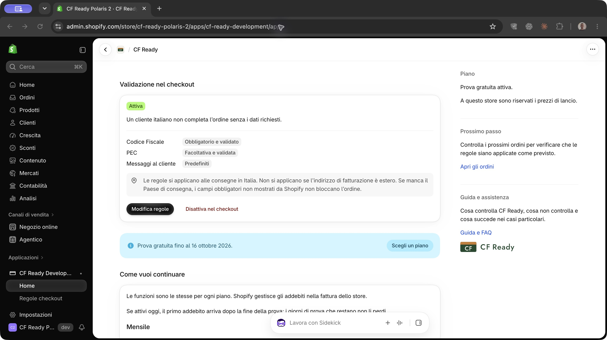
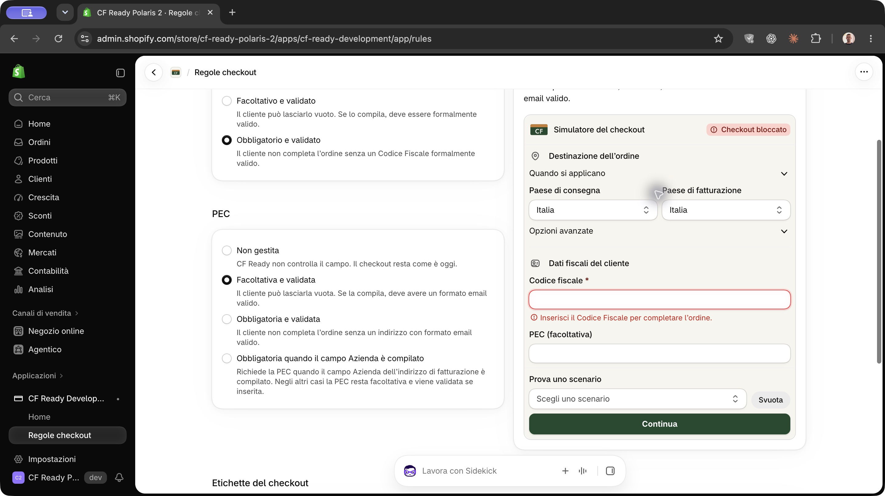
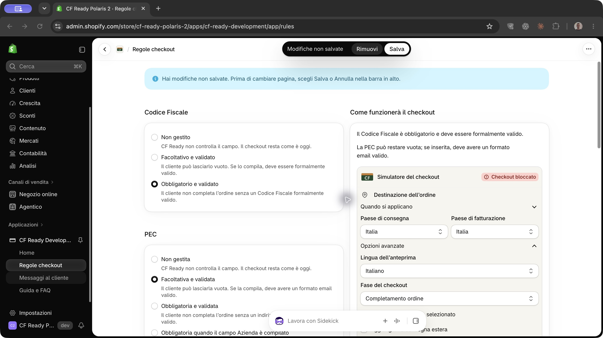
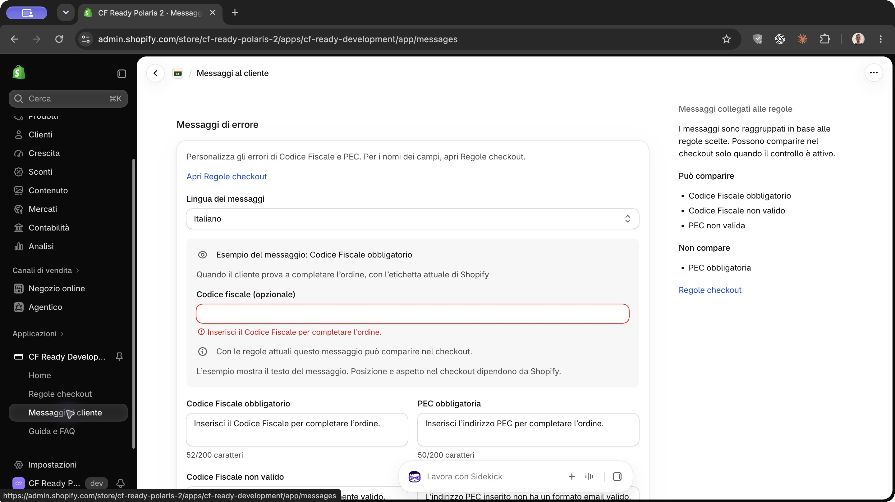
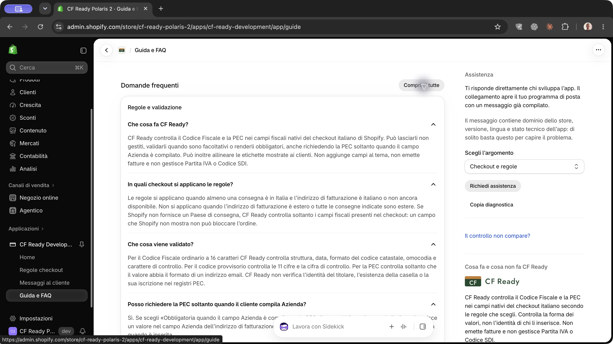
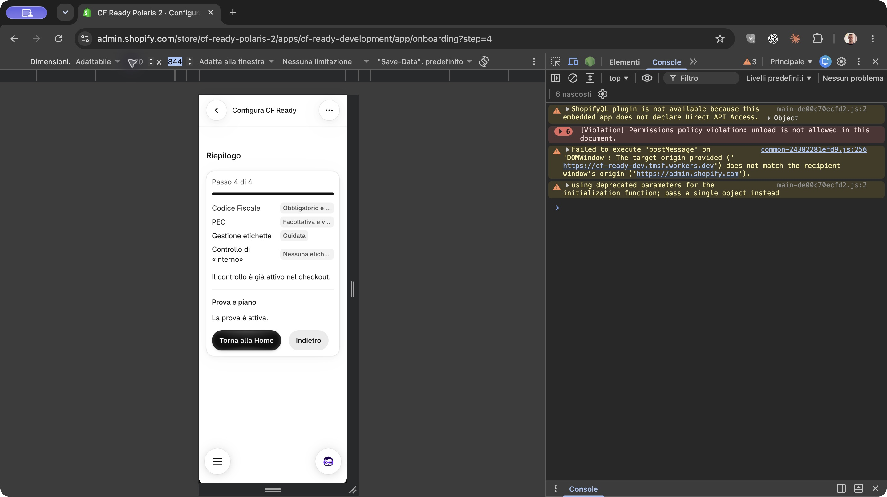
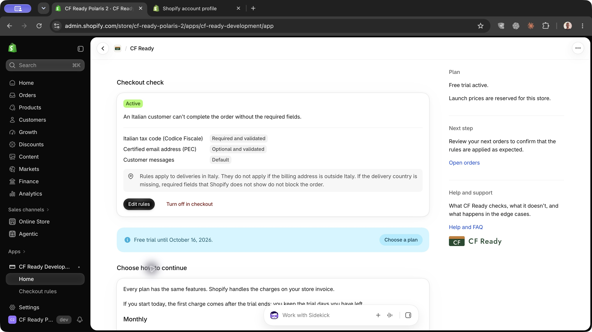

# Audit grafico di CF Ready 2.0 con Polaris 2 (Claude)

**Stato:** ricontrollo indipendente in Chrome del 4 ottobre 2026 (§28), seguito dalla pubblicazione e verifica italiana di F-2 su Development 2.0.15, commit `56d59c5` (§29). Dei 50 ID: **38 risolti, 6 parziali, 6 accettati per decisione**. Il difetto del testo della bozza è corretto; restano i badge troncati su mobile (O-5), le verifiche live residue e due checkout IT/EN con etichette da verificare in ciascuno dei due store Development osservati. Il ricontrollo live inglese del fix F-2 è escluso su richiesta dell’owner. Non è confermata una chiusura senza punti residui. Le sezioni 1–27 conservano le osservazioni e le prove dei giri precedenti; §28 e §29 riportano lo stato corrente.
**Data:** 3 ottobre 2026, circa 20:30-21:45 CEST, compresi il ricontrollo e la prova della conferma etichette
**Ambiente:** Development, `cf-ready-polaris-2.myshopify.com` (preview
`new_admin_design`), app `cf-ready-development`
**Codice del giro originale:** `develop` a `e68cac8` (`package.json` 2.0.4). La
versione live non è stata letta dalla diagnostica (sezione 16)
**Strumento:** Chrome con la sessione Admin dell'owner, scheda visibile, a
1440, 1054 e 500 px reali
**Metodo:** [audit di Claude del 1 ottobre](2026-10-01-audit-ui-ux-production.md)
**Prove:** [evidence/2026-10-03-polaris-2-claude](evidence/2026-10-03-polaris-2-claude)

## 1. Metodo e perimetro

Il fuoco è la resa grafica dell'intera app nel nuovo Admin, non solo ciò che
la migrazione a Polaris 2 ha cambiato: box, spaziature, colori, tipografia,
gerarchia dei titoli, badge, bottoni, icone, testi e armonia con le pagine
native. Le funzioni esistenti non sono state valutate. I salvataggi sono
serviti solo a far comparire stati visivi (toast, save bar, badge, conferme,
pannelli); i difetti funzionali notati di passaggio stanno in una riga ciascuno
nella sezione 14.

Tre giri, come il 1 ottobre:

1. osservazione delle quattro pagine e dell'onboarding nello stato iniziale;
2. interazioni senza scritture: pannelli, disclosure, simulatore, FAQ,
   diagnosi, bozza delle regole poi scartata;
3. scritture temporanee con ripristino: regole, attivazione, messaggi,
   lingua del profilo (sezione 15).

Un ricontrollo finale ha confrontato ogni finding con la propria cattura e con
il codice, ha cercato le superfici non aperte (sezione 16) e ha corretto le
misure non confermate.

Le misure sono in px CSS, lette da screenshot a 1:1 e da ingrandimenti. Il
documento dell'app è un iframe cross-origin: niente letture DOM interne, quindi
le misure hanno una tolleranza di circa 2 px. Le cause indicate nel codice sono
state verificate su `e68cac8`.

Severità: **Alta** confonde un flusso con effetti sul checkout; **Media**
degrada chiarezza o coerenza in modo evidente; **Bassa** è rifinitura. La
confidenza indica quanto il problema è dimostrato dalle prove.

## 2. Criteri Polaris 2 e confronto nativo

Fonti consultate il 3 ottobre:

- [Guida Polaris 2](https://shopify.dev/docs/apps/build/app-home/polaris2):
  tutto ciò che Polaris non controlla resta com'è, e i valori CSS copiati dai
  vecchi token restano ancorati alla vecchia palette; gli elementi fissi in basso
  devono rispettare `--shopify-safe-area-inset-bottom`.
- [Layout](https://shopify.dev/docs/apps/design/layout): griglia a 4 px,
  contenuti dentro contenitori, al massimo un'azione primaria per card, densità
  costante nella stessa pagina.
- [Visual design](https://shopify.dev/docs/apps/design/visual-design): verde
  solo per stati positivi o completati, arancione per attenzione non
  bloccante, rosso solo per blocchi o errori; gerarchia data da dimensione e
  peso; icone coerenti negli elenchi ripetuti.

Confronto con le pagine native dello stesso store:

| Elemento | Admin nativo | CF Ready | Esito |
| --- | --- | --- | --- |
| Colonna laterale | Scheda prodotto: sezioni senza card, titoli grigi, divisori sottili ([03](evidence/2026-10-03-polaris-2-claude/03-nativo-prodotto-aside.jpg)) | Stesso modello in Home, Messaggi, Guida | Coerente |
| Titolo di pagina | Grande titolo nel contenuto, colonna laterale allineata a esso | Titolo solo nella barra Admin; la colonna laterale parte 25 px sopra il primo titolo di sezione | P2-T2 |
| Sezioni impostazioni | Titolo e descrizione fuori dalla card, card bianca ([04](evidence/2026-10-03-polaris-2-claude/04-nativo-impostazioni-checkout.jpg)) | Titoli fuori dalla card in tre pagine su quattro | P2-T3 |
| Badge di stato | «Attivo» verde, «Novità» neutro | Ciano per regole configurate, verde per «Può comparire» | P2-T4 |
| Save bar, toast, modali | Nativi | Nativi in tutte le pagine | Coerente |
| Nome della pagina impostazioni | «Check-out» | «Impostazioni → Checkout» | R-10 |

## 3. Priorità

La matrice per ID di §28.4 è il riferimento corrente, riportato anche nella
colonna **Stato attuale** delle tabelle. Le descrizioni conservano il problema
iniziale; le sezioni successive documentano le prove dei diversi giri.
**Risolto** indica chiusura comprovata nel percorso indicato, **Parziale** un
difetto o una verifica live ancora aperti e **Accettato per decisione** una
scelta conservata. Positivi e informativi non sono difetti.

| ID | Problema | Severità | Confidenza | Stato attuale |
| --- | --- | --- | --- | --- |
| H-5 | Badge verde «Attiva» con nessun campo configurato | Media | Alta | **Parziale** (§28) |
| P2-T4 | Toni dei badge non semantici: ciano identico al banner commerciale, verde per una possibilità | Media | Alta | **Risolto** (§28) |
| R-1 | In Regole la colonna destra resta vuota per almeno tre schermate quando si apre «Testi del checkout» | Media | Alta | **Accettato per decisione** (§28) |
| R-2 | Simulatore con due fondi non tematizzati nello stesso riquadro | Media | Alta | **Accettato per decisione** (§28) |
| H-2 | Azioni della card principale: primario e critico si scambiano posto e peso al cambio di stato | Media | Alta | **Risolto** (§28) |
| P2-T1 | Tre larghezze e griglie di pagina diverse: il bordo sinistro si sposta di 61 px tra Home e Regole | Media | Alta | **Accettato per decisione** (§28) |
| P2-T3 | Gerarchia dei titoli incoerente tra pagine e dentro simulatore e onboarding | Media | Alta | **Risolto** (§28) |
| M-1, N-1 | Esempi dei messaggi indistinguibili dai campi di testo a 500 px; un campo nativo in sola lettura con errore li renderebbe fedeli al checkout | Media | Alta | **Risolto** (§28) |
| N-2 | Il confronto tra etichetta attuale e nuova è una griglia CSS che spezza le citazioni; `s-table` lo risolve in modo nativo | Media | Alta | **Risolto** (§28) |
| R-6, R-7 | Pannello etichette: righe valore mal raggruppate, citazioni spezzate, doppio badge con stati opposti | Media | Alta | **Risolto** (§28) |
| G-2, G-3 | FAQ senza gerarchia domanda-risposta; risultati della diagnosi poco leggibili | Media | Alta | **Risolto** (§28) |

## 4. Problemi trasversali

| ID | Problema | Severità | Confidenza | Stato attuale |
| --- | --- | --- | --- | --- |
| P2-T1 | Tre impianti di pagina. Home, Messaggi e Guida usano `s-page` con colonna laterale (contenuto da x 284, colonna principale 760 px, laterale 280 px). Regole usa una griglia custom 50/50 senza colonna laterale (`RulesLayout.css:127`, contenuto da x 345, due colonne da 476 px). L'onboarding usa `inlineSize="small"` (card 785 px, da y 75 invece di 113). Passando da una pagina all'altra il bordo sinistro si sposta di 61 px, e nell'onboarding la prima riga sta 38 px più in alto che altrove. Prove [01](evidence/2026-10-03-polaris-2-claude/01-home-disattivata-1440.jpg), [05](evidence/2026-10-03-polaris-2-claude/05-regole-iniziale-1440.jpg), [19](evidence/2026-10-03-polaris-2-claude/19-onboarding-passo-1.jpg) | Media | Alta | **Accettato per decisione** (§28) |
| P2-T2 | Colonna laterale non allineata. In Home, Messaggi e Guida il primo titolo laterale («Piano», «Messaggi collegati alle regole», «Assistenza») sta a y 88 e il titolo della prima sezione a y 113. Nella scheda prodotto nativa la colonna laterale è allineata al titolo di pagina, che in CF Ready non c'è nel contenuto | Bassa | Alta | **Accettato per decisione** (§28) |
| P2-T3 | Gerarchia dei titoli incoerente. I titoli di sezione stanno fuori dalla card in Home, Regole, Messaggi e FAQ, ma dentro la card in «Il controllo non compare?» ([16](evidence/2026-10-03-polaris-2-claude/16-guida-diagnosi-card.jpg)), nei passi dell'onboarding e nel simulatore. Nell'onboarding «Benvenuto in CF Ready» è più leggero di «Cosa fa e cosa non fa». Nel simulatore i titoli di gruppo con icona hanno peso normale e le etichette dei campi sono semibold. I sottotitoli laterali sono semibold in Guida («Dove si configura») e quasi uguali alle righe in Messaggi («Codice Fiscale», «PEC») | Media | Alta | **Risolto** (§28) |
| P2-T4 | Toni dei badge non semantici. «Obbligatorio e validato» e «Obbligatoria per aziende» sono ciano saturo, lo stesso tono del banner della prova, anche con validazione disattivata ([29](evidence/2026-10-03-polaris-2-claude/29-home-regole-salvate-disattivata.jpg)). «Può comparire» è verde ([32](evidence/2026-10-03-polaris-2-claude/32-messaggi-puo-comparire.jpg)), ma descrive una possibilità, non un esito positivo. «Aggiornati» verde convive con «Da configurare» arancione nello stesso pannello ([08](evidence/2026-10-03-polaris-2-claude/08-regole-testi-checkout-da-configurare.jpg)). «Consigliato» è neutro e non dà rilievo al piano annuale | Media | Alta | **Risolto** (§28) |
| P2-T5 | Logo in quattro forme. Lockup da 130 px centrato in fondo alla colonna laterale della Home, mentre i testi sopra sono allineati a sinistra. Lockup da circa 160 px a sinistra sotto un titolo grigio in Guida. `s-avatar` con la favicon e un quadrato crema attorno nel simulatore e nell'onboarding | Bassa | Alta | **Risolto** (§28) |
| P2-T6 | Virgolette miste in italiano. «» per le etichette Shopify, ma “ ” in «Nel campo “Interno”», «Controllo di “Interno”», nella procedura manuale («“Campo dopo il salvataggio”») e nella FAQ «Come devo gestire il campo “Interno”?». La decisione T7 del 1 ottobre ha scelto «» | Bassa | Alta | **Risolto** (§28) |
| P2-T7 | Ripetizioni che appesantiscono la pagina. «Nessun campo è configurato: il checkout resta invariato.» compare due volte nella stessa card di Regole. Il paragrafo «Le regole si applicano alle consegne in Italia…» è identico in Home, simulatore e onboarding (passi 1 e 3). A 500 px la nota «L'esempio mostra il testo del messaggio…» compare cinque volte in Messaggi. Nel passo 3 «Con le regole attuali questo messaggio non compare» si ripete quattro volte accanto al badge «Non compare», che dice la stessa cosa | Media | Alta | **Risolto** (§28) |
| P2-T8 | Raggruppamento per vicinanza assente. Nel pannello etichette le righe «Campo attuale» e «Campo dopo il salvataggio» distano 16 px tra loro e 16 px dal campo successivo. Nei risultati della diagnosi testo, link e risultato seguente sono equidistanti (16 px). Nel passo 2 dell'onboarding «Codice Fiscale» sta 40 px sopra i suoi radio e 38 px sotto il gruppo precedente | Media | Alta | **Risolto** (§28) |
| P2-T9 | Disclosure custom disallineati. Il chevron di «Come completare la verifica manuale» sta 16 px più a sinistra di quelli del pannello che lo contiene (x 762 contro 778). Nel simulatore «Quando si applicano» e «Opzioni avanzate» partono dall'icona (x 853) e non dal testo del gruppo (x 885). I chevron sono disegnati in CSS con bordi da 1,5 px, mentre select e controlli nativi usano le icone Polaris | Bassa | Alta | **Risolto** (§28) |

### 4.1 Componenti da sostituire con alternative native

Il catalogo di riferimento e l'inventario dei componenti custom sono nella
sezione 18. Queste tre sostituzioni risolvono problemi osservati; la loro resa
nel nuovo Admin non è ancora stata provata.

| ID | Problema | Severità | Confidenza | Stato attuale |
| --- | --- | --- | --- | --- |
| N-1 | Gli esempi di errore in Messaggi e nel passo 3 dell'onboarding sono box custom (`CustomerMessagesPreview.css`, classe `.customer-messages-preview__error`): testo rosso in un riquadro bianco bordato, che non somiglia al checkout e su mobile si confonde con i campi modificabili (M-1, O-4). Polaris 2 offre `s-text-field` con `readOnly` ed `error`: con `label` uguale all'etichetta Shopify attuale e `error` uguale al messaggio, riproduce campo ed errore in linea come nel checkout reale, senza CSS. Da provare che il campo in sola lettura non sembri modificabile e che l'errore resti rosso | Media | Alta sul problema, Media sulla resa | **Risolto** (§28) |
| N-2 | Il confronto «Campo attuale / Campo dopo il salvataggio» è una griglia CSS (`.checkout-label-context__row`, `RulesLayout.css`) con una colonna valori di circa 270 px: spezza le citazioni a metà, non separa i campi e ripete le etichette su ogni riga (R-6, P2-T8). `s-table` con colonne Campo, Attuale, Dopo il salvataggio allinea i valori, separa le righe in modo nativo e su mobile diventa da sola un elenco chiave-valore (`variant="auto"`) | Media | Alta sul problema, Media sulla resa | **Risolto** (§28) |
| N-3 | Nel simulatore e nel passo 1 dell'onboarding il logo è un `s-avatar` con la favicon: il componente è pensato per persone e aggiunge un fondo chiaro attorno al marchio (R-5). `s-image` a dimensione fissa, come il lockup della Home, mostra il logo senza fondo e unifica il trattamento (P2-T5) | Bassa | Alta | **Risolto** (§28) |

## 5. Home

| ID | Problema | Severità | Confidenza | Stato attuale |
| --- | --- | --- | --- | --- |
| H-1 | Nella card principale il banner della prova è seguito da 33 px vuoti prima del divisore, che dista poi 25 px dalla prima riga. La data della prova compare tre volte nella prima schermata: banner, colonna laterale e testo «primo addebito il 17 ottobre» ([01](evidence/2026-10-03-polaris-2-claude/01-home-disattivata-1440.jpg), [02](evidence/2026-10-03-polaris-2-claude/02-home-piani-1440.jpg)) | Media | Alta | **Risolto** (§28) |
| H-2 | Da disattivata «Modifica regole» è secondario a sinistra e «Attiva nel checkout» primario a destra. Da attiva «Modifica regole» diventa primario a sinistra e «Disattiva nel checkout» compare a destra in rosa critico, con lo stesso peso visivo. Il primario cambia posizione e l'azione distruttiva diventa la più evidente dopo il primario ([30](evidence/2026-10-03-polaris-2-claude/30-home-attiva.jpg)) | Media | Alta | **Risolto** (§28) |
| H-3 | Righe campo-stato: la colonna delle etichette si adatta al testo più lungo, da «Messaggi al cliente» in italiano a «Italian tax code (Codice Fiscale)» in inglese, senza tagli ([43](evidence/2026-10-03-polaris-2-claude/43-home-en-1440.jpg)) | Informativo | Alta | **Informativo** |
| H-4 | Card dei piani: il nome del piano è testo normale da 14 px sopra un prezzo da circa 24 px. Solo «Un solo pagamento» ha una riga descrittiva, quindi le tre righe hanno altezze diverse. Il periodo («al mese») sta 12 px dopo il prezzo. «Consigliato» è neutro mentre «Attiva l'annuale» è l'unico primario della card | Bassa | Media | **Risolto** (§28) |
| H-5 | Con validazione attiva e nessun campo configurato la card mostra il badge verde «Attiva» sopra «Nessun campo è configurato: il checkout resta invariato.» ([49](evidence/2026-10-03-polaris-2-claude/49-home-attiva-senza-campi-conferma.jpg)). Il verde comunica una protezione in corso che non esiste | Media | Alta | **Parziale** (§28) |
| H-6 | «Prossimo passo» cambia struttura con lo stato: link «Regole checkout» da disattivata, solo testo con regole pronte, «Apri gli ordini» da attiva. La colonna laterale cambia altezza e ritmo a ogni stato ([29](evidence/2026-10-03-polaris-2-claude/29-home-regole-salvate-disattivata.jpg)) | Bassa | Media | **Parziale** (§28) |

## 6. Regole checkout

### 6.1 Layout ed etichette

| ID | Problema | Severità | Confidenza | Stato attuale |
| --- | --- | --- | --- | --- |
| R-1 | La griglia 50/50 mette «Etichette del checkout» sotto le regole nella colonna sinistra ([06](evidence/2026-10-03-polaris-2-claude/06-regole-etichette-chiuse.jpg)). Con «Testi del checkout» e la procedura aperti la colonna sinistra si allunga per almeno tre schermate da 666 px e la destra resta bianca, perché il simulatore non è fisso ([26](evidence/2026-10-03-polaris-2-claude/26-regole-testi-da-verificare.jpg), [27](evidence/2026-10-03-polaris-2-claude/27-regole-procedura-manuale.jpg)) | Media | Alta | **Accettato per decisione** (§28) |
| R-6 | Righe valore del pannello: colonna valori di circa 270 px, quindi «Campo dopo il salvataggio: «Codice / fiscale»» va a capo dentro le virgolette. «Predefinito per questa lingua» fa da intestazione sia in «Campo Interno» (senza badge, con una riga «Facoltativo … «Interno, scala, ecc.»») sia in «Testi del checkout» (con badge), con significati diversi ([07](evidence/2026-10-03-polaris-2-claude/07-regole-campo-interno-aperto.jpg), [26](evidence/2026-10-03-polaris-2-claude/26-regole-testi-da-verificare.jpg)) | Media | Alta | **Risolto** (§28) |
| R-7 | Doppio badge: «Da verificare» nel sommario e di nuovo accanto a «Predefinito per questa lingua». Nello stato iniziale il sommario è «Da configurare» arancione e l'interno «Aggiornati» verde ([08](evidence/2026-10-03-polaris-2-claude/08-regole-testi-checkout-da-configurare.jpg), [09](evidence/2026-10-03-polaris-2-claude/09-regole-testi-checkout-dettagli.jpg)) | Media | Alta | **Risolto** (§28) |
| R-8 | Coda tecnica del pannello: «Modalità», «Ultima lettura» e il conteggio sono paragrafi semplici. «Rileggi i campi da Shopify» sta circa 10 px sotto il testo, contro i 16 px del resto. Il bottone disabilitato «Conferma verifica manuale» e «Mantieni le mie etichette» sono due secondari impilati di larghezze diverse sotto un banner giallo ([28](evidence/2026-10-03-polaris-2-claude/28-regole-banner-avviso-annidato.jpg)) | Bassa | Alta | **Risolto** (§28) |
| R-9 | Quattro livelli annidati (card, pannello bordato, disclosure, banner) e una procedura numerata di nove passi densi in una colonna da 410 px | Media | Media | **Risolto** (§28) |
| R-13 | Togliendo il controllo guidato compare un banner giallo dentro il pannello, sopra la spiegazione dei mercati: aggiunge una cornice colorata dentro card e pannello (R-9) e sposta tutto il contenuto di circa 100 px ([56](evidence/2026-10-03-polaris-2-claude/56-regole-avviso-disattivazione-guidato.jpg)) | Bassa | Alta | **Risolto** (§28) |
| R-10 | Il testo dice «Impostazioni → Checkout», ma nell'Admin italiano la pagina si chiama «Check-out» ([04](evidence/2026-10-03-polaris-2-claude/04-nativo-impostazioni-checkout.jpg)) | Bassa | Alta | **Risolto** (§28) |

### 6.2 Simulatore

| ID | Problema | Severità | Confidenza | Stato attuale |
| --- | --- | --- | --- | --- |
| R-2 | Due fondi nello stesso riquadro: verde `#f1f5ef` impostato inline (`CheckoutSimulator.tsx:154`) per la parte superiore e `s-box background="subdued"` grigio per «Prova uno scenario», senza separatore. Il riquadro vuoto «Nessun campo è configurato» è grigio su verde. Il verde è un valore fisso che non segue il tema, il caso che la guida Polaris 2 segnala ([05](evidence/2026-10-03-polaris-2-claude/05-regole-iniziale-1440.jpg), [12](evidence/2026-10-03-polaris-2-claude/12-simulatore-checkout-bloccato.jpg)) | Media | Alta | **Accettato per decisione** (§28) |
| R-3 | Gerarchia invertita: «Destinazione dell'ordine» e «Dati fiscali del cliente» (titoli con icona) hanno peso normale, «Paese di consegna» e «Codice fiscale» (etichette) sono semibold. «Prova uno scenario» è testo normale come le descrizioni | Media | Alta | **Risolto** (§28) |
| R-4 | «Continua» è un bottone custom (`#20492f`, raggio 9 px, 13 px, peso 650) accanto a «Svuota», che è Polaris: nella stessa riga convivono due sistemi di bottoni. Il verde imita il checkout ed è una scelta deliberata; il problema è l'accostamento | Bassa | Media | **Accettato per decisione** (§28) |
| R-5 | Il logo nell'intestazione è un `s-avatar` con la favicon: attorno al marchio compare un quadrato crema chiaro, visibile anche nel passo 1 dell'onboarding | Bassa | Media | **Risolto** (§28) |
| R-12 | Quando nelle opzioni avanzate Shopify non mostra il campo Codice Fiscale, il gruppo «Dati fiscali del cliente» resta con titolo e icona ma senza campi né spiegazione: subito sotto c'è la nota sulle etichette ([52](evidence/2026-10-03-polaris-2-claude/52-simulatore-gruppo-dati-fiscali-vuoto.jpg), [53](evidence/2026-10-03-polaris-2-claude/53-simulatore-opzioni-avanzate.jpg)) | Bassa | Alta | **Risolto** (§28) |
| R-11 | Errore in linea, focus sul campo, badge «Checkout bloccato» con icona e scorrimento automatico al campo funzionano e si leggono bene ([11](evidence/2026-10-03-polaris-2-claude/11-simulatore-errore-in-linea.jpg)) | Positivo | Alta | **Positivo** |

## 7. Messaggi al cliente

| ID | Problema | Severità | Confidenza | Stato attuale |
| --- | --- | --- | --- | --- |
| M-1 | L'esempio è un box bianco con bordo e testo rosso scuro, senza icona né campo: non somiglia né al checkout né a un errore Polaris. A 500 px gli esempi locali hanno sfondo, bordo e raggio identici ai campi di testo e si distinguono solo per il colore del testo ([39](evidence/2026-10-03-polaris-2-claude/39-messaggi-500-esempi-locali.jpg)) | Media | Alta | **Risolto** (§28) |
| M-2 | La nota «L'esempio mostra il testo del messaggio…» sta fuori dal riquadro grigio dell'esempio, tra esempio e campi, quindi non è chiaro a cosa si riferisca ([13](evidence/2026-10-03-polaris-2-claude/13-messaggi-top-1440.jpg), [14](evidence/2026-10-03-polaris-2-claude/14-messaggi-campi-1440.jpg)) | Bassa | Alta | **Risolto** (§28) |
| M-3 | Spaziatura interna del riquadro esempio non uniforme: lo spazio tra il titolo con l'icona e la prima riga è maggiore di quello tra le righe seguenti. «Messaggio selezionato» con badge ripete il nome del campo che ha il focus | Bassa | Media | **Risolto** (§28) |
| M-4 | Colonna laterale: quattro badge identici («Non compare» grigi oppure «Può comparire» verdi) con sottotitoli di peso simile alle righe; il blocco comunica poco a colpo d'occhio | Bassa | Media | **Risolto** (§28) |
| M-5 | La barra di Sidekick copre il campo in fondo mentre lo si modifica a 1440×666 ([51](evidence/2026-10-03-polaris-2-claude/51-messaggi-sidekick-sul-campo.jpg)). È un elemento dell'host; la pagina ha margine sufficiente solo a fine scorrimento | Bassa | Media | **Accettato per decisione** (§28) |

## 8. Guida e FAQ

| ID | Problema | Severità | Confidenza | Stato attuale |
| --- | --- | --- | --- | --- |
| G-1 | Le domande hanno un rientro di 6 px rispetto ai titoli di gruppo (x 306 contro 300); i divisori partono da 300 ([15](evidence/2026-10-03-polaris-2-claude/15-guida-top-1440.jpg)) | Bassa | Alta | **Risolto** (§28) |
| G-2 | La risposta ha peso, colore e dimensione della domanda; a 1440 px le righe arrivano a circa 120 caratteri ([18](evidence/2026-10-03-polaris-2-claude/18-guida-faq-espanse.jpg)) | Media | Alta | **Risolto** (§28) |
| G-3 | Risultati della diagnosi: l'icona informativa è nera mentre avvisi e successi sono colorati; tre link identici «Regole checkout»; ogni link è equidistante dal proprio testo e dal risultato seguente; l'elenco non è contenuto e non ha un riepilogo ([17](evidence/2026-10-03-polaris-2-claude/17-guida-diagnosi-risultati.jpg)) | Media | Alta | **Risolto** (§28) |
| G-4 | Assistenza: tre bottoni a tutta larghezza impilati in 280 px, con un primario nero molto pesante, poi un divisore e un bottone con lente per un salto interno. A 500 px la colonna laterale va in fondo, dopo la card di diagnosi, quindi quel salto porta verso l'alto ([40](evidence/2026-10-03-polaris-2-claude/40-guida-500-aside.jpg)) | Bassa | Media | **Risolto** (§28) |

## 9. Onboarding

| ID | Problema | Severità | Confidenza | Stato attuale |
| --- | --- | --- | --- | --- |
| O-1 | Gerarchia: «Benvenuto in CF Ready» è più leggero di «Cosa fa e cosa non fa». Nel passo 2 «Codice Fiscale» e «PEC» sono titoli di gruppo con peso normale, sotto «Scegli cosa controllare» semibold ([19](evidence/2026-10-03-polaris-2-claude/19-onboarding-passo-1.jpg), [20](evidence/2026-10-03-polaris-2-claude/20-onboarding-passo-2.jpg)) | Media | Alta | **Risolto** (§28) |
| O-2 | Divisore prima di «Campo Interno» ma non prima di «PEC» nello stesso passo | Bassa | Alta | **Risolto** (§28) |
| O-3 | Il riquadro «Etichette proposte» scrive «Italiano: Mantieni il testo attuale, Mantieni il testo attuale» senza nominare i campi ([21](evidence/2026-10-03-polaris-2-claude/21-onboarding-passo-2-fondo.jpg)) | Media | Alta | **Risolto** (§28) |
| O-4 | Passo 3: «Quando si applicano» è un elenco puntato con una sola voce; i quattro esempi sono box bianchi bordati su card bianca, diversi dal riquadro grigio di Messaggi ([22](evidence/2026-10-03-polaris-2-claude/22-onboarding-passo-3.jpg)) | Bassa | Alta | **Risolto** (§28) |
| O-5 | Passo 4: il riepilogo usa testo semplice per gli stessi stati che la Home mostra con badge; tre bottoni con il primario in mezzo ([23](evidence/2026-10-03-polaris-2-claude/23-onboarding-passo-4.jpg)) | Bassa | Alta | **Parziale** (§28) |
| O-6 | «Configurazione completata» ha il titolo fuori dalla card, mentre i passi lo hanno dentro; il bottone dice «Vai alla home» con l'iniziale minuscola ([24](evidence/2026-10-03-polaris-2-claude/24-onboarding-completata.jpg)) | Bassa | Alta | **Parziale** (§28) |

## 10. Conferme e feedback

| ID | Risultato | Severità | Confidenza | Stato attuale |
| --- | --- | --- | --- | --- |
| F-1 | Save bar, toast «Regole salvate.», «Messaggi salvati.», «Validazione attivata/disattivata nel checkout.» e le due finestre di conferma sono nativi, con critico rosso e annullamento neutro ([10](evidence/2026-10-03-polaris-2-claude/10-regole-bozza-save-bar.jpg), [25](evidence/2026-10-03-polaris-2-claude/25-regole-toast-salvate.jpg), [33](evidence/2026-10-03-polaris-2-claude/33-messaggi-toast-salvati.jpg), [31](evidence/2026-10-03-polaris-2-claude/31-home-conferma-disattivazione.jpg), [34](evidence/2026-10-03-polaris-2-claude/34-messaggi-conferma-ripristino.jpg)) | Positivo | Alta | **Positivo** |
| F-3 | Dopo un salvataggio con etichette da verificare compare in cima a Regole un banner di avviso a tutta larghezza, «Regole salvate. Le etichette richiedono attenzione.», con il bottone «Mostra le etichette» e 16 px di distacco dalle sezioni ([55](evidence/2026-10-03-polaris-2-claude/55-regole-banner-etichette-attenzione.jpg)). È coerente con la decisione T13 del 1 ottobre; il banner sparisce appena si apre una nuova bozza | Positivo | Alta | **Positivo** |
| F-4 | La finestra «Conferma etichette» (`AutomaticLabelsConfirmModal.tsx`) non compare in questo store: attivando il controllo guidato con Codice Fiscale obbligatorio, «Salva» scrive subito, perché con i mercati non univoci le etichette sono solo da verificare a mano e non ci sono scritture automatiche da confermare (`app.rules.tsx:244`). L'unico riscontro visivo del salvataggio è la barra di caricamento dell'Admin, poi il banner F-3 ([54](evidence/2026-10-03-polaris-2-claude/54-regole-salva-guidato-senza-conferma.jpg)). La resa della finestra resta non verificata | Informativo | Alta | **Informativo** |
| F-2 | Con una bozza aperta in Regole, un clic su «Messaggi al cliente» nella navigazione non produce cambiamenti visibili nello screenshot: la pagina resta e la save bar non cambia aspetto ([50](evidence/2026-10-03-polaris-2-claude/50-regole-navigazione-con-bozza.jpg)). Il clic è stato inviato via script sul link dell'Admin: l'eventuale scossa animata della save bar non è stata catturata | Bassa | Media | **Risolto** (§29, live IT; EN escluso dall’owner) |

## 11. Responsive

- **500 px reali** (Chrome non scende sotto): nessuno scorrimento orizzontale
  osservato, colonne impilate, colonna laterale dopo il contenuto come nella
  scheda nativa ([35](evidence/2026-10-03-polaris-2-claude/35-home-500.jpg),
  [36](evidence/2026-10-03-polaris-2-claude/36-home-500-aside.jpg)).
- **RW-1** (Bassa, Media): la barra inferiore dell'host (menu e Sidekick,
  circa 100 px opachi) copre le azioni della card principale nella prima vista
  della Home. Sono raggiungibili scorrendo.
  **Stato attuale: Parziale** · Azioni visibili nello stato corrente a
  500×844 e 390×844 nel giro precedente; riconfermate a 390×844 in §28.
  Non copre ogni stato e altezza dell’host.
- **RW-2** (Bassa, Media): in Regole il simulatore finisce dopo tutte le
  etichette ([38](evidence/2026-10-03-polaris-2-claude/38-regole-500-simulatore.jpg)).
  A 500 px il badge di «Testi del checkout» va su una riga propria senza tagli
  ([37](evidence/2026-10-03-polaris-2-claude/37-regole-500-etichette.jpg)).
  **Stato attuale: Risolto** · Simulatore prima delle etichette, riconfermato
  a 390 px nel giro corrente (§28).
- **1054 px**: Home e Regole tengono le due colonne; il riquadro della località
  in Home va su quattro righe in una card da 440 px
  ([41](evidence/2026-10-03-polaris-2-claude/41-home-1054.jpg),
  [42](evidence/2026-10-03-polaris-2-claude/42-regole-1054.jpg)).
- Nella finestra a 500 px compaiono anche M-1 e P2-T7.

## 12. Inglese

Profilo salvato temporaneamente in English; percorse Home, Regole, Messaggi e
Guida a 1440 px. Nessun testo italiano residuo nell'app; la cornice Admin
mantiene alcune voci nella lingua precedente per cache.

| ID | Problema | Severità | Confidenza | Stato attuale |
| --- | --- | --- | --- | --- |
| EN-1 | Titolo «How you want to continue»: sgrammaticato come titolo; per esempio «How do you want to continue?» o «Choose how to continue» ([44](evidence/2026-10-03-polaris-2-claude/44-home-en-piani.jpg)) | Bassa | Alta | **Risolto** (§28) |
| EN-2 | Badge «Set up required»: come sostantivo è «Setup required» ([45](evidence/2026-10-03-polaris-2-claude/45-regole-en-etichette.jpg)) | Bassa | Alta | **Parziale** (§28) |
| EN-3 | Lo stesso campo ha tre nomi: «Italian tax code (Codice Fiscale)» in Home e Regole, «Tax code» nella colonna laterale e nel badge di Messaggi ([46](evidence/2026-10-03-polaris-2-claude/46-messaggi-en.jpg)) | Bassa | Media | **Risolto** (§28) |
| EN-4 | «Frequently asked questions» completo; etichette lunghe senza troncamenti ([47](evidence/2026-10-03-polaris-2-claude/47-guida-en.jpg)) | Positivo | Alta | **Positivo** |

## 13. Aspetti riusciti

- Card, ombre, raggi, font, primari neri e controlli seguono il nuovo Admin
  nelle parti costruite con i componenti Polaris.
- La colonna laterale senza card coincide con il modello della scheda prodotto
  nativa.
- Radio con descrizioni, select, save bar, toast e modali sono nativi e
  coerenti tra le pagine.
- I titoli di sezione fuori dalla card, in tre pagine su quattro, seguono le
  impostazioni native.
- Il simulatore dà un esito chiaro (badge con icona, errore in linea, focus).

## 14. Note funzionali di passaggio

Non valutate oltre, una riga ciascuna:

- La validazione si può attivare e risulta «Attiva» con entrambi i campi non
  gestiti (H-5 ne descrive la resa).
- In Messaggi l'esempio mostra l'etichetta Shopify «Codice fiscale (opzionale)»
  accanto all'errore di campo obbligatorio, perché le etichette non sono state
  aggiornate dopo il salvataggio delle regole.
- Con una bozza aperta, la navigazione dall'Admin resta ferma (F-2).
- L'attivazione del controllo guidato delle etichette si salva senza conferma
  quando non ci sono scritture automatiche (F-4).

## 15. Stato dello store dopo i test

Stato iniziale e finale coincidono: validazione disattivata, Codice Fiscale e
PEC non gestiti, messaggi predefiniti, prova fino al 16 ottobre 2026, campo
Interno facoltativo, gestione etichette disattivata, profilo in Italiano con
fuso Roma ([48](evidence/2026-10-03-polaris-2-claude/48-home-finale-ripristinata.jpg)).

Scritture eseguite e ripristinate, tra circa le 21:00 e le 21:30 CEST:

- **Regole:** salvate Codice Fiscale obbligatorio e PEC obbligatoria per aziende,
  poi di nuovo non gestiti. Una bozza precedente è stata scartata con «Rimuovi».
- **Validazione:** attivata e poi disattivata dalla Home, con la conferma critica.
- **Messaggi:** salvato il messaggio italiano «Codice Fiscale obbligatorio» con
  il suffisso « Grazie.», poi ripristinati e salvati i predefiniti.
- **Lingua del profilo:** English salvata e riletta. Al ripristino un
  salvataggio intermedio ha registrato «Indonesia (Beta)» per la selezione da
  tastiera della select di Shopify (come il 1 ottobre). Corretta subito in
  Italiano e riletta; fuso Roma invariato. Il primo tentativo di cambio lingua
  era stato bloccato dal controllo dei permessi di Claude Code ed è stato
  ripetuto su richiesta dell'owner.
- **Diagnosi:** «Aggiorna e verifica» eseguita una volta (21:02 CEST).
- **Onboarding:** percorso dal passo 1 a «Torna alla Home senza attivare» senza
  cambiare valori.
- **Ricontrollo:** due bozze in Regole (Codice Fiscale obbligatorio con il campo
  nascosto nel simulatore; controllo guidato delle etichette) scartate con
  «Rimuovi», senza salvataggi. Dopo lo scarto la pagina mostra di nuovo «Da
  configurare».
- **Conferma etichette, su richiesta dell'owner:** salvati Codice Fiscale
  obbligatorio e controllo guidato delle etichette (nessuna finestra, F-4),
  poi Codice Fiscale non gestito e controllo guidato tolto. Rilettura alle
  21:38 CEST: modalità «Disattivata», etichette Shopify invariate
  («Codice fiscale (opzionale)», «PEC (opzionale)»), stato «Da configurare»
  ([57](evidence/2026-10-03-polaris-2-claude/57-regole-etichette-ripristinate.jpg)).
  Nessuna etichetta è stata scritta su Shopify.

Tracce non annullabili: orari di salvataggio e lettura aggiornati, eventi di
telemetria di attivazione e disattivazione, ultima diagnosi registrata. Etichette
Shopify, campo Interno, mercati e piano non sono stati toccati. Non sono stati
premuti «Richiedi assistenza», «Copia diagnostica», «Rileggi i campi da
Shopify» o i bottoni dei piani.

## 16. Non verificato

- **Versione live:** non letta dalla diagnostica; il riferimento è il codice di
  `develop` a `e68cac8`.
- **390 px reali:** la finestra di Chrome non scende sotto 500 px; nessuna
  emulazione mobile.
- **Inglese a 500 px e onboarding in inglese.**
- **Checkout reale, stati di billing (piano attivo, scaduto, pagamento unico),
  gestione automatica delle etichette, ErrorBoundary.**
- **Finestre e stati non raggiungibili senza scritture:** conferma «Annulla
  rinnovo» (`PlanChoice.tsx:27`, solo con abbonamento attivo); ripristino delle
  etichette del campo Interno (`Address2CheckoutLabels.tsx:246`, solo con
  etichette ripristinabili); conferma della gestione automatica
  (`AutomaticLabelsConfirmModal.tsx`), che in questo store non compare perché
  non ci sono scritture automatiche (F-4); banner
  critico dei campi mancanti del simulatore (`CheckoutSimulator.tsx:417`,
  non comparso nella fase «Compilazione»); guida di configurazione e banner di
  check-in della Home (`SetupGuide.tsx`, `MerchantCheckIn.tsx`), legati a stati
  commerciali o di primo avvio diversi da quello dello store.
- **Tema scuro, zoom al 200%, screen reader.**
- **Misure DOM:** l'iframe è cross-origin, quindi le misure vengono dagli
  screenshot con tolleranza di circa 2 px.

## 17. Relazione con l'audit Codex dello stesso giorno

Il [report pubblicato con #628](2026-10-03-audit-ui-ux-development-2.0.md) e
i fix dei gruppi 1 e 2 erano già su `develop` durante questo giro. Sovrapposizioni:

| Questo audit | Codex | Stato osservato |
| --- | --- | --- |
| R-2, R-4 | V2-T1 | Il fallback dei pannelli è stato rimosso dal gruppo 1, ma il verde fisso del simulatore resta |
| R-7, R-9 | V2-R2, V2-R3 | «Da configurare» ha sostituito «Verifica manuale richiesta»; resta il doppio badge con stati opposti |
| M-1 | V2-M2 | Il titolo «Esempio del messaggio» c'è; l'esempio ora si confonde con i campi a 500 px |
| H-4 | V2-H2 | La card dei piani è stata modificata dal gruppo 2 (`PlanChoice.tsx`); restano nome del piano leggero e righe di altezze diverse |
| P2-T3 | V2-T2 | Titolo FAQ portato fuori dalla card; restano le altre incoerenze |
| EN-4 | V2-G1 | Risolto |

Gli altri findings di questo report non compaiono nel report Codex.

## 18. Componenti custom e alternative native

Inventario su `e68cac8`: 519 righe di CSS in otto file e markup HTML custom in
13 file dell'interfaccia. Catalogo di riferimento:
[App Home 2.0 RC web components](https://shopify.dev/docs/api/app-home/v2.0-rc/web-components).
Il catalogo non contiene accordion o disclosure. `s-text-field` supporta
`readOnly` ed `error`; `s-table` passa da tabella a elenco su mobile
(`variant="auto"`); lo slot `aside` di `s-page` esiste solo con
`inlineSize="base"`.

| Componente CF Ready | Dove | Alternativa nativa | Findings risolti | Raccomandazione |
| --- | --- | --- | --- | --- |
| Box dell'esempio errore (`CustomerMessagesPreview.css`, `.customer-messages-preview__error`) | Messaggi, esempi locali a 500 px, passo 3 dell'onboarding | `s-text-field` con `readOnly`, `label` uguale all'etichetta Shopify attuale ed `error` uguale al messaggio: riproduce campo ed errore in linea come nel checkout | N-1 (M-1, M-3, O-4, V2-M2) | **Sostituire**. Verificare nel nuovo Admin che `readOnly` mostri l'errore in rosso e non venga scambiato per un campo modificabile |
| Righe «Campo attuale / Campo dopo il salvataggio» (`.checkout-label-context__row`, griglia CSS) | Regole, «Testi del checkout» e «Campo Interno» | `s-table` con colonne Campo, Attuale, Dopo il salvataggio; su mobile diventa elenco chiave-valore | N-2 (R-6, parte di P2-T8) | **Sostituire** |
| Elenchi chiave-valore `.cf-data-list` / `.cf-data-row` (`ui-motion.css`, `app.onboarding.css`) | Colonna laterale di Messaggi, riepilogo del passo 4 | `s-query-container` con `s-grid` e `s-badge`, come le righe stato della Home (`HomeSections.tsx:112`) | M-4, O-5 | **Sostituire**, con lo stesso schema della Home |
| Logo con `s-avatar` e favicon | Intestazione del simulatore, passo 1 dell'onboarding | `s-image` con dimensione fissa, come il lockup della Home | N-3 (R-5, parte di P2-T5) | **Sostituire**. `s-avatar` è pensato per persone e aggiunge il fondo chiaro |
| `
` con chevron disegnato in CSS (`.cf-disclosure`, `.checkout-labels-disclosure__summary::before`) | FAQ, simulatore, pannelli etichette, procedura manuale | Nessun accordion nativo. Tenere `
` e mettere nel `summary` un `s-icon` `chevron-down`, con una sola regola di posizione | P2-T9 | **Tenere** il contenitore, **sostituire** il chevron |
| Procedura manuale in nove passi dentro un `
` annidato | Regole, «Testi del checkout» | `s-button` «Come completare la verifica» che apre un `s-modal` con `s-ordered-list` | R-9, parte di R-1 | **Valutare**: riduce l'annidamento e l'altezza della colonna sinistra |
| Fondo `#f1f5ef` inline e `s-box background="subdued"` | Simulatore | Un solo `s-box`, con fondo `subdued` oppure senza fondo | R-2 | **Sostituire** il colore fisso; la scelta del fondo è editoriale |
| Bottone «Continua» custom (`.checkout-simulator__button`) | Simulatore | `s-button variant="primary"` | R-4 | **Valutare**: il verde imita il checkout. Se resta, va tenuto distinto anche nel peso dagli `s-button` vicini |
| Griglia `.rules-layout` (`RulesLayout.css`) | Regole | `s-grid` con colonne responsive. Lo slot `aside` di `s-page` non basta, perché è largo circa 280 px | Non risolve da solo P2-T1 e R-1 | **Valutare** insieme a una diversa collocazione delle etichette, per esempio a tutta larghezza sotto la griglia |
| Elenco risultati della diagnosi (`.guide-diagnosis`) | Guida | `s-stack` con `s-icon` già nativi; per i link ripetuti `s-table variant="list"` oppure un `s-banner` di riepilogo | G-3 | **Valutare**: il problema è la composizione, non il componente |
| `<button>` dentro `ui-save-bar` | Regole, Messaggi | Nessuna: App Bridge richiede bottoni HTML nella save bar | — | **Tenere** |
| `s-progress`, `s-badge`, `s-banner`, `s-modal`, toast, save bar, `s-choice-list`, `s-select`, `s-text-area` | Tutte le pagine | Già nativi | — | Nessuna azione |

Le raccomandazioni non sono state provate nel nuovo Admin: prima di adottarle
serve una prova visiva su `cf-ready-polaris-2` e sul vecchio Admin, perché
l'app deve funzionare in entrambi durante il rollout. Per le sostituzioni
contrassegnate «Sostituire», l'ordine di convenienza è: esempio errore,
tabella delle etichette, elenchi chiave-valore, logo, chevron.

## 19. Correzioni verificate live

La base condivisa (P2-T1…P2-T9, N-3, R-5, EN-3) è entrata in `develop` con
[#629](https://github.com/max23468/CF-Ready/pull/629) (`db4b589`, versione
`2.0.5-dev.e1d976218ee1`) ed è stata distribuita in Development. La verifica
live è del 4 ottobre 2026, in Chrome con la sessione Admin dell'owner, scheda
in primo piano, su `cf-ready-polaris-2`, in italiano, a 1440, 1054 e 500 px,
senza salvataggi. Lo stato dello store era quello iniziale della sezione 15:
regole non gestite, validazione disattivata, prova attiva.

### 19.1 Corretti e verificati live

| ID | Esito osservato | Prove |
| --- | --- | --- |
| P2-T1 | Home, Regole, Messaggi e Guida partono dallo stesso bordo sinistro (x 284 a 1440 px, contro x 345 di Regole nell'audit); in Regole il simulatore stava nella colonna laterale. Sostituito da 2.0.6, vedi 19.3 | [58](evidence/2026-10-03-polaris-2-claude/58-v205-home-1440.jpg), [59](evidence/2026-10-03-polaris-2-claude/59-v205-regole-1440.jpg), [62](evidence/2026-10-03-polaris-2-claude/62-v205-messaggi-1440.jpg), [63](evidence/2026-10-03-polaris-2-claude/63-v205-guida-1440-faq-aperta.jpg) |
| P2-T4 (parte) | Righe Codice Fiscale, PEC e Messaggi della Home con badge neutri al posto del ciano; colonna laterale di Messaggi con badge neutri | [58](evidence/2026-10-03-polaris-2-claude/58-v205-home-1440.jpg), [70](evidence/2026-10-03-polaris-2-claude/70-v205-messaggi-500-colonna-laterale.jpg) |
| P2-T5 | Lockup a 128 px allineato al testo, dentro «Guida e assistenza» nella Home e sotto «Cosa fa e cosa non fa CF Ready» nella Guida | [58](evidence/2026-10-03-polaris-2-claude/58-v205-home-1440.jpg), [63](evidence/2026-10-03-polaris-2-claude/63-v205-guida-1440-faq-aperta.jpg) |
| P2-T6 | Citazioni italiane con «»: «Interno», «Regole checkout», «Campo Interno», «Codice fiscale (opzionale)», «PEC (opzionale)» | [60](evidence/2026-10-03-polaris-2-claude/60-v205-regole-1440-campo-interno-aperto.jpg), [61](evidence/2026-10-03-polaris-2-claude/61-v205-regole-1440-testi-checkout-aperto.jpg), [63](evidence/2026-10-03-polaris-2-claude/63-v205-guida-1440-faq-aperta.jpg) |
| P2-T8 (parte) | Righe etichetta-valore della Home e della colonna laterale di Messaggi in un'unica griglia, valori allineati anche a 500 px | [58](evidence/2026-10-03-polaris-2-claude/58-v205-home-1440.jpg), [67](evidence/2026-10-03-polaris-2-claude/67-v205-home-500.jpg), [70](evidence/2026-10-03-polaris-2-claude/70-v205-messaggi-500-colonna-laterale.jpg) |
| P2-T9 | Chevron Polaris al bordo destro di «Campo Interno», «Testi del checkout», «Quando si applicano», «Opzioni avanzate» e delle FAQ; verso l'alto quando il pannello è aperto | [60](evidence/2026-10-03-polaris-2-claude/60-v205-regole-1440-campo-interno-aperto.jpg), [61](evidence/2026-10-03-polaris-2-claude/61-v205-regole-1440-testi-checkout-aperto.jpg), [63](evidence/2026-10-03-polaris-2-claude/63-v205-guida-1440-faq-aperta.jpg) |
| N-3, R-5 | Marchio senza il quadrato crema nell'intestazione del simulatore e nel passo 1 dell'onboarding (il fondo stava nella favicon, non in `s-avatar`) | [59](evidence/2026-10-03-polaris-2-claude/59-v205-regole-1440.jpg), [64](evidence/2026-10-03-polaris-2-claude/64-v205-onboarding-passo1-1440.jpg) |
| P2-T3 (parte) | Sottotitoli «Codice Fiscale» e «PEC» della colonna laterale di Messaggi come titoli, distinti dalle righe | [62](evidence/2026-10-03-polaris-2-claude/62-v205-messaggi-1440.jpg), [70](evidence/2026-10-03-polaris-2-claude/70-v205-messaggi-500-colonna-laterale.jpg) |

### 19.2 Corretti nel codice, non ancora verificati live

- **EN-3:** un solo nome inglese per il Codice Fiscale. Serve il profilo in
  inglese, che richiede un permesso dell'owner.
- **P2-T8, passo 4 dell'onboarding:** verificato nel giro della sezione 21.
  Riaprendo un onboarding già completato e mantenendo le scelte salvate,
  il passo 2 prosegue senza scrivere le regole.

Non corretti di proposito: P2-T2 (comportamento dell'host). P2-T3 (resto),
P2-T7 e le applicazioni di P2-T8 a diagnosi e passo 2 sono convenzioni del
Master Plan §15.1, assegnate alle chat di pagina.

### 19.3 Decisioni successive, verificate live (2.0.6)

Dopo la verifica di 2.0.5 l'owner ha preso cinque decisioni, entrate con
[#630](https://github.com/max23468/CF-Ready/pull/630) (`b7c2db9`, versione
`2.0.6-dev.6d362a39b546`). Verifica live del 4 ottobre, stesse condizioni di
19.1. Nel frattempo l'owner aveva salvato nuove regole nello store (Codice Fiscale
facoltativo, PEC obbligatoria per aziende, con due verifiche manuali in
sospeso): questo ha reso visibili casi che in 2.0.5 non
comparivano.

| ID | Esito osservato | Prove |
| --- | --- | --- |
| R-1, P2-T1 | Regole affianca regole e simulatore al 50% (simulatore circa 476 px a 1440, 360 px a 1054) ed «Etichette del checkout» sta a tutta larghezza sotto; a 500 px tutto si impila. A 1440 il bordo sinistro di Regole è x 345 contro x 284 delle altre pagine, per scelta; a 1054 coincide (x 252) | [72](evidence/2026-10-03-polaris-2-claude/72-v206-regole-1440.jpg), [78](evidence/2026-10-03-polaris-2-claude/78-v206-regole-1054.jpg), [79](evidence/2026-10-03-polaris-2-claude/79-v206-home-1054.jpg), [80](evidence/2026-10-03-polaris-2-claude/80-v206-regole-500-simulatore.jpg) |
| R-2, R-4 | Il simulatore ha un solo fondo panna, senza la fascia grigia di «Prova uno scenario»; «Continua» resta verde bottiglia (brand A-19) | [72](evidence/2026-10-03-polaris-2-claude/72-v206-regole-1440.jpg), [73](evidence/2026-10-03-polaris-2-claude/73-v206-regole-1440-colonna-sinistra-vuota.jpg) |
| H-1 | La card della Home non ha più il banner della prova; «Scegli un piano» sta nella sezione Piano. A 500 px le azioni della card stanno sopra la barra dell'host (migliora RW-1) | [71](evidence/2026-10-03-polaris-2-claude/71-v206-home-1440.jpg), [81](evidence/2026-10-03-polaris-2-claude/81-v206-home-500.jpg) |
| P2-T8 (densità) | Righe di stato a 26 px l'una dall'altra (prima 32) nella Home e nella colonna laterale di Messaggi | [71](evidence/2026-10-03-polaris-2-claude/71-v206-home-1440.jpg), [77](evidence/2026-10-03-polaris-2-claude/77-v206-messaggi-1440.jpg) |
| P2-T4 | «Può comparire» è neutro, come «Non compare» | [77](evidence/2026-10-03-polaris-2-claude/77-v206-messaggi-1440.jpg) |
| R-7 | Nessun badge verde per lingua: con verifiche in sospeso il titolo e la riga da verificare hanno «Da verificare» arancione | [74](evidence/2026-10-03-polaris-2-claude/74-v206-regole-1440-testi-checkout-aperto.jpg) |
| P2-T9 | Il chevron di «Come completare la verifica manuale» è alla stessa x del pannello che la contiene (x 1267; nell'audit lo scarto era 16 px); aperta, la procedura mostra i nove passi | [74](evidence/2026-10-03-polaris-2-claude/74-v206-regole-1440-testi-checkout-aperto.jpg), [75](evidence/2026-10-03-polaris-2-claude/75-v206-regole-1440-procedura-aperta.jpg) |
| Campo Interno | L'aiuto sotto la scelta è un solo paragrafo | [76](evidence/2026-10-03-polaris-2-claude/76-v206-regole-1440-campo-interno-aperto.jpg) |

Rilievi aperti emersi dalla verifica:

- **R-1 residuo:** con la PEC obbligatoria per aziende il simulatore è più
  alto delle due card di regole, quindi a 1440 px la colonna sinistra resta
  vuota per circa 240 px prima delle etichette
  ([73](evidence/2026-10-03-polaris-2-claude/73-v206-regole-1440-colonna-sinistra-vuota.jpg)).
- **Confronto delle etichette con modifiche:** quando cambia il valore restano
  due righe («Campo attuale», «Campo dopo il salvataggio»), come deciso; la
  riga singola vale solo senza modifiche, caso non presente nello store.
- **Non verificati live durante quel giro:** EN-3 e passo 4 dell'onboarding.
  Gli stati aggiornati e i limiti del ricontrollo sono nella sezione 21.

## 20. Correzioni successive in 2.0.7

Decisioni dell'owner del 4 ottobre, completate dopo l'interruzione della
sessione di Claude:

- esito del simulatore nell'intestazione, in alto a destra; rimossa la nota
  sulle etichette e la spiegazione degli scenari, con «Prova uno scenario»
  come etichetta nativa della select;
- banner della prova nuovamente visibile dopo la card della validazione,
  equidistante dalla card e dal titolo «Come vuoi continuare», con «Scegli un
  piano» nello slot nativo del banner. Questa decisione sostituisce la
  collocazione nella sezione Piano descritta in 19.3.

La verifica locale misura le distanze con i componenti Polaris reali in
Chromium e WebKit, con Polaris 1 e 2, in italiano e inglese, a 1440, 1054,
500 e 390 px.

Pubblicazione completata in Development con
[#631](https://github.com/max23468/CF-Ready/pull/631), commit `c44c316`, versione
Shopify `2.0.7-dev.08203c388d1a`. La
[ricevuta](evidence/2026-10-03-polaris-2-claude/deploy-receipt-development.json)
conferma smoke, readback provider e migrazioni verdi sullo stesso commit.
Nessuna promozione Production.

Verifica live del 4 ottobre in Chrome su `cf-ready-polaris-2`: banner della
prova ripristinato, con **27 px sopra e 27 px sotto**, e azione nello slot
nativo ([prova](evidence/2026-10-03-polaris-2-claude/cfr-banner-development.jpg)).
Simulatore verificato nei due store Development: esito nell'intestazione,
nota e spiegazione assenti, etichetta nativa «Prova uno scenario». Nessun
salvataggio di regole o messaggi durante queste verifiche. Le date ripetute
di H-1 e il residuo di altezza di R-1 non sono dichiarati risolti.

### 20.1 Verifica live di EN-3

Su richiesta dell'owner, profilo Shopify temporaneamente in English e app
Development 2.0.7 nello store `cf-ready-polaris-2`, a 1440 px:

- [Home](evidence/2026-10-03-polaris-2-claude/en3-home-live.jpg) e
  [Regole](evidence/2026-10-03-polaris-2-claude/en3-regole-live.jpg):
  «Italian tax code (Codice Fiscale)»;
- [Messaggi](evidence/2026-10-03-polaris-2-claude/en3-messaggi-live.jpg): stesso
  nome esteso nella colonna laterale; forme composte «Italian tax code
  required» e «Italian tax code invalid» nelle etichette e nell'anteprima.
  Nessun vecchio «Tax code» come nome autonomo.

**EN-3 risolto e verificato live.** Italiano e fuso Roma ripristinati e riletti
dal profilo, app riletta in italiano, scheda temporanea del profilo chiusa.
Nessuna regola, messaggio, etichetta checkout o piano modificato.

## 21. Ricontrollo degli stati in Chrome, 4 ottobre 2026

Verifica nel tab **già aperto** di `cf-ready-polaris-2`, app Development.
La diagnostica della Guida identifica la versione **2.0.7**; il commit della
distribuzione resta quello della ricevuta in §20, non è una nuova verifica
provider. Questo giro aggiorna il presente audit con gli stati, non il report
separato con ID `V2-*`.

Superfici osservate: Home, Regole, Messaggi, FAQ espanse, risultati della
diagnosi e tutti i quattro passi dell'onboarding riaperto. Desktop a
1440×900, Messaggi con focus a 1440×666, Home/Messaggi/Regole a 500×844;
Home anche a 390×844. Sono viewport CSS emulati in Chrome, non dispositivi
fisici. Le prove sono in
[evidence/2026-10-04-status-chrome](evidence/2026-10-04-status-chrome).

Stato trovato nello store: Validation attiva, CF e PEC facoltativi e validati,
messaggi predefiniti, gestione etichette guidata, due verifiche manuali
pendenti. È diverso dal ripristino storico di §15 e non ne modifica il
resoconto. «Aggiorna e verifica» ha riletto lo stato e aggiornato l'orario
operativo. Le due bozze locali (CF obbligatorio e disattivazione del controllo
guidato) sono state scartate; nessun salvataggio, attivazione, pagamento,
scrittura delle etichette o invio di assistenza.

Alla fine viewport ripristinato e tab originale riportato alla Home, senza
bozze: [rilettura finale](evidence/2026-10-04-status-chrome/home-finale-ripristinata.jpg).
Gli altri tab già aperti non sono stati modificati.

### 21.1 Esito per finding

Gli stati di chiusura restano invariati: **50 ID**, **7 risolti**, **9
parziali**, **30 aperti**, **4 accettati per decisione**, quindi **39 da
completare**. Una mancata riproduzione in un solo stato non equivale a
risoluzione. «Prova precedente» distingue i casi non riconfermati live in
questo giro; non sono nuovi esiti positivi.

| ID | Stato | Riscontro di questo giro |
| --- | --- | --- |
| P2-T1 | Accettato per decisione | Regole conserva il 50/50 e l'onboarding il contenitore stretto. Decisione precedente preservata. |
| P2-T2 | Accettato per decisione | Aside di Messaggi/Guida ancora sopra la prima sezione; comportamento host accettato. |
| P2-T3 | Parziale | Titoli laterali di Messaggi distinti; diagnosi e passi onboarding mantengono titoli dentro la card. |
| P2-T4 | Parziale | Badge neutri in Home e Messaggi, ma **«Può comparire» è ancora verde nel passo 3 dell'onboarding**. Non resta soltanto «Consigliato». |
| P2-T5 | Risolto | Marchio senza fondo in simulatore e onboarding; lockup allineato in Guida. Nessuna regressione osservata nelle superfici controllate. |
| P2-T6 | Risolto | «Interno» e citazioni nelle etichette, FAQ e riepilogo onboarding usano «». |
| P2-T7 | Aperto | Nota dell'esempio presente cinque volte nel DOM mobile di Messaggi; disponibilità ripetuta negli esempi onboarding. |
| P2-T8 | Parziale | Righe del passo 4 **ora verificate live e allineate**; restano le distanze dei risultati diagnostici e dei gruppi del passo 2. |
| P2-T9 | Risolto | Chevron Polaris a destra nei pannelli, procedura manuale e FAQ; apertura confermata. |
| N-1 | Aperto | Messaggi e passo 3 conservano box custom rossi, senza campo nativo in sola lettura. |
| N-2 | Aperto | Confronto etichette ancora in righe custom; nessuna tabella nativa. |
| N-3 | Risolto | Marchio senza quadrato crema nel simulatore e nel passo 1. |
| H-1 | Parziale | Banner esterno e compatto; data della prova ripetuta nella sezione Piano e continuità commerciale. |
| H-2 | Aperto | Da attiva: Modifica regole primaria a sinistra, Disattiva critica a destra. Variante disattivata non ricreata. |
| H-4 | Aperto | Prezzo distinto e periodo vicino; nome leggero, descrizione aggiuntiva solo nel pagamento unico, «Consigliato» neutro. |
| H-5 | Aperto | Non ricreato: lo store ha entrambi i campi configurati. Resta la prova precedente del caso attivo senza campi. |
| H-6 | Aperto | Da attiva la sezione propone Apri gli ordini; confronto con gli altri stati conservato dalla prova precedente. |
| R-1 | Parziale | Etichette sotto entrambe le colonne; diversa altezza di regole e simulatore ancora visibile. Non confermata la misura storica di 240 px con PEC aziendale. |
| R-2 | Accettato per decisione | Unico fondo panna del simulatore riconfermato. |
| R-3 | Aperto | Titoli dei gruppi leggeri rispetto alle etichette; Prova uno scenario è ora etichetta nativa, come già documentato in §20. |
| R-4 | Accettato per decisione | Continua verde custom mantenuto accanto a Svuota Polaris. |
| R-5 | Risolto | Marchio del simulatore senza il fondo crema. |
| R-6 | Parziale | Caso con modifiche: due righe attuale/proposto; intestazione Predefinito per questa lingua ancora presente. Caso senza modifiche non ricreato. |
| R-7 | Parziale | Da verificare ripetuto nel sommario e nel caso della lingua; nessun Aggiornati verde in quello stato. |
| R-8 | Aperto | Modalità, ultima lettura e conteggio restano paragrafi; conferma disabilitata nella procedura aperta. |
| R-9 | Aperto | Procedura annidata di nove passi e banner interno ancora presenti. |
| R-10 | Aperto | Testo Impostazioni → Checkout ancora nel DOM; denominazione nativa Check-out conservata dalla prova precedente. |
| R-12 | Aperto | Togliendo entrambi i campi nelle opzioni locali resta Dati fiscali del cliente vuoto, senza spiegazione. |
| R-13 | Aperto | Disattivazione guidata in bozza mostra ancora il banner giallo dentro il pannello; bozza scartata. |
| M-1 | Aperto | A 500 px esempi locali e campi modificabili conservano box bianchi bordati simili. |
| M-2 | Aperto | Nota di fedeltà ancora fuori dal riquadro grigio. |
| M-3 | Aperto | Spaziatura differenziata e Messaggio selezionato con badge ancora presenti. |
| M-4 | Parziale | Titoli e badge neutri confermati; restano i quattro indicatori ripetuti. |
| M-5 | Aperto | **Non riprodotto nel percorso provato:** a 1440×666 il focus su PEC non valida scorre il campo sopra Sidekick. Il percorso intermedio storico non è escluso. |
| G-1 | Aperto | Domande ancora rientrate rispetto ai titoli e divisori. |
| G-2 | Aperto | Espandi tutte conferma domanda e risposta con gerarchia poco distinta e righe desktop lunghe. |
| G-3 | Aperto | Diagnosi eseguita: tre link Regole checkout, distanze uniformi e assenza di riepilogo. Nel caso corrente non c'è un esito informativo con icona nera. |
| G-4 | Aperto | Tre azioni impilate nell'assistenza desktop; variante con salto verso l'alto a 500 px non riprovata. |
| O-1 | Aperto | Passi 1 e 2 confermano il titolo introduttivo leggero e la gerarchia dei gruppi. |
| O-2 | Aperto | Passo 2: separatore prima di Interno, nessun separatore equivalente prima di PEC. |
| O-3 | Aperto | Proposte ancora elencate per lingua senza righe dedicate ai campi. Variante Mantieni il testo attuale non ricreata. |
| O-4 | Aperto | Passo 3: una sola voce sotto Quando si applicano, esempi bianchi su card bianca. |
| O-5 | Aperto | **Passo 4 verificato live:** righe allineate ma stati in testo semplice. Da già attiva ci sono due azioni; variante con tre bottoni non ricreata. |
| O-6 | Aperto | Completamento non rieseguito; conserva la prova precedente. Riaprire l'onboarding non mostra quella schermata. |
| F-2 | Aperto | Clic reale sul link Admin con bozza: pagina resta in Regole e save bar presente, senza spiegazione aggiuntiva. Animazione transitoria non qualificata; bozza scartata. |
| RW-1 | Parziale | Azioni della Home visibili sopra la barra host a 500×844 e 390×844 nello stato corrente; non copre ogni stato e altezza. |
| RW-2 | Risolto | A 500 px simulatore prima delle etichette; badge delle etichette su riga autonoma. |
| EN-1 | Aperto | Non riconfermato live EN; codice corrente conserva How you want to continue (`app/i18n/en.ts`). |
| EN-2 | Aperto | Non riconfermato live EN; codice corrente conserva Set up required (`app/i18n/en.ts`). |
| EN-3 | Risolto | Conservata la verifica inglese recente di §20.1; nessuna nuova conferma live EN in questo giro. |

### 21.2 Prove e limiti

| Prova | Findings principali |
| --- | --- |
| [Home desktop](evidence/2026-10-04-status-chrome/home-1440.jpg), [Home mobile](evidence/2026-10-04-status-chrome/home-500.jpg) | H-1, H-2, H-4, H-6, RW-1 |
| [Confronto etichette](evidence/2026-10-04-status-chrome/etichette-confronto-1440.jpg), [procedura](evidence/2026-10-04-status-chrome/etichette-procedura-1440.jpg) | N-2, R-6, R-7, R-8, R-9, P2-T9 |
| [Banner in bozza](evidence/2026-10-04-status-chrome/etichette-disattivazione-bozza-500.jpg) | R-13 |
| [Simulatore senza campi](evidence/2026-10-04-status-chrome/simulatore-senza-campi-1440.jpg), [ordine mobile](evidence/2026-10-04-status-chrome/regole-simulatore-500.jpg) | R-12, RW-2 |
| [Messaggi desktop](evidence/2026-10-04-status-chrome/messaggi-1440.jpg), [mobile](evidence/2026-10-04-status-chrome/messaggi-500.jpg), [focus](evidence/2026-10-04-status-chrome/messaggi-focus-1440x666.jpg) | N-1, M-1…M-5, P2-T7 |
| [FAQ espanse](evidence/2026-10-04-status-chrome/faq-espanse-1440.jpg), [diagnosi](evidence/2026-10-04-status-chrome/diagnosi-1440.jpg) | G-1…G-3, P2-T8 |
| [Passo 1](evidence/2026-10-04-status-chrome/onboarding-passo1-1440.jpg), [passo 2](evidence/2026-10-04-status-chrome/onboarding-passo2-1440.jpg), [passo 3](evidence/2026-10-04-status-chrome/onboarding-passo3-1440.jpg), [passo 4](evidence/2026-10-04-status-chrome/onboarding-passo4-1440.jpg) | O-1…O-5, P2-T3/T4/T8, N-3 |
| [Navigazione con bozza](evidence/2026-10-04-status-chrome/navigazione-bozza-1440.jpg) | F-2 |

L'Admin conserva l'italiano anche passando `locale=en` nell'URL esterno;
quel tentativo non è una prova inglese. Profilo non modificato, quindi
EN-1/EN-2 restano corroborati dal codice e EN-3 dalla prova precedente.
Durante il giro sono comparse modifiche locali concorrenti a componenti,
test e Master Plan: non sono state toccate né usate come prova di correzione
live. Gli stati della tabella si riferiscono alla versione osservata in Chrome.
Non sono stati ricreati Validation disattivata, assenza di campi salvati,
completamento onboarding, scritture automatiche e varianti di billing.
I positivi/informativi H-3, R-11, F-1, F-3, F-4 ed EN-4 restano esclusi
dal conteggio; toast di salvataggio, errori del simulatore e modale automatica
non sono stati riqualificati in questo giro.

## 22. Correzioni in 2.0.8

Correzioni dei residui di §21 per P2-T3, P2-T4, P2-T7, P2-T8, N-1 e N-2,
con le convenzioni aggiornate nel Master Plan §15.1. I test browser misurano
le superfici con Polaris 1 e 2, in Chromium e WebKit; la verifica live è in
§22.1.

| ID | Correzione |
| --- | --- |
| P2-T3 | Il titolo di ogni passo dell'onboarding e quello di «Il controllo non compare?» sono il titolo nativo di `s-section`, fuori dalla card. Nel simulatore «Destinazione dell'ordine» e «Dati fiscali del cliente» sono `s-heading` (anche R-3, O-1) |
| P2-T4 | Badge del passo 3 neutri; «Consigliato» in tono `info`, come il banner della prova |
| P2-T7 | «Nessun campo è configurato» una sola volta in Regole, nel simulatore; nota dell'esempio una sola volta in Messaggi anche a 500 px; nel passo 3 nessuna nota che ripeta il badge e nessun paragrafo sulle consegne in Italia, già nel passo 1 |
| P2-T8 | Confronto etichette in tabella; nella diagnosi testo e link dello stesso esito attaccati, esiti a 16 px; nel passo 2 titolo a 6 px dalle opzioni e gruppi a 20 px (prima 12 e 16) |
| N-1 | Esempi di Messaggi e del passo 3 come `s-text-field` in sola lettura, con l'etichetta del campo come `label` e il messaggio come `error` (anche M-1, O-4) |
| N-2 | Confronto «Campo attuale / Campo dopo il salvataggio» e testi di «Interno» in `s-table`, colonne Campo, Campo attuale e Campo dopo il salvataggio o Testo Shopify; su mobile elenco nativo (anche R-6) |

### 22.1 Verifica live di 2.0.8

Pubblicazione Development con
[#635](https://github.com/max23468/CF-Ready/pull/635), commit `4fa2081`,
versione Shopify `2.0.8-dev.833f85d2e807`, deployment Worker
`7123cb17-b416-46b0-b29c-e25f433d0c91`; la
[ricevuta](evidence/2026-10-04-v208-live/deploy-receipt-development.json)
conferma smoke, readback provider e migrazioni verdi. Rollback: Shopify
`2.0.7-dev.8533ec6f53a8`. Nessuna promozione Production.

Verifica del 4 ottobre in Chrome con la sessione Admin dell'owner, scheda in
primo piano, a 1440 px e, per Messaggi, a 500 px. `cf-ready-polaris-2` usa il
nuovo Admin, `cf-ready-dev` il vecchio. Le regole sono state cambiate solo in
una bozza poi scartata con «Rimuovi»; i passi dell'onboarding sono stati
aperti con `?step=`, senza salvare. «Aggiorna e verifica» della Guida rilegge
soltanto Shopify. Nessuna regola, messaggio, etichetta o piano salvato.

| ID | Stato | Riscontro |
| --- | --- | --- |
| P2-T3 | Risolto | Titoli dei quattro passi e di «Il controllo non compare?» fuori dalla card nel nuovo Admin, visibile anche dopo il salto da Assistenza; «Destinazione dell'ordine» e «Dati fiscali del cliente» sono titoli ([passo 1](evidence/2026-10-04-v208-live/p2-onboarding-passo1-1440.jpg), [diagnosi](evidence/2026-10-04-v208-live/p2-diagnosi-1440.jpg), [regole](evidence/2026-10-04-v208-live/p2-regole-senza-campi-bozza-1440.jpg)) |
| P2-T4 | Risolto | Badge del passo 3 neutri; «Consigliato» in tono `info` ([piani](evidence/2026-10-04-v208-live/p2-home-piani-1440.jpg), [passo 3](evidence/2026-10-04-v208-live/p2-onboarding-passo3-1440.jpg)) |
| P2-T7 | Risolto | In bozza senza campi gestiti «Nessun campo è configurato» compare una volta, nel simulatore; a 500 px la nota dell'esempio non si ripete; il passo 3 non ha note né «Quando si applicano» ([regole](evidence/2026-10-04-v208-live/p2-regole-senza-campi-bozza-1440.jpg), [messaggi 500](evidence/2026-10-04-v208-live/p2-messaggi-500.jpg)) |
| P2-T8 | Risolto | Tabella delle etichette; nella diagnosi ogni link sta sotto il proprio esito; nel passo 2 il titolo è vicino alle opzioni e PEC è staccato dal gruppo sopra ([etichette](evidence/2026-10-04-v208-live/p2-etichette-tabella-1440.jpg), [passo 2](evidence/2026-10-04-v208-live/p2-onboarding-passo2-1440.jpg)) |
| N-1, M-1, O-4 | Risolto | Esempi come campi in sola lettura con l'etichetta reale («Codice fiscale (opzionale)») e l'errore in linea; digitando il campo resta vuoto. A 500 px gli esempi si distinguono dalle aree di testo ([messaggi](evidence/2026-10-04-v208-live/p2-messaggi-1440.jpg), [messaggi 500](evidence/2026-10-04-v208-live/p2-messaggi-500.jpg)) |
| N-2 | Risolto | Colonne Campo, Campo attuale, Campo dopo il salvataggio; citazioni intere; «Nessuna modifica» nella riga senza modifiche ([nuovo Admin](evidence/2026-10-04-v208-live/p2-etichette-tabella-1440.jpg), [vecchio Admin](evidence/2026-10-04-v208-live/p1-etichette-tabella-1440.jpg)) |
| O-1 | Risolto | Il titolo del passo è quello della sezione; «Cosa fa e cosa non fa», «Codice Fiscale» e «PEC» gli restano subordinati |
| R-3 | Parziale | I titoli dei gruppi non sono più leggeri delle etichette, ma hanno la stessa dimensione |
| G-3 | Parziale | Distanze corrette; restano i tre link «Regole checkout» e l'assenza di un riepilogo |
| H-4 | Parziale | «Consigliato» ha rilievo; restano nome leggero e descrizione solo nel pagamento unico |
| R-6 | Parziale | Le citazioni non vanno più a capo; resta l'intestazione «Predefinito per questa lingua» con due significati |

Nel vecchio Admin (`cf-ready-dev`) Home, Regole, simulatore, Messaggi, Guida e
passo 3 non mostrano modifiche impreviste: le card restano a 16 px, i titoli di
sezione stanno dentro la card come in tutte le pagine di quell'host, e campi
d'esempio e tabella usano lo stile del vecchio Admin
([home](evidence/2026-10-04-v208-live/p1-home-1440.jpg),
[regole](evidence/2026-10-04-v208-live/p1-regole-1440.jpg),
[messaggi](evidence/2026-10-04-v208-live/p1-messaggi-1440.jpg),
[passo 3](evidence/2026-10-04-v208-live/p1-onboarding-passo3-1440.jpg),
[diagnosi](evidence/2026-10-04-v208-live/p1-diagnosi-1440.jpg)). La scelta del
piano non compare in `cf-ready-dev`, che ha un pagamento unico attivo.

Rilievo nuovo: nel nuovo Admin, al passaggio del mouse e al focus, il campo
d'esempio in sola lettura perde il bordo rosso e diventa grigio, mentre
l'errore resta rosso sotto il campo
([prova](evidence/2026-10-04-v208-live/p2-messaggi-esempio-focus.png)). È lo
stile nativo di `readOnly`; non impedisce di leggere l'esempio.

Conteggio dopo questo giro: **50 ID**, **16 risolti**, **9 parziali**, **21
aperti**, **4 accettati per decisione**; restano **30 da completare**.

## 23. Correzioni della Home in 2.0.9

Correzioni dei findings H-1, H-2, H-4, H-5 e H-6, con la regola delle azioni
aggiornata nel Master Plan §15.3. H-3 è informativo e non richiede interventi.

| ID | Correzione |
| --- | --- |
| H-1 | Con il banner della prova visibile la data compare solo nel banner: la sezione Piano dice «Prova gratuita attiva.» e la scelta del piano «il primo addebito arriva dopo la fine della prova». Senza banner restano le date |
| H-2 | Il primario è sempre il primo bottone della card: da disattivata con un piano «Attiva nel checkout» poi «Modifica regole»; da attiva «Modifica regole» poi «Disattiva nel checkout», terziario critico con conferma |
| H-4 | Nome del piano come `s-heading` sopra il prezzo; mensile e annuale hanno una riga descrittiva come il pagamento unico («Si rinnova ogni mese finché non cancelli il rinnovo.», «Equivale a … al mese e si rinnova ogni anno.»). «Consigliato» in `info` da 2.0.8 |
| H-5 | Il badge «Attiva» è verde solo con almeno un campo configurato, altrimenti neutro |
| H-6 | «Prossimo passo» ha sempre testo e azione: «Regole checkout» per configurare o rivedere prima di attivare, «Vedi le opzioni» verso la scelta del piano per prova da avviare o piano scaduto, «Apri gli ordini» da attiva |

### 23.1 Verifica live di 2.0.9

Pubblicazione Development con
[#637](https://github.com/max23468/CF-Ready/pull/637), commit `e531e96`,
versione Shopify `2.0.9-dev.dca7971e3c22`, deployment Worker
`509c9f12-dfd1-413e-869e-72b088a166d5`; la
[ricevuta](evidence/2026-10-04-v209-live/deploy-receipt-development.json)
conferma smoke, readback provider e migrazioni verdi. Rollback: Shopify
`2.0.8-dev.acda0712bd7b`. Nessuna promozione Production.

Verifica del 4 ottobre in Chrome su `cf-ready-polaris-2`, nuovo Admin, a
1440 px, con Validation attiva, CF e PEC facoltativi e prova in corso. Solo
lettura: nessuna regola, attivazione o piano modificato. Questa è la prova
storica raccolta da Claude su 2.0.9, non una nuova verifica della versione
Development attuale.

| ID | Stato | Riscontro |
| --- | --- | --- |
| H-1 | Risolto | La data compare solo nel banner («Prova gratuita fino al 16 ottobre 2026»); Piano dice «Prova gratuita attiva.» e la scelta del piano «il primo addebito arriva dopo la fine della prova» ([home](evidence/2026-10-04-v209-live/p2-home-attiva-1440.jpg), [piani](evidence/2026-10-04-v209-live/p2-home-piani-1440.jpg)) |
| H-2 | Risolto | «Modifica regole» primario e primo, «Disattiva nel checkout» terziario rosso senza fondo ([home](evidence/2026-10-04-v209-live/p2-home-attiva-1440.jpg)). La variante disattivata è coperta dai test browser, non ricreata live |
| H-4 | Risolto | Nomi dei piani come titoli, prezzo distinto, una riga descrittiva per ogni opzione, «Consigliato» in `info` ([piani](evidence/2026-10-04-v209-live/p2-home-piani-1440.jpg)) |
| H-5 | Parziale | Con campi configurati «Attiva» resta verde, come previsto. Il caso senza campi è coperto dai test unitari ma non ricreato live per non salvare regole |
| H-6 | Parziale | Da attiva testo e «Apri gli ordini». Gli altri stati sono coperti dai test unitari ma non ricreati live |

Conteggio dopo questo giro: **50 ID**, **19 risolti**, **9 parziali**, **18
aperti**, **4 accettati per decisione**; restano **27 da completare**.
Questo conteggio precede l'intervento R di §24 e non ne include le correzioni.

## 24. Correzioni locali degli R, 4 ottobre 2026

Ripresa della chat «Implementazione audit R (escluso R-1)», nel worktree
`CF-Ready-audit-r`, branch `fix/polaris2-audit-regole`, base `482c31c`.
L'incarico esclude R-1, considerato validato dall'owner, e richiede di
implementare gli altri R e aggiornare i findings senza pubblicare.
Questa tabella aggiorna lo stato locale; le prove live delle sezioni precedenti
restano storiche e non attestano queste modifiche.

| ID | Stato locale | Intervento o decisione |
| --- | --- | --- |
| R-1 | Accettato per decisione | Validato così dall'owner, escluso dall'intervento; layout invariato. |
| R-2, R-4 | Accettato per decisione | Conservati il fondo panna unico e il bottone Continua verde. |
| R-3 | Risolto in locale | Titoli nativi `s-heading`; divisore Polaris tra destinazione e dati fiscali per distinguere i gruppi senza alterare la tipografia nativa. |
| R-5 | Risolto in precedenza | Marchio senza fondo già presente nella base. |
| R-6 | Risolto in locale | Conservata la tabella nativa; Interno non ripete «Predefinito per questa lingua». Se ci sono più lingue della stessa famiglia mostra il nome della lingua. |
| R-7 | Risolto in locale | Stato soltanto nel sommario di Testi del checkout; rimossi i badge per contesto e la ripetizione della scelta di mantenere le etichette native. |
| R-8 | Risolto in locale | Modalità, ultima lettura e conteggio automatico in `StatusList`; conteggio manuale nel riepilogo, azioni affiancate con spaziatura nativa. |
| R-9 | Risolto in locale | Procedura in modale Polaris con apertura e chiusura esplicite; conferma accanto all'apertura, motivo della disabilitazione come testo. Eliminati disclosure e banner interni della procedura. |
| R-10 | Risolto in locale | Percorsi dell'Admin italiano aggiornati a «Impostazioni → Check-out»; inglese conservato. |
| R-11 | Positivo | Conservati errori in linea e comportamento del simulatore. |
| R-12 | Risolto in locale | Spiegazione IT/EN quando Shopify non mostra i campi gestiti; quando il completamento italiano richiede campi assenti resta soltanto il banner di errore specifico. |
| R-13 | Risolto in locale | Conseguenze della disattivazione nei dettagli della checkbox, senza banner annidato. |

Verifiche locali: 704 test Workers, 333 test browser e 195 test Function
verdi; lint, formattazione, TypeScript, build app e Function, deploy dry-run
verdi. Le prove browser usano fixture sintetiche con Polaris 1 e 2,
Chromium e WebKit, IT/EN, desktop e mobile. Sono verificati apertura e chiusura
della modale, avviso di disattivazione e assenza di badge ripetuti.
Coverage globale: statements 98,33%, branches 96,04%, functions 99,21%,
lines 98,60%; righe eseguibili modificate 100% (5/5), calcolate sul diff
non committato con le utility canoniche. Soglie globali, dei domini critici
e della Function rispettate; 242 test operativi verdi. Mutation non richiesta
per questo diff, che non tocca domini critici.
La raccolta browser è stata eseguita con una configurazione temporanea che
isola la cache Vite e consente la lettura del `node_modules` condiviso:
il caricamento del provider Istanbul falliva con la configurazione ordinaria
del worktree collegato. L'ultimo giro completo ha 333 test verdi senza errori
del provider; le mappe sono state rigenerate sul codice finale.

Alla chiusura dell'implementazione non erano stati eseguiti commit, push, PR
o deploy. Il successivo incarico dell'owner autorizza la pubblicazione della
patch `2.0.11` solo Development, senza promozione. La prova locale non attesta
la verifica embedded negli store Shopify; il deploy e il readback sono
documentati dalla ricevuta del ciclo di pubblicazione.

Nel medesimo incarico di pubblicazione l'owner ha chiesto di rimuovere dal
passo 2 dell'onboarding l'intera sezione «Etichette proposte in italiano e
inglese», inclusa la casella del controllo guidato. Il passo conserva le sole
scelte CF e PEC, senza anteprima, richiesta di permessi o azioni sulle
etichette. Il salvataggio preserva la modalità già configurata; gestione e
permessi restano nella pagina Regole checkout. Master Plan §15.9 e test di
regressione aggiornati, con casi `off`, `guided`, `partial` e `automatic`.

## 25. Correzioni locali di Messaggi al cliente, 4 ottobre 2026

Incarico dell'owner: implementare i findings di §7, escludendo Sidekick,
considerato accettato. Base `e444efa`, branch `codex/fix-audit-customer-messages`.
Gli stati in §7 riflettono questo intervento; §21 e §22 conservano i riscontri
storici. Nessuna pubblicazione o scrittura sullo store in questo incarico.

| ID | Stato | Intervento o decisione |
| --- | --- | --- |
| M-1 | Risolto in precedenza; rafforzato in locale | Conservato il campo Polaris in sola lettura con errore in linea, già verificato live in §22. Gli esempi mobile hanno ora un contenitore grigio con icona e titolo, distinto dalle aree modificabili. |
| M-2 | Risolto in locale | Nota su posizione e aspetto dentro il riquadro grigio principale, una sola volta; nessuna ripetizione negli esempi locali. |
| M-3 | Risolto in locale | Spaziatura nativa uniforme; tipo del messaggio nel titolo dell'esempio. Rimossi riga «Messaggio selezionato» e badge ridondante. Griglia nativa per mantenere icona e titolo affiancati anche a 320 px. |
| M-4 | Risolto in locale | Elenchi Polaris raggruppati per «Può comparire» e «Non compare», con nomi completi CF/PEC e nessun badge ripetuto. Gruppi vuoti omessi; disponibilità calcolata con la funzione condivisa `messageAppears`. Test IT/EN per campi non gestiti, facoltativi, obbligatori e PEC aziendale. |
| M-5 | Accettato per decisione | Sidekick escluso dall'intervento su richiesta dell'owner. |

Le prove locali usano fixture sintetiche, Polaris 1 e 2 reali, Chromium e
WebKit, IT/EN, desktop e mobile fino a 320 px. Non attestano la nuova resa
embedded nello store: quella richiede pubblicazione e successiva verifica live.

Catture del rendering locale:
[Polaris 2, italiano desktop](evidence/2026-10-04-messages-local/polaris2-messages-it-chromium-1280.png),
[italiano mobile](evidence/2026-10-04-messages-local/polaris2-messages-it-webkit-390.png),
[inglese a 320 px](evidence/2026-10-04-messages-local/polaris2-messages-en-chromium-320.png),
[Polaris 1 desktop](evidence/2026-10-04-messages-local/polaris1-messages-it-chromium-1280.png).

Verifiche: corsia `standard`, `npm run check:standard` verde con 704 test
Workers, 341 test browser e 195 test Function; lint, formattazione, TypeScript,
build app e Function e deploy dry-run verdi. Dopo il controllo delle catture,
corretti l'affiancamento dell'icona a 320 px e la spaziatura interna finale:
12 test visuali mirati verdi, oltre alla raccolta coverage sul codice finale.
`npm run coverage:check` verde: statements 98,36%, branches 96,05%, functions
99,33%, lines 98,66%. Righe eseguibili modificate 100% (3/3), calcolate sul
diff locale con le utility canoniche. Mutation non richiesta: il diff non
tocca domini critici. `npm run check:docs` e `git diff --check` verdi.
Commit, push, PR, deploy e nuova verifica embedded non eseguiti.

## 26. Verifica live di Messaggi in Chrome, Development 2.0.12

Il 4 ottobre 2026 la [PR #643](https://github.com/max23468/CF-Ready/pull/643)
è stata unita in squash a `d7c9d1f097098c055fc3825c6c0bc929dd32852f`.
Il [deploy Development](https://github.com/max23468/CF-Ready/actions/runs/37219162292)
ha concluso con smoke, migrazioni e readback verdi. Versione Shopify
`2.0.12-dev.840f7c373b00`, deployment Worker
`660d8def-5c5f-4200-8934-c06a16198ae5`, versione Worker
`1ed5bb59-126e-4b6b-8c0d-614f140bb826` al 100%.
Rollback: Shopify `2.0.11-dev.709cb5ff10d0`, Worker
`ba4ed63e-4c57-4370-a2ae-ba9ace24f503`. Nessuna nuova migrazione nel diff.

La verifica usa la sessione Chrome dell'owner sullo store
`cf-ready-polaris-2.myshopify.com`, pagina embedded Messaggi al cliente.
Vista iniziale 1440×666, poi viewport 500×844 e 320×844. Controllati messaggi
italiani e inglesi tramite la select della pagina; lingua merchant italiana.
Nessun testo o regola salvato; al termine ripristinati select italiana e
viewport iniziale. Le altre combinazioni di regole e la UI merchant inglese
restano coperte dai test locali, non da questo giro live.

| ID | Stato live | Riscontro |
| --- | --- | --- |
| M-1 | Risolto | Campo d'esempio vuoto con errore in linea; a 500 e 320 px icona e contenitore grigio distinguono l'esempio dal testo modificabile. |
| M-2 | Risolto | Nota dentro il riquadro grigio principale, assente dagli esempi accanto ai campi. |
| M-3 | Risolto | Titolo e icona affiancati; tipo di messaggio nel titolo principale e nessuna riga «Messaggio selezionato» con badge. Il focus su PEC cambia correttamente l'esempio. |
| M-4 | Risolto | Nello stato corrente CF obbligatorio e PEC facoltativa, «Può comparire» elenca i due errori CF e PEC non valida; «Non compare» contiene soltanto PEC obbligatoria. Nessun badge ripetuto; entrambi i gruppi leggibili anche a 320 px. |
| M-5 | Accettato per decisione | Sidekick escluso dall'incarico. |

Prove:
[desktop](evidence/2026-10-04-messages-live/polaris2-it-1440.jpg),
[focus a 500 px](evidence/2026-10-04-messages-live/polaris2-it-500-focus.jpg),
[esempi locali](evidence/2026-10-04-messages-live/polaris2-it-500-esempi.jpg),
[messaggi inglesi a 320 px](evidence/2026-10-04-messages-live/polaris2-en-320-focus.jpg),
[riepilogo a 320 px](evidence/2026-10-04-messages-live/polaris2-320-riepilogo.jpg).

L'owner ha chiarito che la pubblicazione era autorizzata solo Development.
La [PR di promozione #644](https://github.com/max23468/CF-Ready/pull/644),
aperta dal coordinatore, è stata chiusa prima del merge e l'auto-merge
disabilitato. Il coordinatore Production è stato terminato: nessun deploy
Production avviato, `main` invariato a
`83b5b591c34d81fcad4fe7df46b34cec5eabc1c2`, nessuna release creata.

## 27. Correzioni locali delle categorie 8–12, 4 ottobre 2026

Implementazione sul branch `codex/fix-audit-categories-8-12`, a partire da
`2daab51` (2.0.12), preparata come 2.0.13. Pubblicazione autorizzata soltanto
Development, senza promozione Production. La verifica live segue il deploy.

Stati correnti delle categorie 8–12, prima della verifica Chrome:

| ID | Stato corrente |
| --- | --- |
| G-1, G-2, G-3, G-4, O-5, O-6, EN-1, EN-2 | Corretti e verificati localmente; verifica live in attesa del deploy. |
| O-1, O-2, O-3, O-4 | Superati dal codice già presente; verificati localmente, da riconfermare live. |
| F-2 | Corretto il feedback in bozza; da verificare live il clic sulla navigazione Admin. |
| RW-1 | Parziale: lo stato corrente è coperto localmente, non ogni variante della cornice host. |
| RW-2, EN-3 | Risolti in precedenza; da ricontrollare per regressioni. |
| F-1, F-3, EN-4 | Positivi, senza correzioni necessarie. |
| F-4 | Informativo: la modale richiede uno stato con scritture automatiche, non ricreato nel giro locale. |

| ID | Riscontro nel codice e intervento locale |
| --- | --- |
| G-1 | Rimossi i 6 px di rientro: domande, risposte e divisori condividono il bordo iniziale. |
| G-2 | Domande semibold; risposte con colore secondario e larghezza massima di 70 caratteri tipografici, mantenendo il ritorno a capo mobile. |
| G-3 | Esiti raccolti in un riquadro Polaris, con riepilogo distinto per avvisi, impostazioni non verificate e impostazioni senza interventi. Icone informative blu, link con nomi specifici e maggiore distanza tra gli esiti che tra testo e link. Il riepilogo riguarda le impostazioni, non prova il checkout shopper. |
| G-4 | Assistenza con azione di invio secondaria, copia terziaria e link alla diagnosi. Rimosse larghezza forzata e lente; il salto conserva scorrimento e focus accessibile anche quando la diagnosi è sopra. |
| O-1 | Già superato nel codice di base: i passi usano il titolo di sezione nativo, mentre CF e PEC mantengono titoli di gruppo e opzioni vicine. |
| O-2, O-3 | Già superati nel codice di base: il passo 2 contiene solo CF e PEC. Non ci sono il blocco Interno, il divisore asimmetrico o le proposte di etichette senza nomi di campo. Non reintrodotti. |
| O-4 | Già superato nel codice di base: condizioni in paragrafi e anteprime con lo stesso campo Polaris in sola lettura di Messaggi, solo per i messaggi applicabili. |
| O-5 | Riepilogo con badge neutri, come Home; PEC aziendale con il testo breve esistente. Azione primaria prima delle altre, anche nella variante con tre azioni. |
| O-6 | Completamento già con titolo di sezione coerente; corretta la maiuscola in «Vai alla Home» e «Go to Home». |
| F-2 | Con una bozza di regole o etichette compare una spiegazione bilingue che indica Salva o Annulla prima di cambiare pagina. Sparisce scartando la bozza. La protezione della save bar rimane nativa: animazione e intercettazione dei clic nella cornice Admin richiedono ancora verifica embedded. |
| RW-1 | Nessun nuovo difetto dimostrato nel codice della Home. Resta parziale: i test locali non qualificano ogni stato e altezza della barra host Shopify. |
| RW-2 | Conservato il simulatore prima delle etichette; nessuna modifica necessaria. |
| EN-1, EN-2 | Corretti in «Choose how to continue» e «Setup required». |
| EN-3, EN-4, F-1, F-3, F-4 | Conservati gli esiti precedenti; nessuna ulteriore correzione individuata nel perimetro. |

Questa sezione aggiorna gli stati storici delle categorie 8–12 riportati nelle
tabelle precedenti. Le correzioni sono locali e non costituiscono ancora una
verifica live di questa implementazione. Rimangono da
ricontrollare nello store le superfici modificate e il clic nella navigazione
Admin con bozza aperta.

Verifiche locali completate: `npm run check:standard` e
`npm run coverage:check` verdi; 146 test browser mirati verdi in Chromium e
WebKit. Il gate comprende 704 test applicativi, 341 test browser e 195 test
Function, oltre a lint, formato, tipi, build e deploy simulato. La verifica con
Polaris reale copre FAQ e onboarding in entrambi i browser, con Polaris 1 e 2;
un controllo aggiuntivo a 320×666 verifica i badge IT/EN per tutte le
classificazioni del campo Interno. Nessuna mutation richiesta dal diff
(`scripts/ci-lane.mjs`: corsia `standard`, domini mutation vuoti).
Non eseguiti E2E di installazione/sito pubblico e verifica live embedded.

Preparazione della pubblicazione 2.0.13: il primo gate completo ha rilevato
due superamenti della soglia React Doctor introdotti dalla presentazione del
riepilogo e del feedback bozza. Il riepilogo è ora calcolato fuori dal
componente React e l’avviso usa `RulesResultBanners`, che riceve già lo stato
di bozza. React Doctor torna a 100/100, senza soppressioni; `npm run check`
è stato ripetuto e passa su 2.0.13. Il bump di manifest e lockfile porta la
pubblicazione nella corsia `full`, con i gate mutation richiesti dalla CI.

### 27.1 Pubblicazione Development e correzione della spaziatura

2.0.13 pubblicata solo Development con
[#646](https://github.com/max23468/CF-Ready/pull/646), commit `9a99ffc`,
versione Shopify `2.0.13-dev.94cb8af17d9a`.
Il [run di deploy](https://github.com/max23468/CF-Ready/actions/runs/37223333938)
contiene la ricevuta: Worker deployment `bbf5570d-58b6-4ace-9d3f-027a489db620`,
migrazioni, smoke e readback verdi. Rollback Shopify
`2.0.12-dev.3ef5b2206e29`; Worker `a067e391-04d7-406a-9617-41602b151959`.

Primo riscontro Chrome su `cf-ready-polaris-2`, italiano, 1440×666:
FAQ allineate, domande semibold, risposte secondarie; diagnosi con riepilogo
di attenzione e link distinti; assistenza con azioni secondaria e terziaria.
Passi 1–3 dell’onboarding osservati. La verifica è stata interrotta dall’owner
per due rifiniture della Guida e prosegue dopo il prossimo deploy.

L’owner ha chiesto di sfruttare la fascia vuota a destra delle risposte e di
centrare «Il controllo non compare?» tra i separatori. In 2.0.14 viene rimosso
il limite di 70 caratteri, sostituendo la scelta di G-2 descritta sopra: la
risposta occupa tutta la larghezza disponibile. Il link riceve lo spazio
aggiuntivo sopra richiesto dall’aside Polaris 2; Polaris 1 conserva la sua
spaziatura. I controlli con Polaris reale misurano sia la larghezza delle
risposte aperte sia la distanza del link dai due divisori.

### 27.2 Riscontro finale Chrome, Development 2.0.14

[#647](https://github.com/max23468/CF-Ready/pull/647) unita in `1c1c2fa`.
Il [deploy Development](https://github.com/max23468/CF-Ready/actions/runs/37225063770)
ha pubblicato `2.0.14-dev.05567710becd`, Worker deployment
`387abfc4-d0f0-410d-9322-0a0384db8d0d`, con migrazioni, smoke e readback verdi.
Rollback: Shopify `2.0.13-dev.94cb8af17d9a`, Worker
`65903690-14fb-47bb-99cb-bb41522895dc`. Nessuna promozione Production.

Verifica nella sessione Chrome dello store `cf-ready-polaris-2`, italiano:

| Finding | Riscontro corrente |
| --- | --- |
| G-1, G-2 | Tutte le 14 FAQ aperte: risposta e riga larghe 728 px, `max-inline-size: none`; domande semibold, testo secondario. |
| G-3, G-4 | Diagnosi con riepilogo di attenzione, link specifici e icone coerenti nello stato osservato; assistenza secondaria, copia terziaria e salto alla diagnosi con focus. Link nell’aside a 34 px dal divisore superiore e 34,5 px da quello inferiore. Lo stato diagnostico ignoto è coperto localmente. |
| O-1, O-2, O-3, O-4 | Passi 1–3 osservati, con soli controlli CF/PEC nel passo 2 ed esempi nativi nel passo 3; restano valide le chiusure precedenti. |
| O-5 | Passo 4 osservato a 1440×666 e 390×844: badge neutri, PEC breve e senza overflow, azione principale prima di Indietro. |
| O-6 | Corretto e verificato localmente. Lo store già configurato mostra il riepilogo di revisione; la schermata di completamento iniziale non è stata esposta live. |
| F-2 | Una bozza temporanea nelle regole mostra l’avviso e blocca la navigazione; ripristinato il valore iniziale senza salvare. |
| RW-1 | Home senza overflow a 390×844 nello stato osservato: validazione attiva e prova gratuita. Restano parziali gli altri stati dipendenti dall’host. |
| RW-2 | A 390×844 il simulatore precede le etichette; nessun overflow orizzontale. |
| EN-1, EN-2, EN-3 | Controlli locali completati; verifica inglese in Chrome esclusa su richiesta dell’owner. |

Le prove live non chiudono gli stati non osservati. Le viewport mobili sono
emulate in Chrome. Nessuna modifica alle regole dello store è stata salvata.

## 28. Verifica indipendente completa dell’audit, 4 ottobre 2026

**Esito:** le correzioni delle ultime PR sono presenti e le superfici
osservate funzionano. L’audit conserva **7 ID parziali**: due comprendono
difetti lievi dimostrati, gli altri richiedono ancora una verifica live.
Non è possibile confermare che CFR sia privo di qualsiasi problema aperto.
La diagnosi segnala inoltre etichette da verificare nello store di preview.
Questa sezione sostituisce i conteggi e gli stati correnti dei giri precedenti;
le prove storiche restano conservate come cronologia.

### 28.1 Versione e metodo

Verifica nella sessione autenticata di **Google Chrome**, nuovo Admin Shopify,
store `cf-ready-polaris-2.myshopify.com`, app Development. Percorse Home,
Regole checkout, Messaggi al cliente, Guida e FAQ e tutti i quattro passi
della revisione della configurazione. Desktop con finestra larga 1440 px CSS;
viewport emulata 390×844 per Home, Regole e riepilogo; 500×844 per Messaggi;
320×844 per Home, Messaggi, FAQ e riepilogo. Le dimensioni emulano il browser,
non certificano l’app Shopify su un dispositivo fisico.

Il checkout simulato è stato esercitato con dati sintetici già offerti
dall’app: CF obbligatorio vuoto, dati validi, PEC non valida e campi fiscali
non esposti, sia durante la compilazione sia al completamento. Aperte e
annullate le conferme di disattivazione e ripristino dei messaggi; aperta e
chiusa la procedura manuale. Creata una bozza temporanea delle etichette,
provato il clic effettivo nella navigazione Admin, poi scartata la bozza.
Nessuna regola, attivazione, messaggio o etichetta è stata salvata. Su
autorizzazione esplicita dell’owner, la lingua del profilo è stata passata
temporaneamente in English, poi ripristinata in Italiano. Il readback del
profilo dopo ricaricamento conferma Italiano, formato Italiano (Italia) e
fuso Roma; CFR è stata riletta in italiano. «Aggiorna e verifica» ha eseguito
la rilettura diagnostica. Le letture delle etichette aggiornano normalmente
le osservazioni operative in D1, senza scrivere i testi del checkout Shopify.

Per cercare il badge inglese iniziale, sono state aperte anche Home e Regole
di `cf-ready-dev.myshopify.com`, senza modifiche. Lo store Dev ha l’Admin
classico, un piano a pagamento unico attivo e lo stesso stato «Needs review»
per le etichette. Non espone il caso «Setup required» cercato.

Codice verificato: `develop` a
`4571c30cc1faa10c22d7f42a7657f577f30ebfac`, `package.json` **2.0.14**.
[#648](https://github.com/max23468/CF-Ready/pull/648) è unita; le PR di
correzione [#629](https://github.com/max23468/CF-Ready/pull/629),
[#630](https://github.com/max23468/CF-Ready/pull/630),
[#631](https://github.com/max23468/CF-Ready/pull/631),
[#635](https://github.com/max23468/CF-Ready/pull/635),
[#637](https://github.com/max23468/CF-Ready/pull/637),
[#638](https://github.com/max23468/CF-Ready/pull/638),
[#641](https://github.com/max23468/CF-Ready/pull/641),
[#643](https://github.com/max23468/CF-Ready/pull/643),
[#646](https://github.com/max23468/CF-Ready/pull/646) e
[#647](https://github.com/max23468/CF-Ready/pull/647) risultano unite a
Development. La promozione
[#644](https://github.com/max23468/CF-Ready/pull/644) è chiusa senza merge.

Il [deploy del commit verificato](https://github.com/max23468/CF-Ready/actions/runs/37225404133)
è verde e riporta readback Shopify **`2.0.14-dev.b1a1c7abd531`**, Worker version
ID `b9366ece-5d7e-485a-b9a1-7cc3b67ed14f`, smoke e readback Worker verdi,
nessuna migrazione D1 pendente. La diagnostica aperta in Chrome identifica
2.0.14. Questi riscontri qualificano Development; Production non è stata
ricontrollata in questo incarico. Nessuna issue GitHub aperta al momento della
lettura; questo dato non dimostra l’assenza di difetti nell’app.

### 28.2 Percorsi e prove attuali

Le catture originali sono in
[evidence/2026-10-04-chrome-completo](evidence/2026-10-04-chrome-completo).
Le immagini qui sotto provengono da questo giro, non dalle verifiche delle PR.

1. **Home: corretta nello stato attivo con prova e campi configurati.**
   Badge neutri per le regole, stato attivo positivo, data della prova nel
   banner, primario prima della disattivazione terziaria. «Scegli un piano»
   raggiunge le opzioni; nomi e descrizioni dei tre piani presenti. La conferma
   di disattivazione si apre e si annulla. Restano H-5, H-6 e RW-1 per le
   varianti non riprodotte; a 320 px alcuni badge sono troncati (C-2).

   

   Prove aggiuntive: [conferma](evidence/2026-10-04-chrome-completo/02-home-conferma.png),
   [piani](evidence/2026-10-04-chrome-completo/03-home-piani.png),
   [Home 390](evidence/2026-10-04-chrome-completo/30-home-mobile-390.png).

2. **Regole e simulatore: correzioni confermate.** Titoli e divisori nativi;
   CF vuoto blocca con errore, focus e scorrimento; il caso valido è pronto;
   PEC malformata mostra l’errore della PEC. Nascondendo entrambi i campi,
   l’app spiega che non c’è nulla da compilare; il completamento con consegna
   italiana e CF richiesto mostra invece il blocco specifico. A 390 px il
   simulatore precede le etichette.

   

   Prove: [caso valido](evidence/2026-10-04-chrome-completo/06-simulatore-valido.png),
   [PEC errata](evidence/2026-10-04-chrome-completo/07-simulatore-pec.png),
   [compilazione senza campi](evidence/2026-10-04-chrome-completo/08-simulatore-campi-nascosti.png),
   [completamento senza campi](evidence/2026-10-04-chrome-completo/09-simulatore-campi-nascosti-completamento.png),
   [ordine mobile](evidence/2026-10-04-chrome-completo/32-regole-simulatore-mobile.png).

3. **Etichette e bozza: confronto e protezione corretti, testo da correggere.**
   Tabella nativa, un solo badge di attenzione per il riepilogo, modalità e
   ultima lettura raggruppate, procedura in una modale ampia. La bozza blocca
   davvero la navigazione Admin e porta il focus alla save bar. Il banner
   indica però un pulsante che la barra non contiene (C-1).

   

   Prove: [Interno](evidence/2026-10-04-chrome-completo/10-etichette-interno.png),
   [confronto CF e PEC](evidence/2026-10-04-chrome-completo/11-etichette-testi.png),
   [procedura](evidence/2026-10-04-chrome-completo/12-procedura-manuale.png),
   [bozza senza banner annidato](evidence/2026-10-04-chrome-completo/13-etichette-bozza-disattivazione.png).

4. **Messaggi al cliente: correzioni confermate.** Gli esempi in sola lettura
   restano vuoti digitando; il focus nell’editor PEC cambia l’anteprima
   principale; il ripristino apre una conferma annullabile. A 500 e 320 px gli
   esempi locali grigi, con icona ed errore, si distinguono dalle aree
   modificabili. La nota sulla fedeltà compare una volta. Le regole correnti
   producono tre voci in «Può comparire» e una in «Non compare».

   

   Prove: [focus PEC](evidence/2026-10-04-chrome-completo/16-messaggi-focus-pec.png),
   [conferma](evidence/2026-10-04-chrome-completo/17-messaggi-conferma-ripristino.png),
   [editor 500](evidence/2026-10-04-chrome-completo/35-messaggi-editor-mobile-500.png),
   [editor 320](evidence/2026-10-04-chrome-completo/36-messaggi-mobile-320.png).

5. **Guida e FAQ: correzioni confermate.** Aperte tutte le 14 risposte;
   domande semibold, risposte secondarie su tutta la larghezza utile e bordi
   iniziali allineati. «Aggiorna e verifica» restituisce il riepilogo e i link
   specifici. Il salto da Assistenza porta focus e scorrimento alla diagnosi,
   anche verso l’alto a 320 px. Apertura delle FAQ provata anche da tastiera.

   

   Prove: [diagnosi](evidence/2026-10-04-chrome-completo/21-guida-diagnosi-esito.png),
   [FAQ 320](evidence/2026-10-04-chrome-completo/38-guida-faq-mobile-320.png),
   [salto mobile](evidence/2026-10-04-chrome-completo/39-guida-salto-mobile.png).

6. **Configurazione guidata: passi 1–3 corretti, riepilogo mobile parziale.**
   Passo 2 con soli CF/PEC e titoli vicini alle opzioni; passo 3 con i tre
   esempi applicabili e campi nativi; passo 4 con badge neutri e primaria
   prima di Indietro. Il ritorno alla Home funziona da tastiera. Lo store
   già configurato non espone la schermata di completamento iniziale.
   A 390 e 320 px lo spazio dei badge non basta per alcuni testi (C-2).

   

   Prove: [passo 1](evidence/2026-10-04-chrome-completo/22-onboarding-passo-1.png),
   [passo 2](evidence/2026-10-04-chrome-completo/23-onboarding-passo-2.png),
   [passo 3](evidence/2026-10-04-chrome-completo/24-onboarding-passo-3.png),
   [passo 4 desktop](evidence/2026-10-04-chrome-completo/25-onboarding-passo-4.png),
   [riepilogo 390](evidence/2026-10-04-chrome-completo/27-onboarding-mobile-390.png),
   [ritorno Home 320](evidence/2026-10-04-chrome-completo/29-onboarding-ritorno-home.png).

7. **Interfaccia inglese: EN-1 e EN-3 confermati, EN-2 ancora parziale.**
   La Home mostra «Choose how to continue». Home e Regole riportano
   «Italian tax code (Codice Fiscale)»; Messaggi usa coerentemente le forme
   composte «Italian tax code required/invalid», anche nell’aside e negli
   esempi. I testi correnti delle etichette Shopify restano mostrati come
   dati reali dello store, distinti dai nomi dell’app. Entrambi gli store
   sono già configurati e mostrano «Needs review»: il codice contiene
   «Setup required», ma quel badge non è stato esposto dal vivo.

   

   Prove: [Regole preview](evidence/2026-10-04-chrome-completo/41-regole-inglese.png),
   [Messaggi](evidence/2026-10-04-chrome-completo/43-messaggi-inglese.png),
   [Regole store Dev](evidence/2026-10-04-chrome-completo/44-regole-inglese-store-dev.png),
   [CFR ripristinata in italiano](evidence/2026-10-04-chrome-completo/45-ripristino-italiano.png).

### 28.3 Difetti residui dimostrati e configurazione ancora da verificare

| ID del giro | Collegamento | Severità | Confidenza | Prova, causa e intervento necessario |
| --- | --- | --- | --- | --- |
| C-1 | F-2 | Bassa (P3) | Alta | Il banner dice «scegli Salva o Annulla nella barra in alto», ma la barra nativa presenta «Rimuovi» e «Salva». Il blocco della navigazione funziona. Il testo aggiunto in `app/i18n/it.ts`, `common.unsavedNavigation`, resta incompatibile con il nome del pulsante in questo Admin. Correggere l’istruzione condivisa senza dipendere da una traduzione dell’host non garantita, poi ricontrollare il caso embedded IT/EN. |
| C-2 | O-5; anche Home a 320 px | Bassa (P3) | Alta | A 390 px «Nessuna etichetta fiscale rilevata» diventa «Nessuna etichetta fisc…»; a 320 px si tagliano anche CF e PEC. Il testo completo rimane nell’albero accessibile, ma non è leggibile interamente a vista. `StatusList` mantiene due colonne sopra 200 px e i `s-badge` neutral vengono compressi. Correggere la resa comune delle righe e dei badge alle larghezze strette, conservando l’allineamento desktop, poi verificare Home e onboarding IT/EN. |

La tabella conserva i riscontri su 2.0.14. C-1 è ora corretto e verificato
in italiano (§29), mentre C-2 mantiene parziale O-5. C-1 era emerso nel
testo introdotto dalla correzione; per C-2 non è dimostrato che il
taglio della Home sia nato nelle ultime PR. Nessun altro difetto nuovo con
impatto funzionale è stato riprodotto nei percorsi esercitati.

**Configurazione dello store, ancora aperta:** «Testi del checkout» dichiara
**2 checkout in italiano e inglese da verificare**. In italiano la tabella
mostra «Codice fiscale (opzionale)» rispetto alla proposta «Codice fiscale» e
«PEC (opzionale)» rispetto a «PEC (facoltativa)». La diagnosi conferma
`action_required`; Interno non contiene un’etichetta fiscale. La richiesta
di conferma manuale rimane disabilitata con spiegazione. È uno stato operativo
da completare nel checkout e nell’editor delle lingue/mercati interessati,
non una prova che il sistema di validazione sia guasto. Non sono state
modificate le etichette né è stata confermata una verifica mai eseguita.

Anche `cf-ready-dev.myshopify.com` segnala **2 checkout IT/EN da verificare**,
con modalità Mixed. Nel pannello inglese i valori predefiniti coincidono con
le proposte; l’override del mercato Italia conserva però «Certified email
address (PEC) (required for companies)» mentre la regola attuale è facoltativa
e la proposta è «Certified email address (PEC) (optional)». Non è stata
eseguita alcuna conferma manuale o correzione dell’override. Questo controllo
aggiunge un residuo operativo nel secondo store, non un nuovo difetto del
codice dimostrato. Prova: [store Dev](evidence/2026-10-04-chrome-completo/44-regole-inglese-store-dev.png).

La console osservata contiene avvisi ShopifyQL, inizializzazione deprecata,
violazioni della policy `unload` e un avviso `postMessage` di origine diversa.
I collegamenti visibili puntano ai bundle dell’Admin su `cdn.shopify.com`;
[cattura](evidence/2026-10-04-chrome-completo/26-console-host.png).
Non è stato riprodotto un malfunzionamento associato nei flussi provati.
Non sono stati riclassificati come bug CFR senza una causa nell’app dimostrata.

### 28.4 Stato dei 50 ID

«Risolto» indica codice presente e comportamento o resa attuale verificati
nel percorso pertinente; eventuali varianti non esposte sono esplicitate.
«Parziale» mantiene aperto il difetto o la verifica live indicata.
«Accettato per decisione» conserva le scelte dell’owner, senza contarle
come correzioni. Totale aggiornato dopo §29: **38 risolti, 6 parziali, 6 accettati**.

| ID | Stato | Riscontro corrente / limite |
| --- | --- | --- |
| P2-T1 | Accettato per decisione | Conservate le larghezze diverse approvate. |
| P2-T2 | Accettato per decisione | Conservato l’allineamento dell’aside approvato. |
| P2-T3 | Risolto | Titoli fuori dalle card e gruppi subordinati in tutte le pagine e passi osservati. |
| P2-T4 | Risolto | Regole e disponibilità neutre; successi positivi; piano consigliato informativo. |
| P2-T5 | Risolto | Marchio senza avatar e lockup coerenti nelle superfici percorse. |
| P2-T6 | Risolto | Citazioni italiane «» nei testi di Interno, FAQ, modale e riepilogo. |
| P2-T7 | Risolto | Nota principale una volta; onboarding senza blocchi ridondanti; spiegazione dei campi assenti specifica. |
| P2-T8 | Risolto | Tabella, gruppi di regole e coppie esito/link della diagnosi raggruppati. Il taglio dei badge è C-2. |
| P2-T9 | Risolto | Disclosure nativi, apertura di pannelli, FAQ e procedura confermata. |
| N-1 | Risolto | Campo nativo in sola lettura, errore in linea; la digitazione non modifica l’esempio. |
| N-2 | Risolto | Confronti in tabella nativa, valori e nomi dei campi distinti. |
| N-3 | Risolto | Marchio con immagine senza fondo avatar in simulatore e passo 1. |
| H-1 | Risolto | Banner compatto e data della prova non triplicata. |
| H-2 | Risolto | Primario primo; disattivazione terziaria con conferma. Variante inattiva coperta dal codice/test, non riprodotta live. |
| H-4 | Risolto | Tre titoli, tre descrizioni, periodo vicino al prezzo e badge Consigliato distinto. |
| H-5 | Parziale | Stato attivo con campi configurati corretto; caso senza campi verificato nel codice/test, non salvato sullo store. |
| H-6 | Parziale | Da attiva testo e azione presenti; osservato anche il piano a pagamento unico nello store Dev. Altre condizioni verificate nel codice/test, non ricreate live. |
| R-1 | Accettato per decisione | Layout approvato dall’owner conservato. |
| R-2 | Accettato per decisione | Fondo panna unico conservato. |
| R-3 | Risolto | Titoli nativi e divisore tra destinazione e dati fiscali. |
| R-4 | Accettato per decisione | Continua verde deliberato, conservato. |
| R-5 | Risolto | Marchio senza quadrato dell’avatar. |
| R-6 | Risolto | Tabella dei valori; Interno non ripete «Predefinito per questa lingua». |
| R-7 | Risolto | Un badge nel riepilogo, assenza del badge duplicato nel caso aperto. |
| R-8 | Risolto | Modalità e lettura raggruppate, azioni vicine e motivo della conferma disabilitata leggibile. |
| R-9 | Risolto | Procedura in modale ampia, apertura/chiusura confermate. |
| R-10 | Risolto | Percorso italiano «Impostazioni → Check-out». |
| R-12 | Risolto | Spiegazione senza campi in compilazione; blocco specifico al completamento italiano richiesto. |
| R-13 | Risolto | Bozza senza banner giallo annidato; conseguenze nei dettagli della checkbox. |
| M-1 | Risolto | Campi d’esempio nativi; contenitore grigio e icona distinti dagli editor a 500 e 320 px. |
| M-2 | Risolto | Nota sulla fedeltà dentro l’esempio principale, una volta. |
| M-3 | Risolto | Titolo e icona affiancati, nessun badge ridondante; focus PEC cambia l’anteprima. |
| M-4 | Risolto | Elenchi separati per disponibilità, coerenti con CF richiesto e PEC facoltativa. |
| M-5 | Accettato per decisione | Sidekick escluso dall’intervento dall’owner; non contato come bug corretto. |
| G-1 | Risolto | Domande e risposte allineate al bordo iniziale dei gruppi. |
| G-2 | Risolto | Domande semibold e risposte secondarie su tutta la larghezza, leggibili anche a 320 px. |
| G-3 | Risolto | Diagnosi eseguita: riepilogo e link distinti, esiti raggruppati. Stato ignoto non ricreato live. |
| G-4 | Risolto | Assistenza secondaria e copia terziaria; salto e focus confermati su desktop e mobile. |
| O-1 | Risolto | Gerarchia dei titoli nei passi 1 e 2 coerente. |
| O-2 | Risolto | Il blocco Interno è assente dal passo 2; asimmetria rimossa. |
| O-3 | Risolto | Il passo 2 contiene CF e PEC, senza proposte anonime di etichette. |
| O-4 | Risolto | Condizioni in paragrafi ed esempi nativi per i messaggi applicabili. |
| O-5 | Parziale | Badge neutri e primaria prima di Indietro; testi troncati su mobile (C-2). Variante a tre azioni non ricreata live. |
| O-6 | Parziale | Correzione nel codice; completamento iniziale non esposto dallo store già configurato. |
| F-2 | Risolto | Testo corretto pubblicato in 2.0.15, navigazione bloccata e focus presenti; bozza scartata con ripristino dei valori iniziali. Verificato live IT (§29); live EN escluso dall’owner. |
| RW-1 | Parziale | Home a 390×844 con azioni raggiungibili e senza overflow visibile; altre altezze/stati host non qualificati. |
| RW-2 | Risolto | A 390×844 il simulatore precede le etichette. |
| EN-1 | Risolto | «Choose how to continue» letto e catturato nella Home embedded inglese corrente. |
| EN-2 | Parziale | Codice attuale «Setup required» e test verdi; i due store configurati mostrano «Needs review», senza esporre il badge iniziale. |
| EN-3 | Risolto | Nomi coerenti riletti in Home, Regole e Messaggi embedded in English; screenshot attuali e ripristino Italiano confermato. |

Le osservazioni positive/informative H-3, R-11, F-1, F-3, F-4 ed EN-4 restano
fuori dal conteggio dei 50 difetti. R-11 e le conferme F-1 sono state riprovate;
i toast dopo scritture, F-3, la modale con scritture automatiche F-4 ed EN-4
non sono stati riattivati o ricontrollati live in questo giro.

### 28.5 Controlli e verifiche ancora necessarie

Controllo supplementare sul codice corrente: **73 test in 8 file verdi** con
`npm test -- tests/home-ui.test.ts tests/messages-ui.test.ts tests/checkout-simulator.test.ts tests/onboarding-loader.test.ts tests/i18n`.
Questi test non sostituiscono le interazioni nella sessione Chrome. La modifica
di questo incarico riguarda soltanto audit e prove, corsia `docs`.
`npm run check:docs` verde: 54 controlli dello script e 101 documenti
verificati; `git diff --check` verde. Non ripetuti gate standard/full,
coverage o mutation, perché il codice applicativo non è stato modificato.

Restano da qualificare dal vivo H-5, H-6, completamento iniziale O-6 e le
varianti responsive dipendenti dall’host RW-1. Le varianti non esposte dei
flussi chiusi sono indicate nella matrice, fra cui lo stato inattivo di H-2,
diagnosi ignota e modale di conferma delle scritture automatiche.
Il primo tentativo con `locale=en` nell’URL Admin manteneva l’app in italiano:
[riscontro](evidence/2026-10-04-chrome-completo/40-home-locale-url.png).
La successiva autorizzazione al cambio temporaneo del profilo ha consentito
la verifica diretta di EN-1 e EN-3. EN-2 resta parziale: è stato cercato nel
preview e nel Dev, ma nessuno dei due store mostra lo stato iniziale richiesto.
La verifica inglese precedente esclusa in §27.2 resta cronologia; le nuove
prove inglesi di §28.2 costituiscono il riscontro corrente.

Non eseguiti acquisti, attivazioni o disattivazioni effettive, salvataggi di
regole/messaggi/etichette, installazione o disinstallazione, promozioni o
deploy. Non verificati checkout shopper per lingua e mercato, flussi di
pagamento, Production, dispositivo fisico, tema scuro né conformità completa
di accessibilità. Focus, tastiera e leggibilità osservati non certificano
tutti i percorsi con screen reader o tutte le combinazioni di contrasto.
I cicli di scrittura dell’audit precedente del 1 ottobre, in particolare
salvataggi ripetuti con conflitto R-H3 e conservazione della conferma manuale
R-H4 (b), non sono stati riprovati dal vivo in questo incarico. Gli stati
storici di implementazione non sono presentati come nuove prove live.

Per chiudere l’audit restano la correzione di C-2, la verifica live dei
casi parziali e il completamento della verifica delle etichette IT/EN nel
checkout reale. Il giro di §28 e il fix di C-1 sono stati pubblicati con
la PR #649; §29 registra la verifica successiva al deploy.

## 29. Pubblicazione e verifica italiana di F-2, 4 ottobre 2026

Su richiesta dell’owner, corretta `common.unsavedNavigation` nei dizionari
italiano e inglese. Il banner descrive ora le azioni senza citare i nomi dei
pulsanti dell’Admin: «Prima di cambiare pagina, salva o scarta le modifiche
dalla barra in alto.» In inglese: «Before leaving this page, save or discard
your changes using the bar above.» La protezione della bozza e la barra
Shopify mantengono il comportamento esistente.

Verifica mirata: 31 test dei dizionari e 52 test browser della route Regole
verdi, questi ultimi su Chromium e WebKit.

Anche `npm run check:standard` e `npm run coverage:check` sono verdi sulla
correzione. L’owner ha poi richiesto la pubblicazione di fix e audit soltanto
in Development, senza promozione: pubblicata la patch 2.0.15 con
[#649](https://github.com/max23468/CF-Ready/pull/649), squash
`56d59c537056e66ff5e21bd076ca64627db98a6c`.
Il coordinatore ha ripetuto il gate completo e la coverage prima del push.
[CI](https://github.com/max23468/CF-Ready/actions/runs/37230793106) e
[deploy Development](https://github.com/max23468/CF-Ready/actions/runs/37231117748)
verdi, comprese mutation e verifiche di versione, smoke e readback.

Nel vero Admin Shopify di `cf-ready-polaris-2.myshopify.com`, dopo il deploy,
Chrome in italiano mostra la nuova frase mentre la barra nativa espone
«Rimuovi» e «Salva». Una bozza temporanea rende facoltativo il Codice Fiscale;
il clic su «Messaggi al cliente» lascia aperte le Regole e porta il focus
su «Salva». Con «Rimuovi» spariscono banner e barra e il Codice Fiscale torna
obbligatorio. La PEC resta facoltativa. Nessuna regola è stata salvata.

| Prova live | Esito |
| --- | --- |
| [Bozza e nuova istruzione](evidence/2026-10-04-f2-live/01-bozza-italiano.png) | Testo coerente con le azioni disponibili, navigazione protetta. |
| [Bozza scartata](evidence/2026-10-04-f2-live/02-bozza-scartata-italiano.png) | Valori iniziali ripristinati, avviso e barra assenti. |

F-2 e C-1 sono chiusi nel perimetro live italiano richiesto. Il ricontrollo
live inglese del fix è escluso su richiesta dell’owner; il testo inglese è
corretto nel codice e coperto dai test, senza nuova conferma embedded EN.
Non è stato salvato un cambio di lingua del profilo durante questo ricontrollo.

Readback del deploy del fix: Shopify `2.0.15-dev.08dd6b1c53c1`, Worker
deployment `cc85aa65-99b0-42f2-bc47-52012d2379f9`, versione
`1fb4f956-5272-4c23-b140-3a630d23195a`, tutti riferiti al commit `56d59c5`.
Nessuna migrazione D1 da applicare. Il rollback coordinato è stato verificato
sul commit precedente `4571c30`, versione 2.0.14. Nessuna promozione Production.

Restano parziali **H-5, H-6, O-5, O-6, RW-1 ed EN-2**. O-5/C-2 richiede
ancora una correzione; gli altri conservano i limiti di verifica descritti
in §28. Le prove nuove e questa chiusura sono pubblicate in un aggiornamento
documentale successivo alla PR del fix, senza ulteriori modifiche operative.
