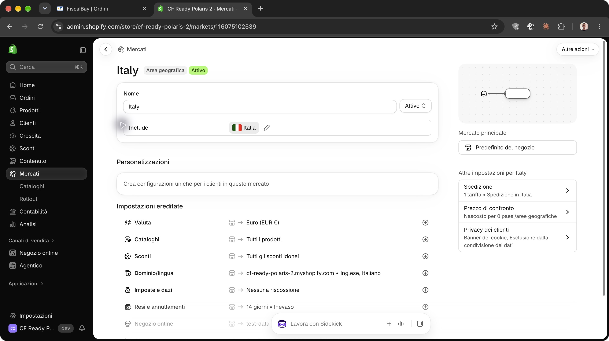
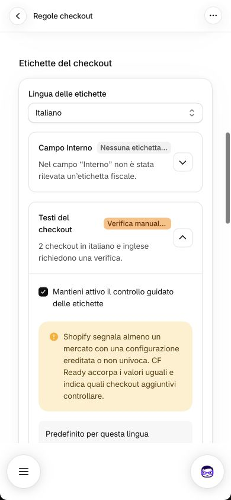

# Audit grafico di CF Ready 2.0 con Polaris 2

**Data:** 3 ottobre 2026.  
**Target:** Development, cf-ready-polaris-2.myshopify.com, app cf-ready-development.  
**Versione live:** 2.0.2-dev.14da91b952ed.  
**Browser:** Chrome, sessione Shopify esistente su macOS.  
**Stato:** confronto delle superfici principali concluso; nessuna correzione grafica implementata.  
**Metodo:** [audit di Claude del 1 ottobre](2026-10-01-audit-ui-ux-production.md).

La nuova grafica è effettivamente attiva. Le card e i controlli Polaris adottano
il nuovo Admin; le discontinuità maggiori sono nelle composizioni custom e
nella densità di alcune sezioni su mobile. Il report raccoglie **10 findings
grafici ed editoriali: 5 medi e 5 bassi**. Non è emerso un problema grafico
di severità alta nelle superfici osservate.

## 1. Metodo e perimetro

L'esame riguarda l'intera app, compresi gli elementi precedenti alla
migrazione: Home, Regole, etichette e campo Interno, simulatore, Messaggi,
Guida/FAQ, diagnosi/assistenza, onboarding, conferme e stati intermedi.
Per ogni superficie sono stati considerati box, spaziature, colori, font,
gerarchia dei titoli, badge, bottoni, icone, testi e armonia con il nuovo Admin.

Sono stati mantenuti i tre giri del precedente audit: osservazione,
interazioni per esporre gli stati visivi e modifiche temporanee autorizzate
con ripristino. Ogni finding riporta severità, confidenza, prova,
riproduzione e proposta. **Media** indica una perdita evidente di chiarezza
o coerenza; **Bassa** indica una rifinitura. La qualifica **editoriale**
distingue una proposta di composizione da un difetto misurabile.

Il giro di salvataggi e checkout ha inizialmente occupato troppo spazio.
L'owner ha ribadito il focus grafico: le verifiche funzionali già eseguite
sono conservate come contesto degli stati osservati e registro del
ripristino. Non sostituiscono il giudizio sul design e non costituiscono
una certificazione funzionale, fiscale o di accessibilità.

La copertura comprende desktop a 1440 px, le quattro pagine italiane a
390 × 844 px emulati, le quattro pagine inglesi desktop, Home e Guida
inglesi a 390 px e Home a 768 × 900 px. Le dimensioni sono quelle CSS;
le immagini Retina possono avere il doppio dei pixel. Le acquisizioni
sono state salvate e ispezionate sullo stesso file.

Non sono stati verificati dark mode, dispositivi mobili fisici, screen
reader, zoom al 200%, ogni breakpoint intermedio e tutte le varianti
commerciali. L'onboarding è documentato nei quattro passi in italiano
desktop; non è stato completato un secondo giro inglese/mobile dopo il
completamento. Le varianti piano scaduto, abbonamento e pagamento unico
non sono state prodotte nel nuovo store. Non sono stati forzati errori
server o di rete per creare artificialmente tutte le ErrorBoundary.
La cronologia non è più una superficie corrente dell'app.

## 2. Nuovo Admin, fonti Polaris 2 e benchmark nativi

### Identità del rendering

Il documento embedded carica un solo bundle Polaris 2.0 RC, i Web Components
sono registrati, il font osservato è Shopify Inter e le sezioni adottano
il tema admin-next-light. Sidebar nera, card bianche, ombre, controlli
arrotondati e primarie nere sono visibili nel nuovo store.

Nel vecchio cf-ready-dev lo stesso runtime conservava il tema precedente,
anche dopo ricarica forzata. La
[reference sul versionamento](https://shopify.dev/docs/api/app-home/v2.0-rc/web-components/versioning)
spiega che il bundle segue il tema dell'Admin. Il nuovo store è stato
creato con la preview new_admin_design, documentata nelle
[feature preview Shopify](https://shopify.dev/docs/apps/build/stores/feature-previews).
La differenza iniziale non è stata attribuita a una cache guasta.

Le prove [01](evidence/2026-10-03-cfr-2-dev/01-home-it-desktop.png),
[02](evidence/2026-10-03-cfr-2-dev/02-rules-it-desktop.png),
[03](evidence/2026-10-03-cfr-2-dev/03-polaris-runtime-theme.png),
[04](evidence/2026-10-03-cfr-2-dev/04-rules-after-hard-reload.png) e
[05](evidence/2026-10-03-cfr-2-dev/05-dev-store-actions.png) documentano
l'identificazione del target, non difetti grafici del nuovo design.

### Criteri ufficiali applicati

| Fonte | Uso nell'audit |
| --- | --- |
| [Guida Polaris 2](https://shopify.dev/docs/apps/build/app-home/polaris2) | Componenti custom, valori copiati dai vecchi token, font, bundle e resa nei due Admin |
| [App Home 2.0 RC](https://shopify.dev/docs/api/app-home/v2.0-rc) | Componenti, controlli e semantica del runtime osservato |
| [Pattern App Home](https://shopify.dev/docs/api/app-home/v2.0-rc/patterns) | Gerarchia, raggruppamenti e azioni |
| [Design delle app Shopify](https://shopify.dev/docs/apps/design) | Chiarezza, densità, priorità visiva, coerenza e feedback |
| [Elementi fissi sopra l'host](https://shopify.dev/docs/apps/build/app-home/polaris2#position-fixed-bottom-elements-above-host-ui) | Raggiungibilità delle azioni rispetto a Menu e Sidekick |

La guida di migrazione richiama espressamente il rischio dei valori CSS
copiati dai vecchi token: sostiene V2-T1. Gli altri findings derivano dal
rendering osservato e dal confronto nativo. Non sono presentati come
divieti Polaris per specifici colori di brand o proporzioni di colonna.
Polaris 2 era una release candidate alla data dell'audit: le conclusioni
valgono per il runtime caricato in questa sessione.

### Confronto con le pagine native

Sono state osservate Prodotti, dettaglio mercato Italy, impostazioni
checkout, editor dei testi, navigazione, conferme e barra di salvataggio.
Translate & Adapt è stato usato per le etichette, senza assumerlo come
riferimento esclusivo del nuovo design.

| Elemento | Shopify nativo | CFR osservato | Giudizio |
| --- | --- | --- | --- |
| Card | Bianche, angoli ampi, ombre leggere sul fondo chiaro | Le sezioni Polaris adottano lo stesso linguaggio | Coerente |
| Primaria | Nero con volume e ombra | Home, assistenza e onboarding coerenti | Coerente |
| Secondaria | Arrotondata, neutra | Azioni e save bar native | Coerente |
| Critica | Rosso distinto dalla primaria ordinaria | Disattivazione con conferma rossa | Coerente |
| Badge | Verde, azzurro, arancione e neutro semantici | Stati distinguibili; alcuni testi troppo lunghi | V2-R1/R3 |
| Box interni | Raggruppamenti sobri e bordi tenui | Fallback precedenti e più livelli di cornice | V2-T1/R2 |
| Tipografia | Shopify Inter, gerarchia sobria | Font coerente, alcuni pesi editoriali migliorabili | V2-T2/H1/H2 |
| Mobile | Menu e Sidekick dell'host, contenuto scorrevole | Azioni osservate raggiungibili con scroll | Buona base, due difetti di composizione |

La [pagina Prodotti](evidence/2026-10-03-cfr-2-dev/07-native-products-desktop.png)
completa il confronto per toolbar, tabella, badge e densità. L'aspetto
non prova l'identità delle implementazioni interne Shopify.

## 3. Valutazione dell'intera app per superficie

| Superficie | Box e spaziature | Colori, tipografia e titoli | Badge, bottoni e icone | Testi e coerenza |
| --- | --- | --- | --- | --- |
| Home | Card ben separate dal fondo; riepilogo e aside ordinati. Banner della prova molto alto su mobile | Palette nativa; font coerente. Prezzi poco distinti dal corpo | Primaria nera, disattivazione critica e badge delle regole leggibili; icona di ambito affiancata al testo nella prima vista mobile | Linguaggio leggibile IT/EN; informazioni commerciali ripetute in più zone. V2-H1/H2 |
| Regole | Sezioni per campo chiare; simulatore distinto. Nella parte etichette troppe cornici e padding successivi | Card nuove coerenti; bordi custom precedenti. Titoli dei campi distinguibili dal testo descrittivo | Radios, select e save bar coerenti. Badge dei disclosure troncati a 390 px; due forme di chevron | Spiegazioni utili ma lunghe e ripetute nella verifica manuale. V2-T1/R1/R2/R3 |
| Simulatore | Riquadro cliente raggruppato, campi vicini agli errori; azione raggiungibile su mobile | Fondo tenue di brand e primaria verde distinguono la simulazione dalla gestione merchant | Icone di destinazione e dati fiscali coerenti fra loro, stato con testo e simbolo | Preview EN distinta dalla lingua merchant. Non viene chiesto di uniformare il checkout simulato all'Admin |
| Messaggi | Card e campi ordinati; preview globale e preview locali mobile. Una riga extra prodotta dall'icona isolata | Gerarchia leggibile e font nativo; errore rosa custom non fedele al checkout osservato | Contatori sempre presenti, badge di disponibilità distinguibili, ripristino secondario | Merchant IT/EN coerente; «Anteprima nel checkout» promette più fedeltà di quella resa. V2-M1/M2 |
| Guida/FAQ | Card FAQ leggibile; separatori ordinati, hover contenuto, aside più leggero | Titolo FAQ dentro la card mentre le altre sezioni principali lo hanno fuori; vecchi fallback nei separatori | Chevron allineati anche nelle domande lunghe, comandi globali e assistenza ben distinti | Testi completi e leggibili; titolo EN «Frequently asked» incompleto. V2-T1/T2/G1 |
| Diagnosi/assistenza | Risultati raggruppati e azioni vicine; salto con titolo visibile | Successo, attenzione e neutralità hanno significati diversi; orari nel fuso dello store | Copia con toast esplicito, primaria assistenza, aggiornamento separato | Nessuna diagnostica grezza non tradotta riscontrata nella vista osservata; la parte tecnica dell'email non è testo di pagina |
| Onboarding | Finestra desktop contenuta; progressione, regole, preview e riepilogo leggibili | Font e controlli nativi; anteprime condividono il rosa custom di Messaggi | Progressione visibile, azioni di avanti/indietro e ritorno distinte | Quattro passi IT osservati. V2-M2 condiviso; «Configurazione completata» è annotato separatamente come contesto UX |
| Conferme e feedback | Finestre proporzionate, padding e spaziatura coerenti; save bar dell'host | Critica rossa e annullamento neutro | Ripristino messaggi e disattivazione leggibili, pulsanti mobile non tagliati | Le azioni descrivono l'effetto; nessuna email o addebito avviato |

Nelle verifiche DOM di Regole e Guida a 390 px, scrollWidth e innerWidth
coincidono: non è stato riscontrato overflow orizzontale in quegli stati.
La conclusione non si estende a ogni testo o variante futura.

## 4. Findings grafici ed editoriali

| ID | Finding | Severità | Confidenza | Natura |
| --- | --- | --- | --- | --- |
| V2-T1 | Parti custom ancorate ai vecchi fallback di bordi, raggi e palette | Media | Alta | Coerenza Polaris 2 |
| V2-R1 | Badge dei pannelli etichette troncati a 390 px | Media | Alta | Difetto responsive |
| V2-R2 | Troppi livelli di box nel controllo etichette | Media | Media | Composizione e densità |
| V2-M1 | Icona informativa isolata sopra il testo nell'anteprima mobile | Media | Alta | Difetto responsive |
| V2-M2 | Anteprima errori con aspetto diverso dal checkout reale | Media | Alta | Fedeltà della rappresentazione |
| V2-T2 | Titoli principali collocati in modo diverso fra pagine | Bassa | Alta sull'osservazione, Media sulla priorità | Editoriale |
| V2-R3 | «Verifica manuale richiesta» prima della scelta di gestione | Bassa | Alta | Testo e semantica visiva |
| V2-G1 | Titolo inglese «Frequently asked» incompleto | Bassa | Alta | Testo |
| V2-H1 | Banner commerciale dominante nella Home mobile | Bassa | Media | Editoriale |
| V2-H2 | Gerarchia tipografica debole di prezzi e periodicità | Bassa | Media | Editoriale |

### V2-T1. Parti custom con valori precedenti

**Dove:** disclosure di Regole, FAQ, errori di Messaggi e onboarding.

Le card Polaris seguono il nuovo Admin, ma le cornici custom appaiono più
piatte e squadrate. Nel pannello etichette è stato misurato un bordo 1 px
rgb(223, 227, 232) e raggio 12 px. Il token --p-color-border-secondary non
è definito nel contesto osservato: viene usato il fallback. Il piccolo
chevron ha cornice quadrata e raggio 8 px, accanto ai controlli nativi più
arrotondati.

Il codice conferma fallback --p-* in
[RulesLayout.css](../../app/features/rules/RulesLayout.css) e
[app.guide.css](../../app/routes/app.guide.css).
[CustomerMessagesPreview.css](../../app/features/messages/CustomerMessagesPreview.css)
conserva fondo #fee9e8, colore #8e1f0b, raggio 8 px e dimensioni del testo
fissate. Non è stato trovato un secondo font merchant: il problema riguarda
valori che non seguono automaticamente il tema.

**Riproduzione:** nuovo Admin, Regole, aprire Interno e Testi del checkout;
confrontare cornici e chevron con la sezione contenitrice e il mercato nativo.

**Prove:** [21](evidence/2026-10-03-cfr-2-dev/21-rules-custom-panels.png),
[46](evidence/2026-10-03-cfr-2-dev/46-rules-labels-current.png),
[49](evidence/2026-10-03-cfr-2-dev/49-messages-en-desktop.png).

**Proposta:** preferire componenti nativi per le superfici merchant; dove
serve CSS custom, definire pochi valori compatibili con entrambi i temi.
Verificare a parte il simulatore cliente. Non inventare nomi di nuovi token.

### V2-R1. Badge tagliati su mobile

A 390 px compaiono «Nessuna etichetta…» e «Verifica manual…». Nel secondo
pannello il titolo va su due righe e compete con badge e chevron. La frase
sottostante aiuta, ma lo stato non si legge per intero a colpo d'occhio.

**Riproduzione:** Regole a 390 × 844, sezione etichette con verifica manuale
pendente. **Prova:** [35](evidence/2026-10-03-cfr-2-dev/35-labels-mobile-390.png).

**Proposta:** badge brevi, per esempio «Da verificare» e «Testo corretto»,
con frase completa nel riepilogo; oppure una riga autonoma per il badge
su mobile. L'ellissi nativa non è un difetto di Polaris: è la composizione
CFR che assegna un testo troppo lungo.

### V2-R2. Stratificazione delle etichette troppo profonda

Card esterna, disclosure bordato, banner mercato, box grigio del caso e
ulteriore disclosure della procedura producono molti livelli visivi. Il
requisito manuale ricompare nel riepilogo, nel caso e nella sintesi finale.
Su mobile il banner occupa molte righe prima delle etichette da confrontare.

**Riproduzione:** aprire Testi del checkout con due casi manuali, poi la
procedura; confrontare mobile e desktop con il raggruppamento del mercato.
Il finding riguarda la composizione, non la necessità dei casi distinti.

**Prove:** [35](evidence/2026-10-03-cfr-2-dev/35-labels-mobile-390.png),
[47](evidence/2026-10-03-cfr-2-dev/47-labels-reread-control.png),
[08](evidence/2026-10-03-cfr-2-dev/08-native-market-it-desktop.png).

**Proposta:** una cornice per gruppo, separazione interna con titolo e
spaziatura; rendere compatta la spiegazione del mercato. Portare il
confronto attuale/proposto prima delle istruzioni lunghe e mostrare una
sola sintesi numerica.

### V2-M1. Icona informativa orfana

Nell'anteprima mobile l'icona info resta sola su una riga; la frase «Con le
regole attuali questo messaggio può comparire nel checkout» comincia sotto.
A desktop sono affiancate. Lo stack inline lascia andare a capo l'intero
testo invece di mantenere il suo legame con l'icona.

**Riproduzione:** Messaggi IT, 390 × 844, anteprima CF obbligatorio.
**Prova:** [36](evidence/2026-10-03-cfr-2-dev/36-messages-mobile-390-top.png).

**Proposta:** due colonne, icona e testo flessibile, allineati in alto;
verificare frasi lunghe ed EN senza fissare l'altezza del box.

### V2-M2. Anteprima grafica diversa dal checkout

Messaggi e onboarding mostrano un banner rosa con icona, titolo «Ordine non
completato» e testo. Nel checkout reale osservato l'errore CFR è rosso inline
sotto il campo, senza quella cornice o quel titolo. «Anteprima nel checkout»
crea un'aspettativa di fedeltà; il componente condiviso dichiara lo stesso
intento nel codice.

Il finding riguarda la rappresentazione grafica, non la validazione.

**Riproduzione:** confrontare Messaggi con un CF non valido nel checkout
italiano di test, senza creare ordini.
**Prove:** [15](evidence/2026-10-03-cfr-2-dev/15-onboarding-step3.png),
[27](evidence/2026-10-03-cfr-2-dev/27-messages-it-top.png),
[44](evidence/2026-10-03-cfr-2-dev/44-checkout-it-invalid-cf.png).

**Proposta:** rappresentare campo ed errore inline come osservati, oppure
chiamarlo «Esempio del messaggio» e dichiarare che posizione e aspetto
dipendono da Shopify. Non aggiungere intestazioni presentate come reali.

### V2-T2. Titoli principali dentro e fuori dalle card

Home, Regole e Messaggi pongono i titoli di sezione sopra le card; Guida
pone Domande frequenti dentro, accanto al comando globale. La prima baseline
del contenuto cambia passando fra pagine. Il formato FAQ resta comprensibile:
è una rifinitura editoriale, non un pattern vietato da Polaris.

**Riproduzione:** prime sezioni delle quattro pagine, desktop e 390 px.
**Prove:** [11](evidence/2026-10-03-cfr-2-dev/11-home-new-admin-initial.png),
[19](evidence/2026-10-03-cfr-2-dev/19-rules-initial-top.png),
[27](evidence/2026-10-03-cfr-2-dev/27-messages-it-top.png),
[30](evidence/2026-10-03-cfr-2-dev/30-guide-top.png).

**Proposta:** collocazione e distanza titolo-card comuni per le sezioni
principali. I titoli più discreti dell'aside hanno una gerarchia appropriata.

### V2-R3. Il badge iniziale descrive il passo sbagliato

Prima della scelta di gestione, il badge arancione dice «Verifica manuale
richiesta» ma il testo chiede «Scegli se CF Ready deve gestire questi testi».
In quello stato sono riportate zero verifiche manuali. Scelta iniziale e
verifica reale sono messaggi diversi, presentati con lo stesso stato visivo.

**Riproduzione:** primo accesso, campi non gestiti e scelta etichette pendente.
**Prova:** [21](evidence/2026-10-03-cfr-2-dev/21-rules-custom-panels.png)
per badge e richiesta; contatore zero letto nel DOM del giro iniziale.

**Proposta:** «Da configurare» o «Scelta richiesta» inizialmente; «Da verificare»
per i casi manuali. Il colore può restare arancione se indica un passo
necessario, ma testo e conteggio devono riferirsi alla stessa azione.

### V2-G1. Titolo FAQ inglese incompleto

La card si intitola «Frequently asked», senza il sostantivo; l'italiano
«Domande frequenti» è completo.

**Riproduzione:** merchant English, Help and FAQ.
**Prove:** [50](evidence/2026-10-03-cfr-2-dev/50-guide-en-desktop.png),
[51](evidence/2026-10-03-cfr-2-dev/51-guide-en-390.png).

**Proposta:** «Frequently asked questions», verificando il comportamento
del comando Expand all su mobile con il titolo più lungo.

### V2-H1. Banner commerciale dominante su mobile

Con prova attiva, il banner azzurro precede il riepilogo campi e contiene
due paragrafi e un pulsante. A 390 px occupa circa 225 px verticali.
Il piano ricompare nella scelta e nell'aside. La palette è nativa: il punto
è il peso relativo del contenuto nella prima vista.

**Riproduzione:** Home, prova e controllo attivi, 390 × 844.
**Prove:** [41](evidence/2026-10-03-cfr-2-dev/41-home-mobile-active.png),
[52](evidence/2026-10-03-cfr-2-dev/52-home-en-390.png).

**Proposta editoriale:** una frase con data e azione, dettagli sugli addebiti
nella scelta del piano; valutare un messaggio esteso vicino alla scadenza.
Non viene suggerita una modifica alla palette globale Polaris.

### V2-H2. Prezzi con gerarchia debole

Nome e prezzo dei piani hanno peso e dimensione vicini al corpo. Badge
Consigliato e primaria annuale emergono più del dato economico. A 768 px
le opzioni sono righe verticali in una card: leggibili, ma la comparazione
rapida dipende soprattutto da separatori e pulsanti.

**Riproduzione:** Home con prova attiva, sezione Come vuoi continuare,
768 px. **Prove:** [43](evidence/2026-10-03-cfr-2-dev/43-home-tablet-768.png),
[26](evidence/2026-10-03-cfr-2-dev/26-home-active-trial.png).

**Proposta editoriale:** prezzo più distinto e periodo vicino al valore;
stesse posizioni per nome, prezzo e azione. Conservare l'enfasi annuale
senza affidare il confronto soltanto al colore del pulsante.

## 5. Aspetti riusciti e confronto con il precedente audit

Le sezioni native seguono bene il nuovo Admin: ombre leggere, card bianche,
controlli arrotondati, font Shopify Inter e primarie nere. I badge verdi
e azzurri migliorano la scansione rispetto al vecchio audit; lo stato
Interno corretto è neutro e non implica una verifica che Shopify non espone.

Le FAQ lunghe vanno a capo con chevron allineato. Il salto alla diagnosi
rende visibile il titolo e assegna il focus. I contatori Messaggi sono
sempre presenti; le preview locali mobile restano vicine al testo modificato.
Il link ordini è presente in Home. La conferma di disattivazione è critica
rossa, con annullamento neutro.

Non sono riconfermati automaticamente T1, T2 e T6 del vecchio audit:
colonne diverse per compiti diversi, verde nel simulatore cliente e usi
del logo non sono classificati da soli come regressioni Polaris 2.
Il nuovo onboarding desktop è più contenuto rispetto al precedente.
I salvataggi eseguiti non hanno riprodotto il falso conflitto del vecchio
audit; è un riscontro di contesto, non un nuovo finding grafico.

## 6. Osservazioni UX di contesto

Queste osservazioni sono conservate per non perdere le prove, ma non sono
conteggiate nei 10 findings grafici e non spostano l'audit sul funzionamento.

| ID | Osservazione | Severità | Confidenza | Prova e proposta |
| --- | --- | --- | --- | --- |
| UX-C1 | «Configurazione completata» pur lasciando i campi non gestiti e controllo inattivo; checklist rimossa | Bassa | Alta | [17](evidence/2026-10-03-cfr-2-dev/17-onboarding-completed.png), [18](evidence/2026-10-03-cfr-2-dev/18-home-trial-inactive.png). Distinguere procedura terminata da configurazione pronta; il prossimo passo resta comunque in Home |
| UX-C2 | Home attiva senza richiamo alle etichette pendenti; CF richiesto ancora etichettato «opzionale» nel checkout | Media | Alta | [35](evidence/2026-10-03-cfr-2-dev/35-labels-mobile-390.png), [41](evidence/2026-10-03-cfr-2-dev/41-home-mobile-active.png), [44](evidence/2026-10-03-cfr-2-dev/44-checkout-it-invalid-cf.png). Richiamo compatto vicino al riepilogo |

Il CF obbligatorio vuoto e non valido produce il messaggio inline reale.
L'incongruenza del testo «opzionale» è distinta dalla validazione del valore.

## 7. Copertura delle prove

Le immagini sono in [evidence/2026-10-03-cfr-2-dev](evidence/2026-10-03-cfr-2-dev).
Gli ID indicano il giro di acquisizione, non la priorità.

| Prove | Superfici |
| --- | --- |
| 01–05, 10 | Vecchio Admin, runtime, ricarica forzata, compatibilità |
| 06–08 | Nuovo Admin e benchmark nativi |
| 09 | Dominio nuovo rifiutato prima del deploy |
| 11–18 | Home iniziale, quattro passi onboarding, completamento e prova |
| 19–25 | Regole, permessi, pannelli, save bar, stati simulatore e opzioni avanzate |
| 26–29 | Home attiva, Messaggi, vuoto e ripristino |
| 30–32 | Guida, salto e risultato della diagnosi |
| 33–42 | Quattro pagine IT a 390 px, assistenza e conferma critica |
| 43 | Home a 768 px |
| 44–45 | Checkout reale ed editor nativo, confronto delle anteprime |
| 46–50 | Etichette, rilettura, Regole/Messaggi/Guida EN desktop |
| 51–53 | Guida e Home EN a 390 px, conferma critica EN |
| 54–61 | Registro ripristino, rilettura finale delle etichette e Home finale; 54/56/57 sono desktop, nonostante il suffisso iniziale del file 54 |

Alcuni file hanno estensione PNG ma contengono JPEG prodotti dal primo
metodo di cattura; sono stati letti correttamente, senza ricampionamento.
Catture temporanee piccole o vuote del tool sono state sostituite con quelle
corrette: non sono state attribuite all'app. Una dimensione richiesta al
tool, se non confermata dal rendering, non è stata usata come prova responsive.

## 8. Dev store e pubblicazione Development

Il nuovo store è stato creato su richiesta dell'owner: Development Basic,
Temisfera, preview new_admin_design, Italia/EUR, fuso Roma, fixture Shopify,
inglese predefinito e italiano pubblicato. Italy e Canada sono attivi.
Provider di prova, spedizione italiana e nome azienda facoltativo consentono
i casi CFR; Interno non è stato rinominato. Translate & Adapt è stata
installata dal flusso nativo. Nessuna copia di dati dal vecchio store.

Il dominio era respinto dall'allowlist. La modifica autorizzata ammette
esattamente vecchio e nuovo dev store, conservando la restrizione.
La [PR #625](https://github.com/max23468/CF-Ready/pull/625) è unita; la
pubblicazione è **solo Development**, senza promozione Production.

| Ricevuta | Valore |
| --- | --- |
| Commit distribuito | a5cf9bac0f411f51568bcbd5285951f904b8eb2c |
| Shopify | 2.0.2-dev.14da91b952ed |
| Deployment Worker | 684c158d-2b1e-454f-ad74-d11ab7cadd29 |
| Versione Worker al 100% | be664bf4-0a6f-49c7-a0eb-e58a82e1ad41 |
| Rollback Worker | c97a78a1-e900-4a01-af84-1b5ae97c2fad |
| Rollback Shopify | 2.0.1-dev.641b737146d1 |
| CI/deploy | [run 37131333179](https://github.com/max23468/CF-Ready/actions/runs/37131333179) |
| Migrazioni | Nessuna applicata o pendente |

Gate completo: 701 test app, 199 UI, 195 Function, controlli operativi,
coverage e mutation CI verdi. Il coordinatore ha ripetuto i gate; deploy,
smoke e readback provider sono verdi. Questi controlli provano il collegamento
tecnico, non sostituiscono l'osservazione grafica. Nessun fix UI pubblicato.

## 9. Modifiche temporanee e ripristino

Sono stati avviati la prova gratuita e l'onboarding autorizzati. Sono stati
salvati temporaneamente CF obbligatorio, PEC aziendale e poi facoltativa,
modalità guidata e quattro etichette native IT/EN. Il controllo è stato
attivato e poi disattivato. I messaggi sono stati provati vuoti, oltre
limite e con un marcatore EN, poi riportati ai predefiniti.

Diagnostica copiata e link email ispezionato; nessun invio. Lingua del
profilo temporaneamente English, poi Italiano. Il checkout è stato aperto
tramite preview autenticata, senza leggere o cambiare la password del negozio,
con fixture sintetiche e indirizzo pubblico di esempio; nessuna carta,
pagamento o ordine. Non è stato concluso un giro checkout inglese completo
o per ogni mercato.

| Elemento | Esito provato |
| --- | --- |
| CF / PEC | Non gestito / Non gestita, riletti dopo il salvataggio |
| Validation | Disattivata; Home offre di nuovo l'attivazione |
| Messaggi | Predefiniti IT/EN, nessun marcatore di audit |
| Gestione etichette | Disattivata, riletta in Regole |
| Etichette IT | «Codice fiscale (opzionale)», «PEC (opzionale)», riletti da CFR |
| CF EN | «Codice Fiscale (optional)», riletto da CFR |
| PEC EN | «PEC (optional)», riletto da CFR dopo il salvataggio nativo |
| Profilo | Italiano selezionato dopo salvataggio e ricarica |
| Vecchio dev store / Production | Nessuna modifica alla configurazione / nessuna pubblicazione |

L'editor Shopify ha temporaneamente smesso di rispondere al controllo del
browser; il ripristino PEC EN è stato completato usando la UI nativa Chrome.
Non è stato classificato come difetto CFR.

La [rilettura finale](evidence/2026-10-03-cfr-2-dev/60-labels-restored-readback.png)
conferma entrambi i testi inglesi di partenza e la modalità Disattivata.
La [Home finale](evidence/2026-10-03-cfr-2-dev/61-home-final-restored.png)
mostra controllo disattivato, campi non gestiti e messaggi predefiniti.
Le schede temporanee sono state chiuse; CFR resta aperta. La vista finale
è desktop. Il reset automatico dell'override viewport non è stato confermato
per l'interruzione del controllo browser; non viene dichiarato il ripristino
delle dimensioni originarie della finestra.

Restano tracce di test: prova autorizzata con scadenza 16 ottobre, onboarding
completato, permessi traduzioni concessi, Interno dichiarato facoltativo e
date/revisioni aggiornate. Il select non consente di tornare a «da controllare»,
ma il valore dichiarato corrisponde alla configurazione Shopify. La UI non
offre reset del completamento o del contatore della prova.

Carrello di prova e diagnostica copiata possono restare nella sessione.
Il precedente contenuto clipboard non è stato letto. Il nuovo store, fixture,
lingue e collegamento Development restano come ambiente di test richiesto.
Il ripristino dei valori visibili non equivale a cancellare tutte le tracce
operative del test.

## 10. Ordine suggerito per le rifiniture

Prima V2-R1 e V2-M1, difetti riproducibili a 390 px. Poi V2-T1 e V2-R2,
ripulendo insieme superfici custom e stratificazione delle etichette.
V2-M2 richiede una decisione sul grado di fedeltà dell'anteprima.
Infine testi e gerarchia V2-T2/R3/G1/H1/H2. Le proposte restano da scegliere
e implementare; l'audit non autorizza una pubblicazione di fix.
